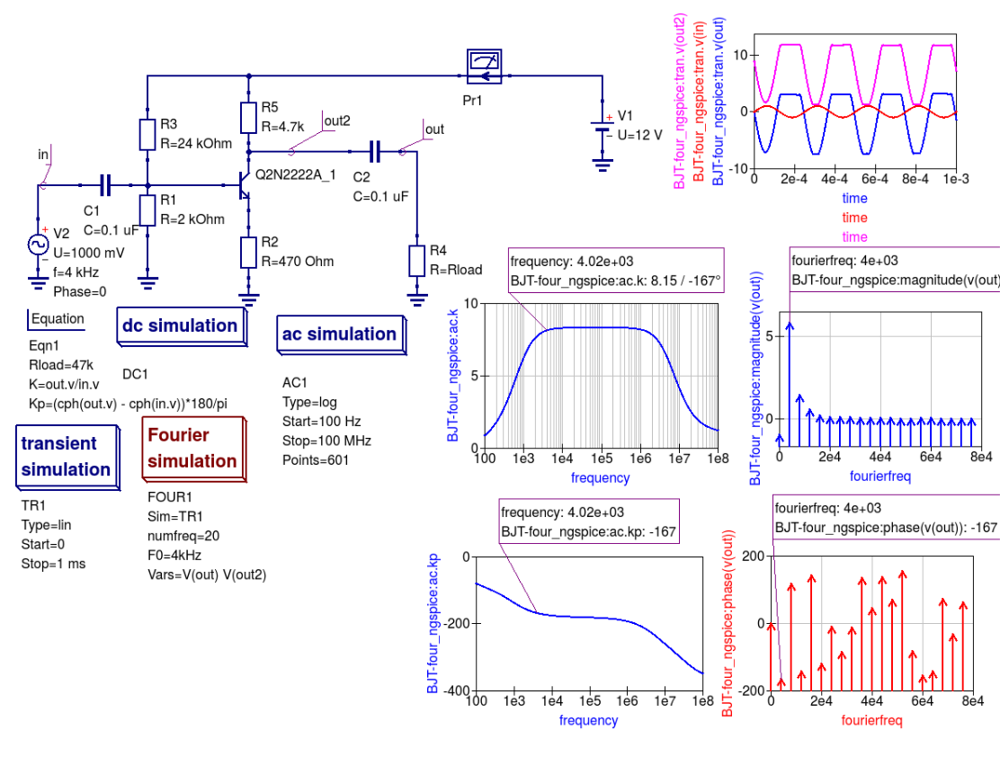
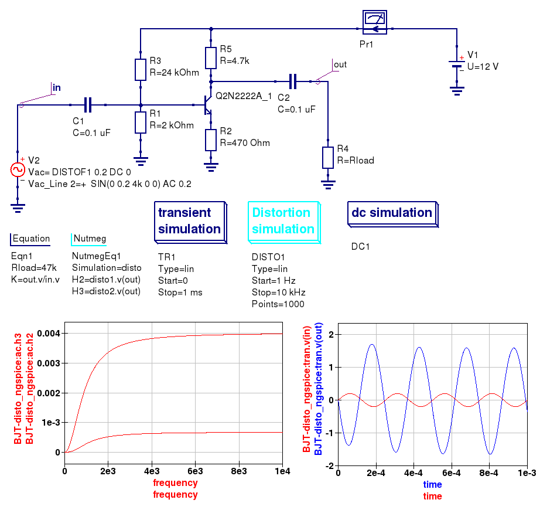
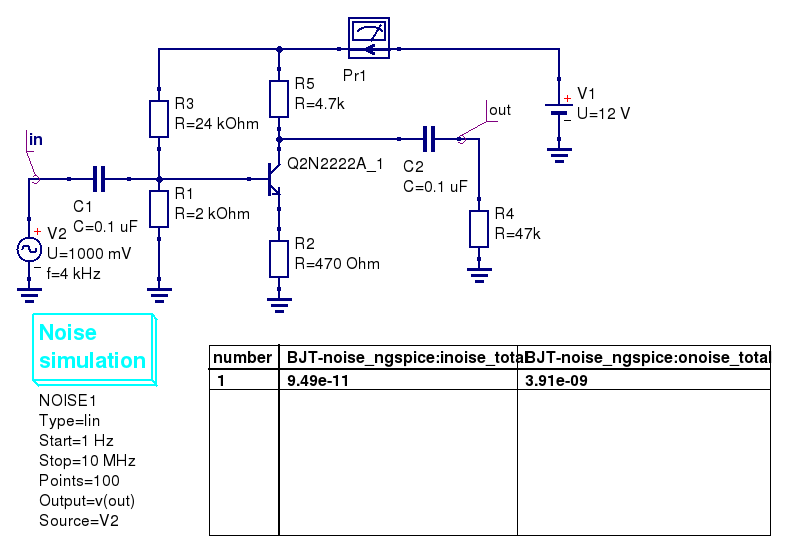
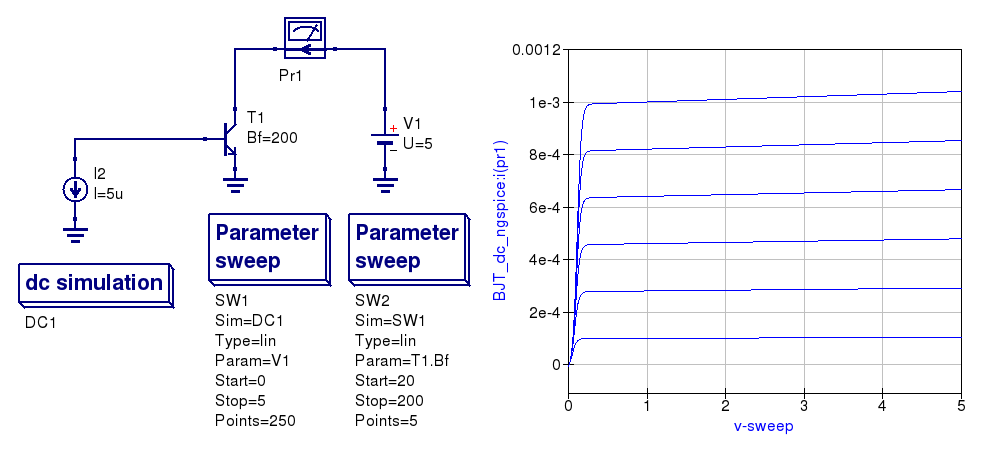
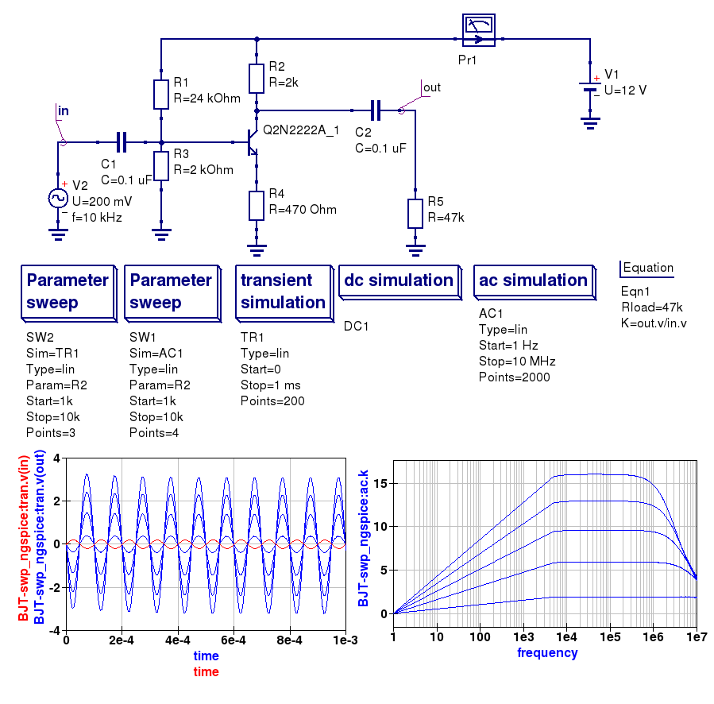

-----------------------------------------------------------
Chapter 5. More advanced circuit simulation techniques.
-----------------------------------------------------------

5.1 Fourier simulation
~~~~~~~~~~~~~~~~~~~~~~

The SPICE implementation of *Fourier analysis* allows users to perform a Fourier transform of
one or more time domain circuit signals and to investigate their spectrum in the frequency domain. 
SPICE *Fourier analysis* is implemented by both Ngspice and Xyce. 
Fourier simulation is available to spice4qucs users via a special icon called *Fourier 
analysis*. This simulation icon is located in the *Spice simulations* group. To request a *Fourier analysis*
place a copy of the *"Fourier analysis"*  icon on the current work schematic alongside a *Transient analysis* icon.  
SPICE *Fourier analysis* uses the simulation data generated by a transient simulation and has no meaning without a set of transient
simulation time domain data.  The link between Fourier analysis and transient simulation is formed by entering the 
name of the coupled transient simulation as the first property of *Fourier analysis*. 

The *Fourier analysis* property list has the following entries:

#. ``Sim``     --- Linked transient analysis icon name.
#. ``numfreq`` --- Number of harmonics: variable number for ngspice and fixed at 10 for Xyce.
#. ``F0``      --- This parameter is the fundamental frequency of the generated frequency domain spectrum.
#. ``Vars``    --- This parameter is a list of output signals. Output signals may be node voltages and currents. In the list each entry should be space separated. 

Fourier simulation creates four output vectors for each specified output signal, for 
example in the case of ``v(out)``:

#. ``magnitude(v(out))``  --- Magnitude spectrum.
#. ``phase(v(out))``      --- Phase spectrum (in degrees--).
#. ``norm(mag(v(out))``   --- Normalized magnitude spectrum.
#. ``norm(phase(v(out))`` --- Normalized phase spectrum.

Spice4qucs allows each of these four display vectors to be plotted. 

Here is a small example of a *Fourier analysis* which demonstrates the main features introduced above 
and the relation between small signal AC simulation and *Fourier analysis*.

|four_EN|
Figure 5.1 Fourier and small signal AC analysis of a single stage transistor amplifier. 

5.2 Distortion simulation
~~~~~~~~~~~~~~~~~~~~~~~~~

SPICE *Distortion analysis* provides a small signal distortion analysis of a circuit being simulated. 
To request a distortion analysis place a copy of the special *Distortion analysis* icon on the current work schematic. 
It undertakes a simulation similar to the small signal *AC analysis*, but calculates the circuit distortion 
components instead. SPICE *Distortion analysis* is only available with ngspice. The calculated distortion components, 
for example values for the second and third harmonic components, can be extracted using ngnutmeg script statements. 
Refer to the official ngspice manual for the details of the available ngnutmeg operators and functions.

Ngspice *Distortion analysis* requires that the circuit being simulated is driven by aspecial *AC voltage* source component. 
This extended signal source can be found in the *Spice components* group. You need to specify voltage source parameters ``DISTOF1`` and/or 
``DISTOF2`` for the ngspice  *Distortion analysis* to function correctly. Refer to the official ngspice manual for 
a detailed description of all the ngspice *Distortion analysis* features. Please NOTE that the standard Qucs AC source will not work 
with ngspice *Distortion analysis*.

Here is an basic example of the application of SPICE *Distortion analysis* for estimating the distortion components of a 
single stage transistor amplifier.

|disto_EN|

Figure 5.2 SPICE small signal distortion analysis of a single stage transistor amplifier.

5.3 Noise simulation
~~~~~~~~~~~~~~~~~~~~~~~~~

SPICE noise simulation allows the calculation of total circuit noise over a specified frequency bandwidth. 
ngspice noise simulation creates two vectors:

#. ``onoise_total`` --- Integrated output noise.
#. ``inoise_total`` --- Equivalent input noise.

Spice4qucs allows these vectors to be plotted. NOTE the Noise simulation at a single signal
frequency only outputs a single set of noise data. At this time only ngspice has noise analysis
implemented. However, in the near future is expected that noise simulation will be added to Xyce.

To set up a *Noise analysis* add the following four parameters to the *Noise analysis* icon
drop-down list:

#. ``Bandwidth limits`` --- Analysis start and stop frequencies in Hz.
#. ``Points count``     --- The number of noise simulation frequency points.
#. ``Output`` --- The output parameter name; this may be a node voltage or branch current.
#. ``Source``           --- Name of the input voltage source. A standard Qucs voltage source is allowed in this context.

|noise_EN|

Figure 5.3 Noise analysis of a single stage transistor amplifier.

5.4 One and two parameter sweep controlled simulations
~~~~~~~~~~~~~~~~~~~~~~~~~~~~~~~~~~~~~~~~~~~~~~~~~~~~~~~

You can use both one and two parameter (in nested loops) sweep with Ngspice and 
Xyce. There is no warranty of proper results for Xyce and Parameter sweep with 
Time-domain simulation, because Xyce uses adaptive time step for each step of 
sweep variable. Parameter sweep for DC and frequency domain works properly. 

There are the following differences between Qucs and Spice4qucs parameter sweep 
definitions.

#. You should use component name instead of variable to sweep component value. 
   For example you should use ``C1``, ``R1``, etc. to sweep values of C1 and R1 
   values.  
#. You can sweep component model parameter value with Ngspice. You should use 
   the following    notation ``Component_name.Parameter_name``. For example 
   ``T1.Bf`` will sweep  the ``Bf`` parameter of the transistor ``T1``. 
#. You cannot use ``.PARAM`` and ``.GLOBAL_PARAM`` names as sweep variables.

|BJT_swp_EN|

Figure 5.4 Parameter sweep example

There is a small example of parameter sweep usage. Sweep variable is collector 
resistor R2. It is specified in Parameter Sweep properties.

|modswp_EN|

Figure 5.5 Model parameter sweep example

5.5 Qucs and SPICE simulation of device and circuit temperature properties
~~~~~~~~~~~~~~~~~~~~~~~~~~~~~~~~~~~~~~~~~~~~~~~~~~~~~~~~~~~~~~~~~~~~~~~~~~~

`back to the top <#top>`__

