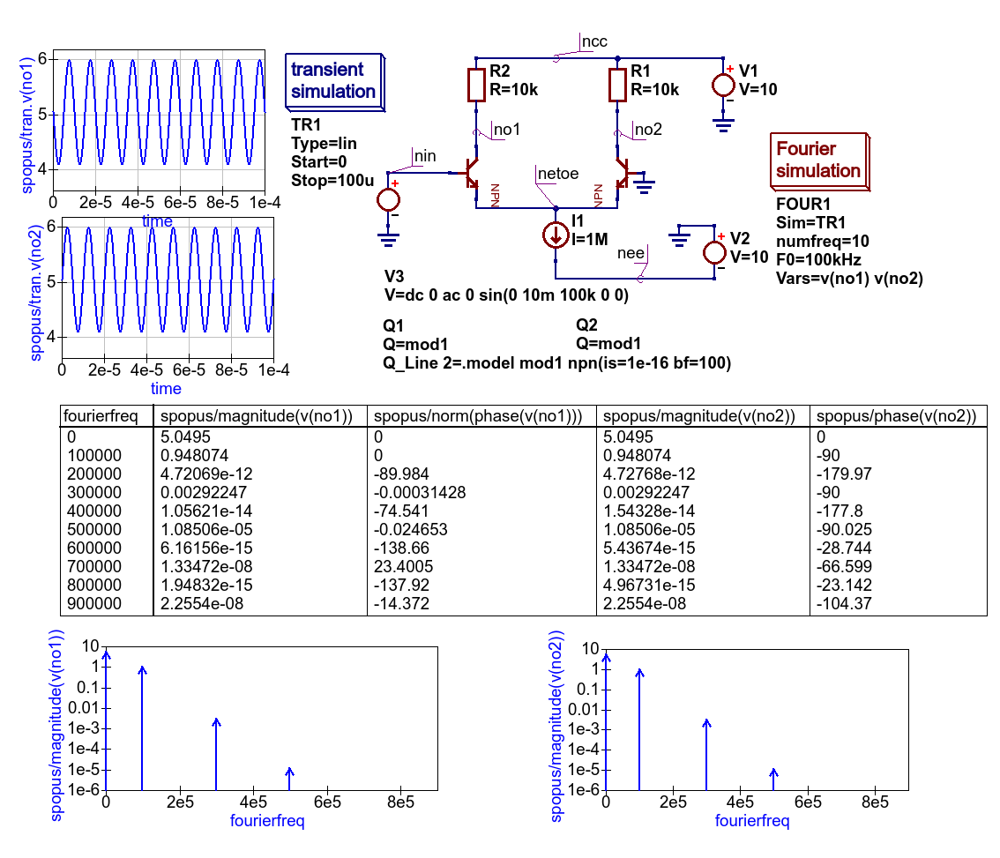
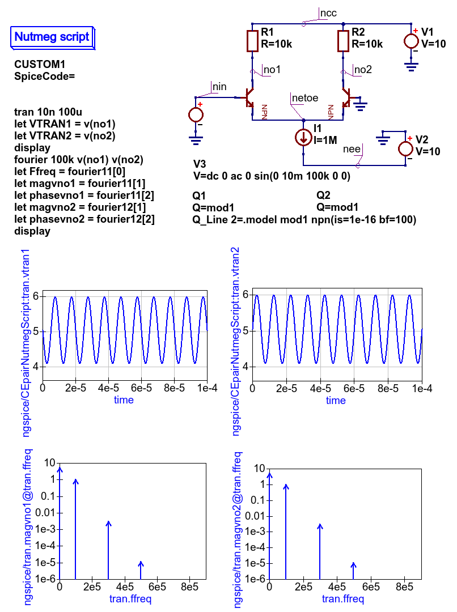
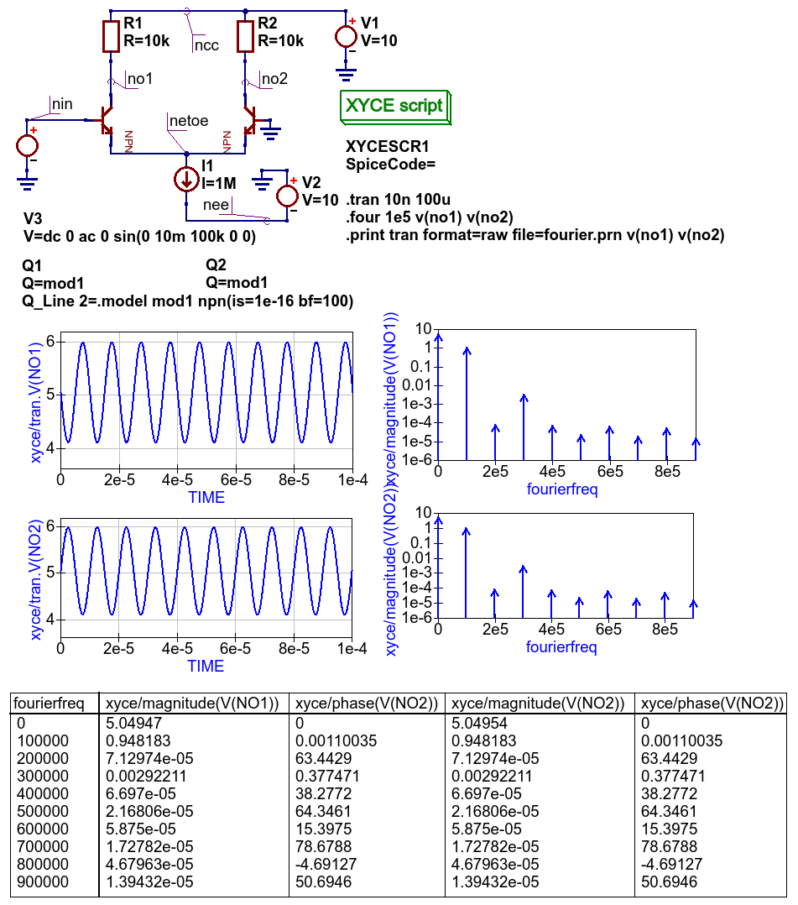
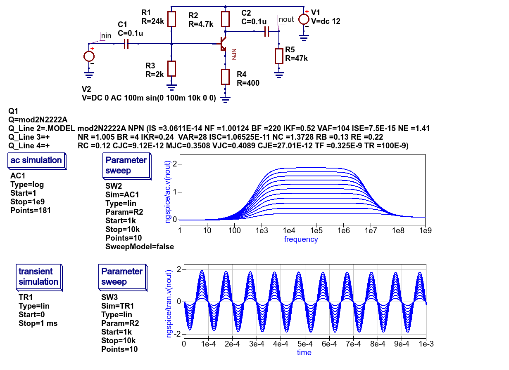
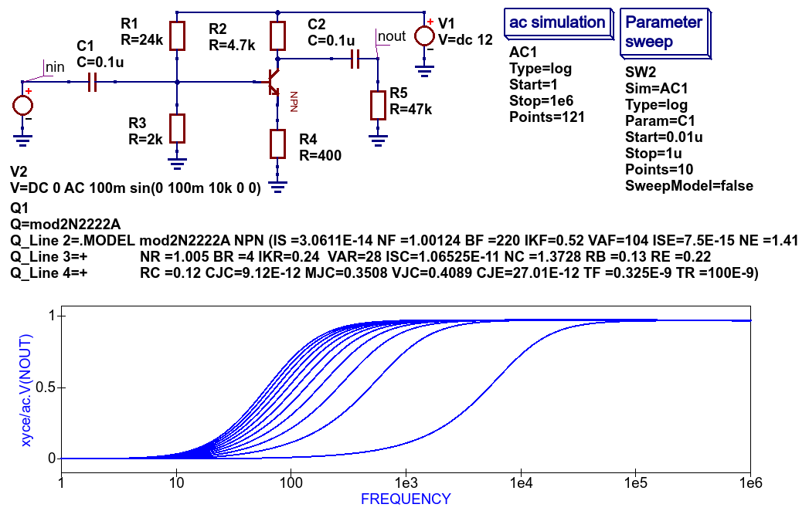
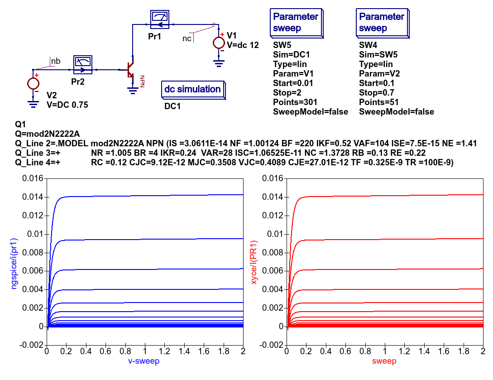
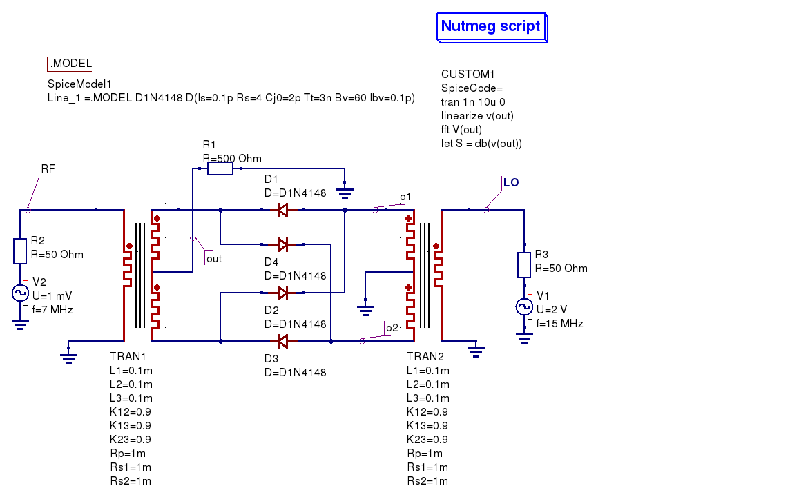
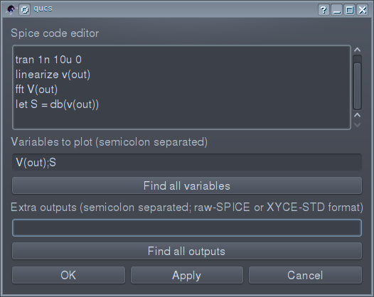
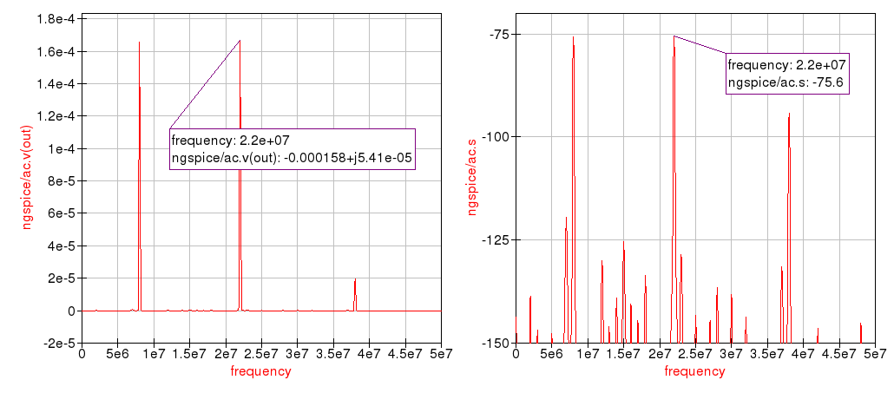

-----------------------------------------------------------
Chapter 5. More advanced circuit simulation techniques.
-----------------------------------------------------------

5.1 Fourier simulation
~~~~~~~~~~~~~~~~~~~~~~

The Qucs-S implementation of *Fourier simulation* allows users to perform a Fourier analysis of
one or more time domain circuit signals and to investigate their spectrum in the frequency domain. 
Qucs-S *Fourier simulation* is implemented by Ngspice, Xyce and SPICE OPUS. 
Fourier simulation is available to Qucs-S users via a special icon called *Fourier simulation*. 
This icon is located in the *simulations* group. To request a *Fourier simulation*
place a copy of the *"Fourier simulation"* icon on the current work schematic alongside a *transient simulation* icon.  
Qucs-S *Fourier simulation* uses the simulation data generated by a *transient simulation* and has no meaning without a set of transient
time domain data.  The link between *Fourier simulation* and *transient simulation* is formed by entering the 
name of the coupled *transient simulation* as the first property of *Fourier simulation*. 

The *Fourier analysis* property list has the following entries:

#. ``Sim``     --- Linked transient simulation icon name.
#. ``numfreq`` --- Number of harmonics: variable number for ngspice and SPICE OPUS but fixed at 10 for Xyce.
#. ``F0``      --- This parameter is the fundamental frequency of the generated frequency domain spectrum.
#. ``Vars``    --- This parameter is a list of output signals. These may be node voltages and currents. In the list each entry must be space separated. 

*Fourier simulation* creates four output vectors for each specified output signal, for 
example in the case of signal ``v(out)``:

#. ``magnitude(v(out))``  --- Magnitude spectrum.
#. ``phase(v(out))``      --- Phase spectrum (in degrees--).
#. ``norm(mag(v(out))``   --- Normalized magnitude spectrum.
#. ``norm(phase(v(out))`` --- Normalized phase spectrum.

Qucs-S allows each of these four display vectors to be plotted. 

Here is a small example of a *Fourier simulation* which demonstrates the main features introduced above 
and the relation between small signal AC simulation and *Fourier simulation*.

|four_EN|
Figure 5.1 Fourier and small signal AC analysis of a single stage transistor amplifier. 

.. |four_EN| image:: _static/en/chapter5/Fourier.svg

5.1.1 Additional Ngspice, SPICE OPUS and Xyce *Fourier simulation* examples
~~~~~~~~~~~~~~~~~~~~~~~~~~~~~~~~~~~~~~~~~~~~~~~~~~~~~~~~~~~~~~~~~~~~~~~~~~~~~~~~~~

Figure 5.1.1 SPICE OPUS *Fourier simulation* basic example.

Figure 5.1.2 Ngspice *Fourier simulation* basic example: see section 17.5.25 of the Ngspice
User Manual for an explanation of the Ngnutmeg *fouriermn* statement.

.. image:: _static/en/chapter5/FourierXyceIcon.png

Figure 5.1.3 Xyce *Fourier simulation* basic example: simulation controlled by *transient simulation* and *Fourier simulation* Icons.

Figure 5.1.4 Xyce *Fourier simulation*: controlled by *Xyce script*; see section 2.1.6 of the Xyce
Reference Guide for an explanation of the *.four* and associated *.print* statement.

5.2 Distortion simulation
~~~~~~~~~~~~~~~~~~~~~~~~~

SPICE *Distortion analysis* provides a small signal distortion analysis of a circuit being simulated. 
To request a distortion analysis place a copy of the special *Distortion analysis* icon on the current work schematic. 
It undertakes a simulation similar to the small signal *AC analysis*, but calculates the circuit distortion 
components instead. SPICE *Distortion analysis* is only available with ngspice. The calculated distortion components, 
for example values for the second and third harmonic components, can be extracted using ngnutmeg script statements. 
Refer to the official ngspice manual for the details of the available ngnutmeg operators and functions.

Ngspice *Distortion analysis* requires that the circuit being simulated is driven by aspecial *AC voltage* source component. 
This extended signal source can be found in the *Spice components* group. You need to specify voltage source parameters ``DISTOF1`` and/or 
``DISTOF2`` for the ngspice  *Distortion analysis* to function correctly. Refer to the official ngspice manual for 
a detailed description of all the ngspice *Distortion analysis* features. Please NOTE that the standard Qucs AC source will not work 
with ngspice *Distortion analysis*.

Here is an basic example of the application of SPICE *Distortion analysis* for estimating the distortion components of a 
single stage transistor amplifier.

|disto_EN|

Figure 5.2 SPICE small signal distortion analysis of a single stage transistor amplifier.

.. |disto_EN| image:: _static/en/chapter5/distoBJT.png

5.3 Noise simulation
~~~~~~~~~~~~~~~~~~~~~~~~~

SPICE noise simulation allows the calculation of total circuit noise over a specified frequency bandwidth. 
ngspice noise simulation creates two vectors:

#. ``onoise_total`` --- Integrated output noise.
#. ``inoise_total`` --- Equivalent input noise.

Spice4qucs allows these vectors to be plotted. NOTE the Noise simulation at a single signal
frequency only outputs a single set of noise data. At this time only ngspice has noise analysis
implemented. However, in the near future is expected that noise simulation will be added to Xyce.

To set up a *Noise analysis* add the following four parameters to the *Noise analysis* icon
drop-down list:

#. ``Bandwidth limits`` --- Analysis start and stop frequencies in Hz.
#. ``Points count``     --- The number of noise simulation frequency points.
#. ``Output`` --- The output parameter name; this may be a node voltage or branch current.
#. ``Source``           --- Name of the input voltage source. A standard Qucs voltage source is allowed in this context.

|noise_EN|

Figure 5.3 Noise analysis of a single stage transistor amplifier.

.. |noise_EN| image:: _static/en/chapter5/noiseBJT.png

5.4 One and two parameter sweep controlled simulations
~~~~~~~~~~~~~~~~~~~~~~~~~~~~~~~~~~~~~~~~~~~~~~~~~~~~~~~

Both one and two **Parameter sweep** simulations (in nested loops) are implemented with Ngspice, SPICE OPUS and Xyce. 
However, there is no warranty that proper results will be obtained with the Xyce time domain simulation 
linked to **Parameter sweep** changes, mainly because Xyce uses an adaptive time step for each step of a sweep variable. 
**Parameter sweep** simulations operating with DC and frequency domain circuit simulation do not suffer from this problem and normally
report accurate output data. 

The differences between the Qucs-S and Qucs **Parameter sweep** definitions are listed below

#. Qucs-S uses a component name instead of a variable name to set a sweep component instance value; 
   for example use ``C1``, ``R1``, etc. to sweep capacitance and resistance values of components ``C1`` and ``R1``.  

#. Ngspice and Xyce allow model parameter values to be swept using the following notation:  
   Ngspice uses ``@dev[param]`` and Xyce uses ``dev:param``. 
   This notation is selected by setting the **Parameter sweep** variable *SweepModel* to true.
   Note also that the Ngspice nutmeg command *altermod* can also be used to change the
   value of a component or model parameter value. Qucs legacy devices use notation ``Component_name.Parameter_name``.
   This notation is selected by setting the **Parameter sweep** variable *SweepModel* to false.  
   Table 5.1 shows the allowed combinations of *SweepModel* and parameter values.
   All other combinations are illegal and will give incorrect output data or cause Qucs-S to crash and should no be used. 

#. Qucs-S does not allow the use of ``.PARAM`` and ``.GLOBAL_PARAM`` names as sweep variables.

Table 5.1 Allowed combinations of Component/Model identifiers and *SweepMpdel* access codes

+--------------------+--------------------------+-------------------------+------------------------------+
| Simulator          |    *SweepModel*          |  Component access       |  Model access                |
+====================+==========================+=========================+==============================+
| Qucsator           |       FALSE              |   Value                 |                              |
+--------------------+--------------------------+-------------------------+------------------------------+
|                    |       FALSE              |                         | Device.parameter_value       |
+--------------------+--------------------------+-------------------------+------------------------------+
| Ngspice            |       FALSE              |   Name                  |                              |
+--------------------+--------------------------+-------------------------+------------------------------+
|                    |       TRUE               |                         | @Device_name[parameter_name] |
+--------------------+--------------------------+-------------------------+------------------------------+
| Xyce               |       FALSE              |   Name                  |                              |
+--------------------+--------------------------+-------------------------+------------------------------+
|                    |       TRUE               |                         |  Device_name:parameter_name  |
+--------------------+--------------------------+-------------------------+------------------------------+

Figure 5.4 shows how changing the values of collector resistance effects the mid-band gain of a single stage BJT
amplifier.  Theoretically, the ideal gain is given by ``R2/R4``, suggesting good agreement between the simulated
output data and theory. The schematic illustrated in Figure 5.4 also presents a technique for scanning a component
value in different simulation domains. In this example the same component value ( ``R2``) is changed by a **Parameter sweep**
icon linked to individual simulation icons (``SW3+TR1`` and ``SW2+AC1``).   

|modswp_EN|

Figure 5.4 Ngspice component sweep example.

The example shown in Figure 5.5 demonstrates the effect of changing capacitor C1  on the low frequency response of
the single stage BJT amplifier introduced in Figure 5.4. Figures 5.6 and 5.7 introduce further extensions of the Qucs-S
swept parameter capabilities. Notice that Xyce allows semiconductor, and indeed other component models with parameters specified
by the ``.MODEL`` statement, to be swept in DC simulations.  However, this is not the case with Ngspice and SPICE OPUS DC simulations where 
only independent voltage and current source values and resistor values can be swept. This limitation follows directly from the original
SPICE 3f5 simulator C code. In contrast to Ngspice and SPICE OPUS, Xyce includes a .STEP statement which supports an extended range 
of swept component parameter features, making it similar to the original Qucs swept parameter simulation. 

|BJT_swp_EN|

Figure 5.5 Xyce component sweep example two.

|Vx2_swp_EN|

Figure 5.6 Two variable nested loop parameter scan: Ngspice and Xyce BJT output characteristics.

|BF_swp_EN|

Figure 5.7 Effects of BJT BF parameter scan on DC collector current: Xyce simualtion.

.. |BF_swp_EN| image:: _static/en/chapter5/SweepBF.png

5.5 Qucs and SPICE simulation of device and circuit temperature properties
~~~~~~~~~~~~~~~~~~~~~~~~~~~~~~~~~~~~~~~~~~~~~~~~~~~~~~~~~~~~~~~~~~~~~~~~~~~

5.6 Spectrum analysis with Ngspice and Nutmeg scripting
~~~~~~~~~~~~~~~~~~~~~~~~~~~~~~~~~~~~~~~~~~~~~~~~~~~~~~~

Qucs-S have no unified simulation type **"Spectrum analysis"** for all simulation
backends. But you may use Nutmeg scripting to implement Spectrum analysis if
Ngspice or SpiceOpus is selected as the default simulation kernel. 

Let's consider double balanced passive diode mixer circuit.

Figure 5.8 Diode double balanced mixer simulation

Balanced mixer circuit has two inputs: local oscillator
:math:`f_{LO}=15\mathrm{MHz}` (``LO`` node) and RF signal :math:`f_{RF}=7\mathrm{MHz}`
(``RF`` node on schematic) and gives a set of signals at the outputs. Transformer
models are taken from the **Transformer** library form the Qucs-S distribution.  
Output signal is taken from the ``out`` node. It contains components with the 
following frequencies:

.. math::
 f_{out}= \pm m f_{RF} \pm n f_{LO}\qquad \mathrm{where}\quad m,n \neq 0

The following two components are the strongest (upper IF and lower IF
respectively):

.. math::
 f_{IF2} = f_{LO} + f_{RF}

.. math::
 f_{IF1} = f_{LO} - f_{RF}

We should see these signals as peaks at the spectrum plot.

We want to obtain mixer output voltage plot ``V(out)``. It's need to use Nutmeg
scripting to obtain the spectrum. **Nutmeg script** component serves for this 
purpose at the presented circuit. Let's consider Nutmeg script structure. Such 
structure is need to be used for every spectrum analysis. Nutmeg script source 
code is presented here:

.. code-block:: Bash
 :linenos:

 tran 1n 10u 0
 linearize v(out)
 fft V(out)
 let S = db(v(out))

Spectrum calculation is performed by the ``fft()`` operator at the line #3.
The argument of this function is transient simulation result vector (voltage or
current). And it's need to perform a transient simulation before.
Transient simulation is performed at the line #1. Simulation step is :math:`t_s=1\mathrm{ns}`
and duration is :math:`T_d=10\mathrm{\mu s}`. This gives 

.. math::
 N = \frac{T_d}{2t_s} = \frac{10\,\mathrm{\mu s}}{2 \cdot 1\,\mathrm{ns}} =5000

spectrum points.

Frequency step will be:

.. math::
 F = \frac{1}{2 N t_s} = 100 \mathrm{kHz}

We can summarize that the smallest timestep and the longest duration gives the
most precise frequency step and spectrum analysis precision. But it increases
the simulation time.

Ngspice uses dynamic timestep calculation at simulation time. And real timestep
may differ from the specified in the ``tran`` statement. It's need to perform
simulation analysis linearization. Line#2 linearizes simulation result (output
voltage ``V(out)``). Vector ``V(out)`` contains now linearized transient simulation
result and could be passed to the ``fft()`` input (line #3).

After FFT we can plot ``V(out)`` vector and see spectrum. But we can apply any
postprocessing to it. For example we can express spectrum in decibels (dB) with
``dB()`` nutmeg function (line #4, ``S`` variable). You need to specify these
two variables in the Nutmeg script properties (Figure 5.9)

Figure 5.9 Nutmeg script properties setup

Simulation results are shown in the Figure 5.10. Both spectrum and logarithmic
spectrum (dB) are shown. 

Figure 5.10 Spectrum simulation result.

We can see two main peak on spectrum (:math:`f_{IF1}=22 \mathrm{MHz}` and :math:`f_{IF2}=8\mathrm{MHz}` 
respectively). RF and LO signals are rejected.

`back to the top <#top>`__

