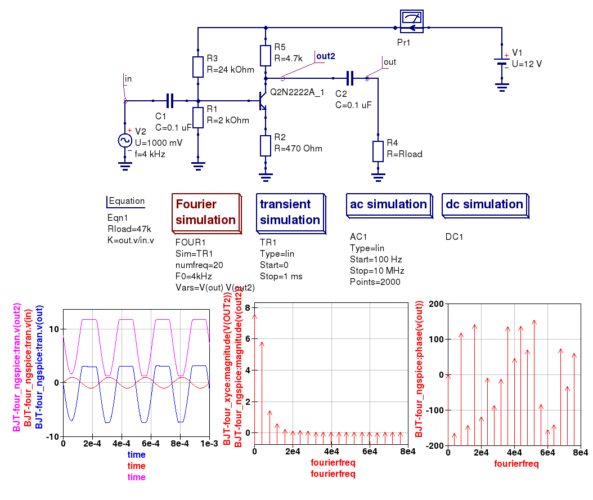

-----------------------------------------------------------
Chapter 5. More advanced circuit simulation techniques.
-----------------------------------------------------------

5.1 Fourier simulation
~~~~~~~~~~~~~~~~~~~~~~

Fourier analysis allows to perform Fourier transform and investigate spectrum 
of different signal. It is available with both Ngspice and Xyce. 
Fourier simulation is available with the special component *"Fourier 
analysis"*. This component is located in *Spice simulations* group. You should 
place it on your schematic. *"Fourier analysis"* component should be attached to 
*Transisent analysis*. Appropriate *Transisent analysis* is specified as the 
first property of *Fourier analysis*. 

Let's consider the properties of *Fourier analysis*

#. ``Sim`` --- appropriate Transient analysis component name
#. ``numfreq`` --- number of harmonics. For Xyce always ``numfreq=10``
#. ``F0`` is fundamental frequency
#. ``Vars`` is a list of output signals. Output signals may be node voltages 
   and currents. They should be space separated. 

Fourier simulation creates four output vectors for each controlled output. For 
example ``v(out)`` is controlled.

#. ``magnitude(v(out))`` --- Magnitude spectrum
#. ``phase(v(out))`` --- Phase spectrum (in degrees--)
#. ``norm(mag(v(out))`` --- Normalized magnitude spectrum
#. ``norm(phase(v(out))`` --- Normalized phase spectrum

You can plot each of these four vectors. 

Here is a small example of Fourier analysis.

|four_EN|
Figure 5.1 Fourier analysis. 

5.2 Distortion simulation
~~~~~~~~~~~~~~~~~~~~~~~~~

*Distortion analysis* provides a small signal distortion analysis of a circuit. 
You need to place special component *Distortion analysis* on schematic. It 
affects similar to *AC analysis* components, but we obtain distortion 
components instead. You should use standard Nutmeg statements to extract 2-nd 
and 3-rd harmonic components. Refer to official Ngspice manual.

*Distortion analysis* is available only with Ngspice. Distortion analysis 
requires special *AC voltage* source component. It could be found in 
*Spice components* group. You need to specify ``DISTOF1`` and/or 
``DISTOF2`` parameter for this component. Refer official Ngspice manual for 
detailed description. Usual Qucs AC source will not work with *Distortion 
analysis*.

Here is an example of Distortion analysis. Please note AC input source 
definition method.

|disto_EN|

Figure 5.2 Distortion analysis

.. |disto_EN| image:: _static/en/chapter5/distoBJT.png

5.3 Noise simulation
~~~~~~~~~~~~~~~~~~~~~~~~~

Noise simulation allows to calculate a total noise in the specified bandwidth. 
Noise simulation creates two vectors:

#. ``onoise_total`` --- integrated output noise
#. ``inoise_total`` --- equivalent input noise

You can plot these vectors. You will obtain a single value for single Noise 
simulation.

First parameters of the *Noise analysis* are bandwidth limits and simulation 
points count. You need to specify two extra parameters for *Noise simulation*

#. ``Output`` --- output parameter name. May be node voltage or current which 
   noise should be analyzed.
#. ``Source`` --- name of the input voltage source. Usual Qucs AC source could 
   be used

|noise_EN|

Figure 5.3 Noise analysis

.. |noise_EN| image:: _static/en/chapter5/noiseBJT.png

5.4 One and two parameter sweep controlled simulations
~~~~~~~~~~~~~~~~~~~~~~~~~~~~~~~~~~~~~~~~~~~~~~~~~~~~~~~

5.5 Qucs and SPICE simulation of device and circuit temperature properties
~~~~~~~~~~~~~~~~~~~~~~~~~~~~~~~~~~~~~~~~~~~~~~~~~~~~~~~~~~~~~~~~~~~~~~~~~~~

   `back to the top <#top>`__

