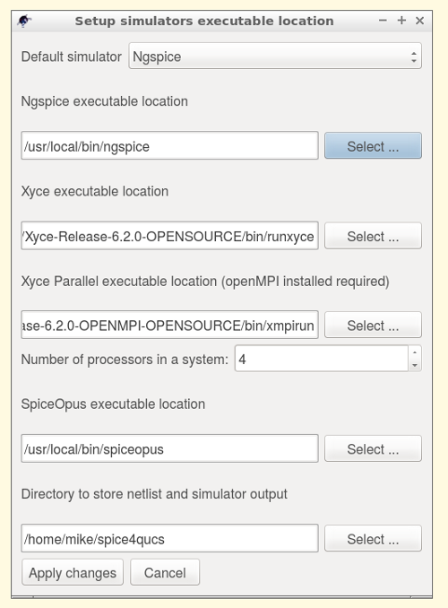
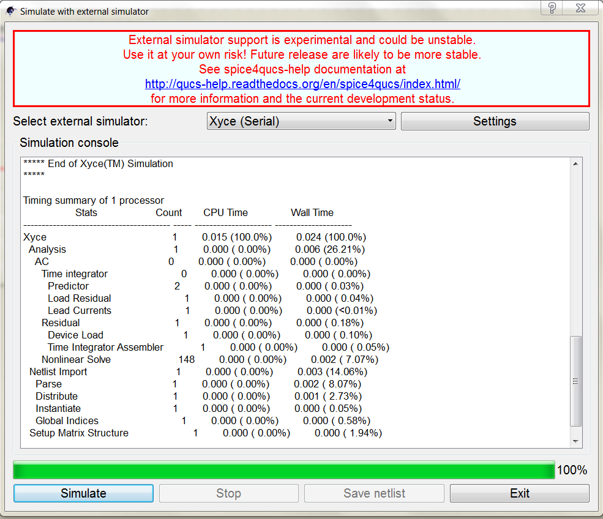

----------------------------------------------------
Chapter 2. Basic Qucs, ngspice and Xyce simulation
----------------------------------------------------

2.1 Introduction
~~~~~~~~~~~~~~~~

This section describes common methods of simulation Qucs schematic with 
external spice-compatible simulator (Ngspice or Xyce). These two simulators 
have built-in support in Qucs via spice4qucs subsystem. These external 
simulators are not embedded in Qucs. At first, you should install them in your 
favorite OS.

2.2 Supported simulators
~~~~~~~~~~~~~~~~~~~~~~~~

Ngspice is a mixed-level/mixed-signal circuit simulator. Its code is based on 
three open source software packages: Spice3f5, Cider1b1 and Xspice. It is one 
of the best spice-based simulator. It allows DC-analysis, analysis in time- and 
frequency domain, fourier-analysis, sensitivity analysis, and advanced 
postprocessing with Ngnutmeg. You can install Ngspice on Linux using packet 
manager for your distributive. You can download Ngspice installer form 
official website: http://ngspice.sourceforge.net/download.html You also can get 
ngspice sources here.

Xyce is an open source, SPICE-compatible, high-performance analog circuit 
simulator, capable of solving extremely large circuit problems by supporting 
large-scale parallel computing platforms. It also supports serial execution on 
all common desktop platforms, and small-scale parallel runs on Unix-like 
systems. Xyce for Linux, Windows, and MacOS could be downloaded from official 
website: https://xyce.sandia.gov/ Xyce parallel package supports only Linux. 
You should install openMPI libraries with your package manager to use Xyce 
parallel. Qucs supports both Xyce-Serial and Xyce-Parallel. 

2.3 General simulation methods
~~~~~~~~~~~~~~~~~~~~~~~~~~~~~~

Let's consider how to simulate your Qucs circuit with external simulator. We 
will use a simple RCL-circuit. You can simulate it with Qucsator.

|RCL_sch_EN|

Figure 1. Test circuit

This schematic contains contains two simulations:

* AC simulation from 1 MHz to 10 MHz. 
* Transient simulation at range from 0 to 1 us;

Let's plot the following outputs:

* Voltage across R1 resistor in frequency domain (``vR`` node);
* Input and output voltages waveforms ( ``vIn`` and ``vR`` nodes );
* Current in frequency domain (``Pr1`` current probe);
* Current waveform (``Pr1``);

You can simulate this schematic using *Simulation->Simulate* .

You can define components properties as for usual Qucs schematics. 
Components values are converted into spice-compatible notation automatically. 
There is no need of manual adaptation. You can execute simulation after all 
components are placed on schematic. It's need to use 
*Simualtion->Simulate with Spice* main menu entry. *External simulator* dialog 
appears (Fig. 2).

|ExtSimDlg_EN|

Figure 2. External simulator dialog. 1 --- simulator selector; 
2 --- simulator settings button; 3 --- Simulate button; 4 --- Save netlist 
button; 

If your simulator is not available in ``$PATH`` you need to select its 
executable location. This step is necessary for Windows and MacOS. You need to 
execute *Simulator settings* dialog (Fig. 3) by pressing button (2).  Here you 
can define simulators executables location. For Xyce Parallel you need to 
define a proper processors number of your system.

|Simset_EN|

Figure 3. *Simulator settings* dialog. 

At first simulate schematic with Ngspice Simulator. Select *Ngspice* and press 
*Simulate* button (Fig. 2). You can see simulation log (Fig. 4).

|ngsp_EN|

Figure 4. Ngspice execution log.

You can only save netlist in file without execution of simulator using 
*Save netlist* button (Fig. 2). Here is netlist for our test schematic:

.. literalinclude:: _static/en/chapter2/netlist.cir
   :language: Bash
   :linenos:
   
   
After simulation is successfully completed, you should close the 
*External simulation* dialog. Now you can drag any diagram right on schematic 
or switch to display page. We will use Cartesian plot. After you place diagram,
*Diagram properties* dialog appears. It's need to select proper dataset now.

|diagr_dlg_EN|

Figure 5. *Diagram properties* dialog. 1 --- dataset selector; 2 --- simulator 
selector;

After the simulation Ngspice produces raw-text spice3f5 output. Qucs converts 
it into Qucs dataset using ``spice4qucs`` subsystem. Results from different 
simulations (for example AC and TRAN) are combined into a single dataset. Qucs 
adds appropriate suffix for each simulator to default dataset name to avoid 
mixing up results from different simulators. For example we have schematic 
named ``RCL.sch`` . We obtain the following three datasets after performing 
simulation with Qucsator (built-in simulator of Qucs), Ngspice and Xyce:

* ``RCL.dat`` --- for Qucsator;
* ``RCL_ngspice.dat`` --- for Ngspice;
* ``RCL_xyce.dat`` --- for Xyce;

You can see that Qucs adds ``_ngspice`` suffix for Ngpsice simulation dataset 
and ``_xyce`` suffix for Xyce simulation dataset. For default dataset no suffix 
is added. 

You can select each of them manually using dataset selector (1) in 
*Diagram properties* dialog (Fig.5). Or you can use simulate selector (2) to 
select appropriate dataset. It's need to select ``RCL_ngspice.dat`` dataset to 
plot Ngspice simulation results. 

After dataset is selected, it's need to select variables to be plot. Qucs 
preserves Spice notation for node voltages names and Current probes names. 
**Node names in Spice are case-insensitive.** Here are two examples:

* ``v(out)`` --- Voltage on ``out`` node;
* ``i(Pr1)`` --- Current of ``Pr1`` current probe;

Qucs adds simulation-dependent prefix (``ac.`` for AC simulation, ``tran.`` for 
transient, ``dc.`` for DC-sweep) to each variable to differentiate variable 
names from each simulation. 

It's need to select by double click ``ac.i(pr1)`` from the variables list 
(arrow on Fig.5) to plot AC current of ``Pr1`` current probe (Fig.1). After 
these operations are performed we can see result output (Fig. 6).

|RCL_ac_EN|

Figure 6. AC simulation result. Magnitude response of current in RCL circuit.

As you can see from Fig.6 RCL-circuit current has resonant peak at 
approximately 8 MHz. Circuit is simulated correctly. 

You need to place another Cartesian diagram and plot ``tran.v(vin)`` and 
``tran.v(vr)`` variables to see voltage waveforms in our RCL-circuit. Results 
are shown in the Figure 7.

|RCL_tran_EN|

Figure 7. Transient simulation result. Voltage waveforms at input and output of 
the RCL circuit.

You can simulate this circuit with Xyce. You need to select *Xyce* (Fig.2) in 
*External simulation* dialog. After pressing *Simulate* button you can see Xyce 
execution log (Fig.8)

|xyce_EN|

Figure 8. Xyce execution result. 

You need to select ``RCL_xyce`` dataset to plot Xyce simulation results 
(Fig.9). Node naming notation is the same as for Ngspice.

|diagr_dlg_xyce_EN|

Figure 9. Xyce simulation results plotting.

Here is transient simulation result for Xyce:

|RCL_tran_xyce_EN|

Figure 10. Transient simulation result for Xyce simulator. 

.. |RCL_sch_EN| image:: _static/en/chapter2/RCL.svg

.. |ExtSimDlg_EN| image:: _static/en/chapter2/Ext_sim_dlg.png

.. |ngsp_EN| image:: _static/en/chapter2/Ngspice_exec.png

.. |RCL_ac_EN| image:: _static/en/chapter2/RCL_ac.svg

.. |RCL_tran_EN| image:: _static/en/chapter2/RCL_tran.svg

.. |diagr_dlg_xyce_EN| image:: _static/en/chapter2/Diagr_dlg_xyce.png

.. |RCL_tran_xyce_EN| image:: _static/en/chapter2/RCL_tran_xyce.svg

2.4 Varible names
~~~~~~~~~~~~~~~~~

In simulation results variables names are converted into from the Qucs 
notation to the Spice notation. Table 2.1 shows how it is performed.

Table 2.1 Qucs and Spice Variables notation.

+--------------------+------------------+------------------+
|  Variable type     |    Qucs notation |  Spice notation  |
+====================+==================+==================+
| DC node voltage    |   Node.V         |   V(node)        |
+--------------------+------------------+------------------+
| AC node voltage    |   Node.v         |   ac.v(node)     |
+--------------------+------------------+------------------+
| TRAN node voltage  |   Node.Vt        |   tran.v(node)   |
+--------------------+------------------+------------------+
| HB node voltage    |   Node.Vb        |   hb.v(node)     |
+--------------------+------------------+------------------+
| DC probe current   |   Pr1.I          |   i(pr1)         |
+--------------------+------------------+------------------+
| AC probe current   |   Pr1.i          |   ac.i(pr1)      |
+--------------------+------------------+------------------+
| TRAN probe current |   Pr1.It         |   tran.i(pr1)    |
+--------------------+------------------+------------------+

2.4 DC
~~~~~~~

Qucs haven't a special analysis type "DC sweep". You should use ``DC analysis`` 
simulation with ``Parameter sweep`` simulation together to get access to DC 
sweep. If Spice netlist builder finds these two connected simulations it 
converts them into ``DC`` spice netlist entry. This example shows how to DC 
sweep with spice4qucs subsystem. It is IV-chart of 1N4148 diode.

|ngspice_DC|

Figure 11. IV-Chart of silicon diode.

You need to take into account the following differences between Spice and Qucs 
DC-sweep analysis. 

* You cannot sweep parameter. You should specify sweep source name or resistor 
name as sweep variable. For example ``R1`` ``V1`` (Fig.11);

* You can sweep model parameter using ``Device.Param`` notation. For example 
you should specify ``T1.Bf`` to sweep ``Bf`` parameter of transistor ``T1`` .

.. |ngspice_DC| image:: _static/en/chapter2/Diode_DC.svg

2.5 AC
~~~~~~~

2.6 TRAN
~~~~~~~~~~

2.7 Other forms of simulation
~~~~~~~~~~~~~~~~~~~~~~~~~~~~~~~

   `back to the top <#top>`__

