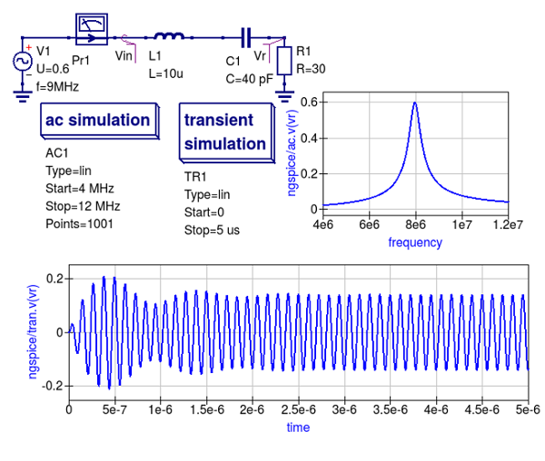
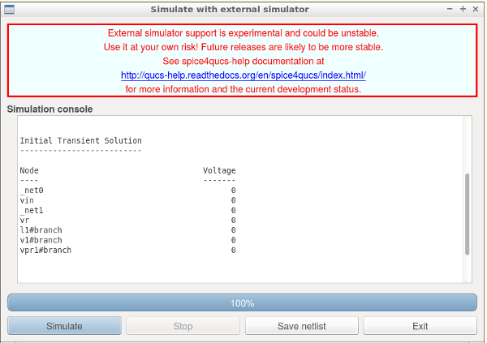
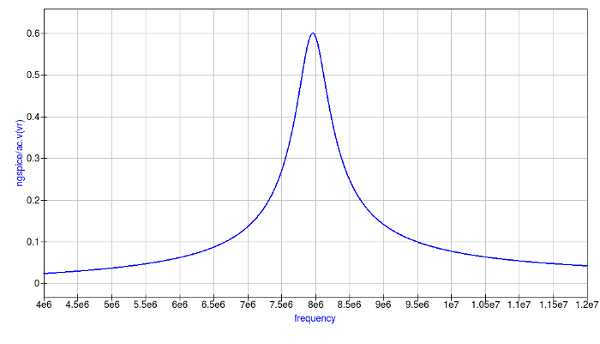
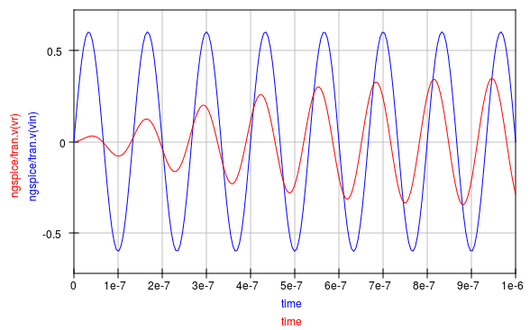
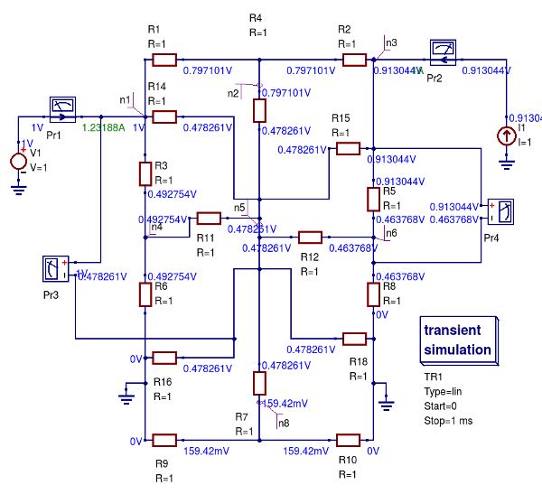
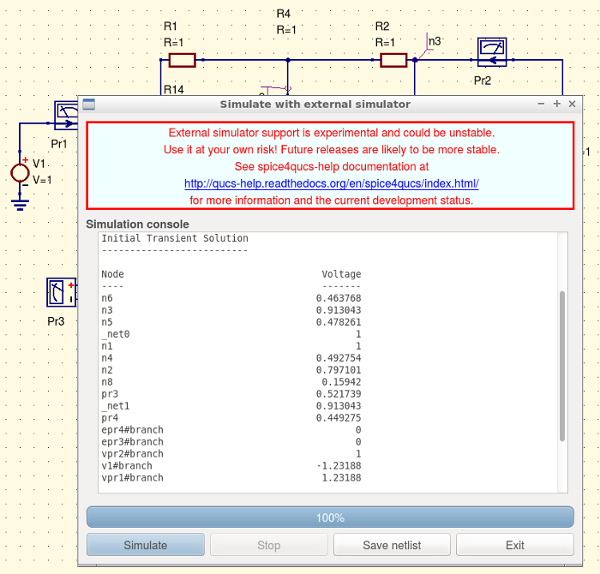

----------------------------------------------------------------
Chapter 2. Basic Qucs, Ngspice, Xyce and SPICE OPUS simulation
----------------------------------------------------------------

2.1 Introduction
~~~~~~~~~~~~~~~~

This section describes a number of fundamental methods for launching circuit simulations from the Qucs GUI  using
the Ngspice, Xyce and SPICE OPUS compatible simulator engines. Spice4qucs includes built-in support for SPICE via a  
subsystem specifically designed for this purpose. 
The Ngspice, Xyce and SPICE OPUS simulators are not embedded in Qucs but operate as independent external simulators. 
Before use with they must be installed on the computer operating system that you are running Qucs. 

2.2 Supported simulators
~~~~~~~~~~~~~~~~~~~~~~~~

Ngspice is a mixed-level/mixed-signal circuit simulator implemented from
three open source software packages: SPICE 3f5, Cider 1b1 and XSPICE. Ngspice is one 
of the most widely used and stable current generation open source SPICE simulators available. 
It implements the original SPICE3f5 simulation capabilities, 
including for example, DC, AC, and transient simulation, Fourier-analysis and sensitivity analysis,
plus a significant number of extra simulation and device model extensions. 
Distributed with Ngspice is a data manipulation package called Ngnutmeg.  This provides advanced  
numerical analysis and visualisation routines for post processing Ngspice simulation data. 
Instructions for installing Ngspice can be found on the Ngspice website at http://ngspice.sourceforge.net/download.html,  
The Ngspice website also gives free access to all the distribution and development package code sources.

Xyce is an open source, SPICE-compatible, high-performance analogue circuit simulator, capable of solving extremely large circuit problems
when implemented on large-scale parallel computing platforms.  
It also supports serial execution on all common desktop platforms, and small-scale parallel execution on Unix-like systems. 
Xyce for Linux, Microsoft Windows, and MacOS can be downloaded from the official Xyce website at https://xyce.sandia.gov/Xyce.
The Xyce parallel circuit simulator running on Linux requires installation of the openMPI libraries.  
Spice4qucs supports both Xyce-Serial and Xyce-Parallel (not currently available for the Microsoft Windows operating system). 

SPICE OPUS is an improved version of SPICE based on the original SPICE 3f5 code with extensions for circuit and device performance
optimization and transient simulation shooting methods for large signal steady state AC analysis.  SPICE OPUS can be downloaded from
its official website at http://www.spiceopus.si/.

Although Ngspice, Xyce and SPICE OPUS are all compatible SPICE simulators they also include extensions to the original SPICE 3f5 netlist syntax
which are often incompatible and may not simulate without causing errors.  The Qucs Team is aware of this limitation and is attempting
to correct such problems as quickly as possible.  Please note this may take some time.  However, if you do identify a compatibility bug please 
inform us by sending in a bug report to the Qucs web site (with an example test schematic if possible) describing the problem you have identified.  

2.3 General simulation methods
~~~~~~~~~~~~~~~~~~~~~~~~~~~~~~

The starting point for understanding how the spice4qucs extensions are built into the Qucs GUI is to study the basic operations 
needed to simulate Qucs circuit schematics with external simulators. 
For this purpose consider the simple RCL circuit shown in Figure 2.1.

|RCL_sch_EN|

Figure 2.1. A simple RCL test circuit for demonstrating a Ngspice, Xyce and SPICE OPUS simulation controlled from Qucs.

This schematic specifies two simulations:

* AC simulation from 4 MHz to 12 MHz. 
* Transient simulation from 0 to 5 us;

Make sure the schematic in Figure 2.1 is drawn correctly then simulate it with qucsator using the sequence *Simulation->Simulate*, or by
pressing key F2. After Qucs finishes the the AC and transient simulations, plot the output data listed below:

* The voltage across R1 resistor in the frequency domain (given by the voltage at the ``Vr`` node ),
* The input and output voltage waveforms (the voltages given by the ``Vin`` and ``Vr`` nodes ) - your plots should be similar to those shown in Figure 2.1,
* The current in the frequency domain (``Pr1`` current probe ),
* The transient current waveform sensed by the current probe ``Pr1``.

Spice4qucs allows schematic component properties to be defined in the same way as Qucs. 
Component values and other icon properties are converted automatically into SPICE compatible netlist format. 
There is no need for manual adaptation by users. 
However, please note that not all the predefined Qucs components are available for simulation with Ngspice, Xyce or SPICE OPUS.   
A number of tables provided in later sections of the text list which components can be used with which simulator.
Following placement and wiring of components, plus the addition of one or more simulation icons, SPICE simulation is 
launched using the Qucs menu sequence  *Simulation* -> *Simulate* or by pressing key F2.  
An  *External simulator* dialogue  then appears.  This is illustrated in Figure 2.2.

|ExtSimDlg_EN|

Figure 2.2. External simulator dialogue: where button *Simulate* launches a circuit simulation, button *Stop* causes a running simulation to finish; button
*Save netlist* generates, and stores, the netlist of the circuit being simulated and button *Exit* closes the external simulator dialogue.

If the Ngspice, Xyce or SPICE OPUS installation directories are not included in the operating system shell ``$PATH`` statement the 
location of their executable code must be registered with spice4qucs before Ngspice Xyce or SPICE OPUS simulations will work. 
This step is necessary for all the operating systems used to run spice4qucs.
To register external circuit simulator installation directories spice4qucs users need to launch the *Select default simulator*, from the *Simulate* dialogue.
The resulting *Setup simulators executable simulator location* dialogue is illustrated in Figure 2.3. Using this dialogue enter the absolute address of the Ngspice, Xyce or SPICE OPUS executable program code 
from the keyboard or by pressing the appropriate *Open File Select button*..
In the case of the Xyce Parallel simulator the number of processors installed in your computer system, 
must also be entered from the keyboard or selected using the dialogue up-down arrow controls.

|Simset_EN|

Figure 2.3. *Setup simulator executable locations* dialogue. 

Please note the Xyce parallel command line for binary Xyce-Parallel package has the following 
format:

``<Path_to_xyce_executable>/xmpirun -np %p``

Where spice4qucs substitutes the number of processors for the ``%p`` wildcard entry.

Also please note that "user builds" of Xyce-Parallel have no ``xmpirun`` script, implying that the full script must be 
completed by users during the external simulators set up process, for example if ``opeMPI`` is installed in directory 
``/usr/bin`` and Xyce-Parallel installed in  ``/usr/local/Xyce_Parallel`` the command  line will be:

``/usr/bin/mpirun -np %p /usr/local/Xyce_Parallel/bin/Xyce``

Spice4qucs users can also define a directory where temporary simulator data and netlists are stored: this simulator working directory is by default assumed to be at ``$HOME/.qucs/spice4qucs``.

To simulate a Qucs schematic with the Ngspice simulator, select simulator *Ngspice* and press the *Simulate* button shown in Figure 2.2. 
During simulation Ngspice produces a simulation log.
This is displayed in the *External simulator* dialog window, see Figure 2.4.  
The Qucs Log text is also saved at Qucs system Log location ``$HOME/.qucs/log.txt``. 
The Log text can be viewed and using the drop down menue sequence *Simulation->Show last messages* (or by pressing key  ``F5``).
If the Ngspice simulation fails, any errors reported by Ngspice during simulation are listed in simulation Log window.
Similarly, a successful completion of a Qucs/Ngspice simulation is reported.

|ngsp_EN|

Figure 2.4. A section of an Ngspice execution Log displayed in the *Simulate with an external simulator* dialogue window.

An novel feature introduced by spice4qucs is its ability to generate and save SPICE netlist files from the information
contained in a Qucs schematic. To save the SPICE netlist file for the current simulation press the *Save netlist* button shown in Figure 2.2.
This process causes a SPICE netlist to be saved as file "netlist.cir" in the ~/.qucs/spice4qucs directory.
Here is the generated netlist for the RCL test example:

.. literalinclude:: _static/en/chapter2/netlist.cir
   :language: Bash
   :linenos:
   
The simulation sequence introduced in the previous sections of the spice4qucs-help text also applies to the Xyce and SPICE OPUS simulators.
However, the information displayed in the simulation log is likely to be different for different simulators and indeed operating systems.
  
After an Ngspice, Xyce or SPICE OPUS simulation has successfully completed close the *External simulation* dialogue by pressing the "Exit" button.
The simulation data generated by a spice4qucs simulation is available for plotting using the normal Qucs visualisation routines: either drag a diagram icon, or table icon, onto the current
Qucs schematic window or onto the associated Qucs display page.
After a diagram or table is placed a *Diagram properties* dialog appears. 
On selecting the dataset for the current simulation the simulation output quantities become available for plotting or tabulating in a similar fashion to standard Qucs.

|diagr_dlg_EN|

Figure 2.5. *Diagram properties* dialogue, listing the selected simulator and the available simulation data names.

Ngspice, Xyce and SPICE OPUS simulation data output is in raw-binary SPICE 3f5 output format. 
Qucs converts the SPICE 3f5 style data into a Qucs dataset using routines provided in the spice4qucs Qucs subsystem. 
Results from different types of simulation, for example SPICE AC and TRAN, are combined into a single Qucs dataset. 
Qucs adds an appropriate suffix to each simulator dataset name in order to avoid name clashes and mixing up results from different types of simulation.
In the RCL test example the Qucs schematic is named ``RCL.sch``. Qucs qucsator simulation, Ngspice, Xyce and SPICE OPUS simulations result in three different datasets:

* ``RCL.dat``         --- for Qucsator;
* ``RCL.dat.ngspice`` --- for Ngspice;
* ``RCL.dat.xyce``    --- for Xyce;
* ``RCL.dat.spopus``  --- for SPICE OPUS;

All four datasets have an extension ``dat`` to signify that each set contains Qucs data for post simulation visualisation.
The Ngspice, Xyce and SPICE OPUS datasets include second a extension to the file name to identify the name of the external Qucs simulator. 

The Dataset selector (see Figure 2.5) shows only the base names of a dataset (for example ``test_RC``). 
Users must also select the appropriate simulator from the *simulator name selector* drop-down list. 
This drop-down only gives existing simulator datasets which prevents users from selecting non-existent datasets by mistake.

Following the selection of a specific data set users must select the variables that are to be plotted. 
Spice4qucs preserves SPICE notation for **node voltage** names and **current probe** names. 
SPICE names are assumed to be case insensitive by spice4qucs, for example

* ``v(out)`` --- Voltage at node ``out``;
* ``i(Pr1)`` --- Current recorded by current probe ``Pr1``;

The Qucs spice4qucs extension also adds a simulation-dependent prefix to each variable name in order to differentiate output variables from different SPICE simulations, 
for example ``ac.`` for AC simulation, ``tran.`` for transient simulation, and  ``dc.`` for DC-sweep. 

There are also individual prefixes for each simulator:

* ``ngspice/`` ---  Ngspice simulator prefix;
* ``xyce/``    ---  Xyce simulator prefix;
* ``spopus/``  ---  SPICE OPUS prefix;

Hence for example, the full name of variable from an Ngspice simulation could be ``ngspice/v(out)``
This naming system helps to avoid dataset name conflicts. 

Individual items for plotting are selected by double clicking on a name in the variable list. As an example when double clicking on ``ac.i(pr1)`` its 
name is copied by Qucs into the right-hand plotting window.  
Like standard Qucs one or more variable items may be selected for plotting on the same 2D or 3D graph. 
Finally pressing the *Apply* button shown at the bottom of Figure 2.5. causes the selected variable items to be plotted. 
The plotted simulation results for the external Ngspice AC simulation of the RCL test circuit are shown in Figure 2.6.

|RCL_ac_EN|

Figure 2.6.  External SPICE AC simulation magnitude response for the current flowing in RCL circuit with a series resonant peak of roughly 8 MHz .

Plotting the transient simulation data for the RCL test example follows the same procedure as the sequence described for the AC simulation except that in the transient plot
variables with ``tran`` in their name are selected, see Figure 2.7.

|RCL_tran_EN|

Figure 2.7. Transient simulation voltage waveforms at the input and output nodes of the RCL circuit.

A similar proceedure is adopted for plotting simulation data generated with the Xyce and SPICE OPUS simulators.  Readers should
make sure they can simulate the example RCL circuit with both Xyce and SPICE opus, then plot the resulting simulation data.  More advanced
techniques for post processing, plotting and undertaking a range of different visualization processes using Qucs and Octave are outlined in chapter 7.

..  |imageQ_EN| image::   _static/en/Qucs.png

..  |Simset_EN| image::  _static/en/chapter2/Simsett.png

..  |ngsp_EN| image::  _static/en/chapter2/Ngspice_exec.png

..  |diagr_dlg_EN| image::  _static/en/chapter2/Diagr_dlg.png

2.4 Variable names
~~~~~~~~~~~~~~~~~~~~~

As part of the spice4qucs extensions Ngspice and Xyce simulation variable names are converted from Qucs 
notation to SPICE notation and vica versa. Table 2.1 shows the correspondence between the two notations.

Table 2.1 Qucs and SPICE Variable equivalence

+--------------------+------------------+------------------+
|  Variable type     |    Qucs notation |  Spice notation  |
+====================+==================+==================+
| DC node voltage    |   Node.V         |   V(node)        |
+--------------------+------------------+------------------+
| AC node voltage    |   Node.v         |   ac.v(node)     |
+--------------------+------------------+------------------+
| TRAN node voltage  |   Node.Vt        |   tran.v(node)   |
+--------------------+------------------+------------------+
| HB node voltage    |   Node.Vb        |   hb.v(node)     |
+--------------------+------------------+------------------+
| DC probe current   |   Pr1.I          |   i(pr1)         |
+--------------------+------------------+------------------+
| AC probe current   |   Pr1.i          |   ac.i(pr1)      |
+--------------------+------------------+------------------+
| TRAN probe current |   Pr1.It         |   tran.i(pr1)    |
+--------------------+------------------+------------------+

Also variable prefixes used to designate data from different simulators (Table 
2.2)

Table 2.2 Qucs and SPICE Variable name prefixes

+----------------------------------+-----------------------------------------+
| Prefix                           |   Explanation                           |
+==================================+=========================================+
| ``Node.Vt``                      |  Qucs simulation, default dataset       |
+----------------------------------+-----------------------------------------+
| ``dataset:Node.Vt``              |  Qucs simulation, external dataset      |
+----------------------------------+-----------------------------------------+
| ``ngspice/tran.v(node)``         |  Ngspice simulation, default dataset    |
+----------------------------------+-----------------------------------------+
| ``ngspice/dataset:tran.v(node)`` |  Ngspice simulation, external dataset   |
+----------------------------------+-----------------------------------------+
| ``xyce/tran.v(node)``            |  Xyce simulation, default dataset       |
+----------------------------------+-----------------------------------------+
| ``xyce/dataset:tran.v(node)``    |  Xyce simulation, external dataset      |
+----------------------------------+-----------------------------------------+
| ``spopus/tran.v(node)``          |  SPICE OPUS simulation, default dataset |
+----------------------------------+-----------------------------------------+
| ``spopus/dataset:tran.v(node)``  |  SPICE OPUS simulation, external dataset|
+----------------------------------+-----------------------------------------+

2.5 DC simulation
~~~~~~~~~~~~~~~~~~~~~~~~

Conventional SPICE 3f5 simulation commands OP and DC are not implemented by Qucs or indeed by spice4qucs.
Instead more convenient versions of these simulation commands are implemented.  These alternative forms
of non-linear steady state DC circuit analysis are linked directly to circuit schematic capture, making them
easy to use.  Moreover, they provide spice4qucs users with a power full diagnostic and analysis tools for investigating
basic circuit operation. The circuit shown in Figure 2.8 represents a simple resistive network with single voltage and current
1 V and 1 A sources respectively. Pressing key "F8" instigates a DC analysis and adds the DC node voltages, probe voltages and probe
currents to the current schematic. This feature provides a practical method for scanning a circuit to see if the DC bias values
are of the correct order of magnitude. Schematics which include the spice4qucs DC icon do not however, list a similar set of voltage
and currents in the *Simulate with an external Simulator" dialogue window. A DC voltage and current list is output when a schematic includes
a transient simulation icon, see Figure 2.9.

|DC_list|

Figure 2.8 A simple linear resistive electrical network driven by single DC voltage and current sources: DC node voltages (V) and voltage
probe values (V) are illustrated in blue and current probe values (A) in green.

|tran_DC_list|

Figure 2.9 A screen dump showing transient simulation initial DC simulation voltage and current values in (V) and (A) respectively
for the resistive circuit given in Figure 2.8: NOTE that the voltage and current variable names are output in SPICE style syntax.
 
Qucs does not define a separate analysis type which is equivalent to the original SPICE 2g6 "DC sweep" simulation or the extended
SPICE 3f5 version which allows current and voltage source scans plus resistor value scans.  In contrast to SPICE the  
Qucs equivalent "DC sweep" is just a specific case of the more general Qucs ``Parameter sweep`` capability.
To emulate the original SPICE `DC sweep`` spice4qucs use a combination of  Qucs DC simulation plus the
``Parameter sweep`` of an independent DC voltage or DC current source or of a resistor numerical value;
when the spice4qucs Spice netlist builder finds these two linked types of simulation it synthesises them into a ``DC`` SPICE netlist entry. 
This procedure is demonstrated in Figure 2.10. where  the test circuit consists of a diode DC bias network connected as a test bench for 
simulating the non-linear DC current-voltage characteristic of a 1N4148 diode. This example can be found in the Qucs examples directory tree 
listed as ``examples\ngspice\diode.sch`` .

|ngspice_DC|

Figure 2.10. Test circuit and simulated DC current-voltage characteristics for a 1N4148 silicon diode.

PLease note the following differences between SPICE and Qucs DC-sweep simulation: 

* Specify a sweep source name or a resistor name **NOT** a source or resistor value; for example in Figure 2.10  ``V1``.

* SPICE model parameters can be swept using the notation ``Device.Param``, for example  ``T1.Bf`` to sweep the ``Bf`` parameter of transistor ``T1``.

..  |ngspice_DC|  image::  _static/en/chapter2/Diode_DC.svg

2.6 AC simulation
~~~~~~~~~~~~~~~~~~~

Small signal AC simulation is fully supported by the *spice4qucs* subsystem. It doesn't require any special adaptation. Just simple place the ``AC simulation`` component icon on a 
schematic and execute an Ngspice, Xyce or SPICE OPUS simulation. Variable name conversions are listed in Table 2.1. The Qucs *spice4qucs* dataset builder adds the ``ac.`` prefix to all variables generated by 
an AC simulation. 

Ngspice, Xyce and SPICE OPUS small signal frequency domain AC simulations use linear, decade or octave frequency scales. Adaptive frequency steps are not implemented. 

2.7 TRANsient simulation
~~~~~~~~~~~~~~~~~~~~~~~~~

Transient simulation is also fully supported by the *spice4qucs* subsystem. Just place the ``Transient simulation`` component icon on a schematic and simulate it. 
There is a difference between the way the qucsator, Ngspice, Xyce and SPICE OPUS simulators implement transient simulation time steps.

Qucsator always uses a fixed time step. Ngspice, Xyce and SPICE OPUS use adaptive time steps. 
The number of simulation points output during a simulation will only be approximately equal to the number of simulation points specified in a ``Transient simulation`` properties list.  
For example, in an example test circuit 200 time points are specified on the schematic. However, due to the fact that the SPICE simulators use adaptive time steps, Ngspice employs 213 simulation points, 
and Xyce employs 799 time points. This difference should be taken into account during simulation data post processing and when comparing simulation results. 

2.8 Other forms of simulation
~~~~~~~~~~~~~~~~~~~~~~~~~~~~~~~

In contrast to SPICE 3f5, the parameter sweep facility found in Qucs has also been implemented with Ngspice, Xyce and SPICE OPUS where the parameter sweep setup and control
is organized by spice4qucs. The details of how the spice4qucs Parameter sweep feature works is the topic of section 5.8.

As well as the fundamental DC, AC and transient simulation types, Ngspice, Xyce and SPICE OPUS also support the additional forms of simulation listed in Table 2.3.

Table 2.3  Spice4qucs simulation types additional to DC, AC and TRAN
  
+-------------------------+----------+--------+--------------+---------------+
| Simulation   Type       |  Ngspice |  Xyce  |  SPICE OPUS  |  See section  |
+=========================+==========+========+==============+===============+
| Fourier                 |    X     |   X    |      X       |     5.1       |
+-------------------------+----------+--------+--------------+---------------+
| Distortion              |    X     |        |      X       |     5.2       |
+-------------------------+----------+--------+--------------+---------------+
| Noise                   |    X     |   X    |      X       |     5.3       |
+-------------------------+----------+--------+--------------+---------------+
| Pole-zero               |    X     |        |      X       |     5.4       |
+-------------------------+----------+--------+--------------+---------------+
| Sensitivity             |    X     |   X    |      X       |     5.5       |
+-------------------------+----------+--------+--------------+---------------+
| Harmonic Balance        |          |   X    |              |    13.5       |
+-------------------------+----------+--------+--------------+---------------+
| Tran shooting method    |          |        |      X       |    13.7       |
+-------------------------+----------+--------+--------------+---------------+
| Custom simulation       |    X     |        |      X       |     8.0       |
+-------------------------+----------+--------+--------------+---------------+

Fourier, distortion pole-zero circuit simulation require special GUI icons. These can be found in the Qucs *Spice simulations* group. 
In contrast sensitivity, the SPICE OPUS tran shooting method is accessed by spice4qucs via the Custom simulation technique, see section 8.0. 

2.9 Spice4qucs circuit simulation components
~~~~~~~~~~~~~~~~~~~~~~~~~~~~~~~~~~~~~~~~~~~~~~~

Qucs is released with a good selection of passive and active component models.  This selection includes both fundamental circuit components, like R, C and L and
collections of specific components for a given circuit design sector, like the RF microstrip component models.  All the original Qucs component and device models were written
to work with Qucs and there is **NO Guarantee** that they will be work with Ngspice, Xyce or SPICE OPUS. For circuit simulation packages which take advantage of simulation multi-engines
this can be a serious problem, particularly for the less experienced user.  To help reduce problems to a minimum, spice4qucs uses a policy of "blacklisting" those
models which do not work with the chosen circuit simulation engine. This policy works in the following way:- when a specific simulator is chosen by a Qucs spice4qucs user, on running
the chosen simulator, **ONLY** those models which work with the selected simulator become available for drawing circuit schematics and simulation.  
The same approach applies to the components held in the spice4qucs libraries.

2.10 More basic simulation examples
~~~~~~~~~~~~~~~~~~~~~~~~~~~~~~~~~~~~~

   `back to the top <#top>`__

