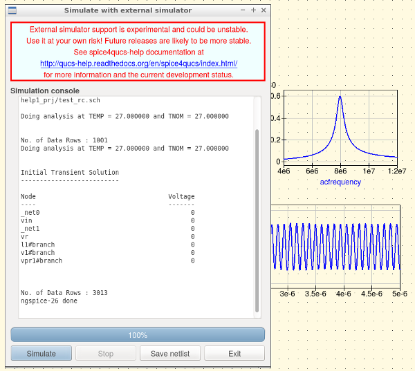
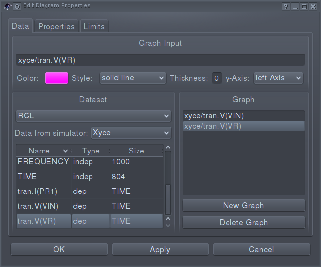
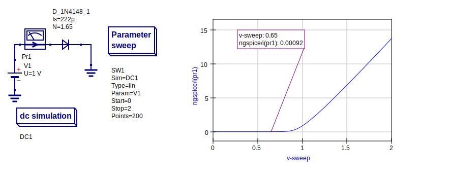

|imageQ_EN|

----------------------------------------------------
Chapter 2. Basic Qucs, ngspice and Xyce simulation
----------------------------------------------------

2.1 Introduction
~~~~~~~~~~~~~~~~

This section describes a number of fundamental methods for launching circuit simulations from the Qucs GUI schematics using
the ngspice and Xyce SPICE  compatible simulator engines. Spice4qucs includes built-in support for SPICE via a spice4qucs 
subsystem specifically designed for this purpose. 
The ngspice and Xyce simulators are not embedded in Qucs but operate as independent external simulators. 
Before use with Qucs both ngspice and Xyce must be installed on the computer operating system that you are running Qucs. 

2.2 Supported simulators
~~~~~~~~~~~~~~~~~~~~~~~~

Ngspice is a mixed-level/mixed-signal circuit simulator implemented from
three open source software packages: SPICE 3f5, Cider 1b1 and XSPICE. Ngspice is one 
of the most widely used and stable current generation open source SPICE simulators available. 
It implements the original SPICE3f5 simulation capabilities, 
including for example, DC, AC, and transient simulation, Fourier-analysis and sensitivity analysis,
plus a significant number of extra simulation and device model extensions. 
Distributed with ngspice is a data manipulation package called ngnutmeg.  This provides advanced  
numerical analysis and visualisation routines for post processing ngspice simulation data. 
Instructions for installing ngspice can be found on the ngspice website at http://ngspice.sourceforge.net/download.html,  
The ngspice website also gives free access to all the distribution and development package code sources.

Xyce is an open source, SPICE-compatible, high-performance analogue circuit  simulator, capable of solving extremely large circuit problems
on large-scale parallel computing platforms.  
It also supports serial execution on all common desktop platforms, and small-scale parallel execution on Unix-like systems. 
Xyce for Linux, Microsoft Windows , and MacOS can be downloaded from the official Xyce website at https://xyce.sandia.gov/Xyce.
The Xyce parallel circuit simulator running on Linux requires installation of the openMPI libraries.  
Spice4qucs supports both Xyce-Serial and Xyce-Parallel (not currently available for the Microsoft Windows  operating system). 

2.3 General simulation methods
~~~~~~~~~~~~~~~~~~~~~~~~~~~~~~

The starting point for understanding how the spice4qucs extensions are built into the Qucs GUI is the basic operations 
needed to simulate Qucs circuit schematics with external simulators. 
For this purpose consider the simple RCL circuit shown in Figure 2.1. This 
schematic example could be found in examples tree 
of Qucs here: ``examples\ngspice\RCL.sch`` .

|RCL_sch_EN|

Figure 2.1. A simple RCL test circuit for demonstrating a ngspice or Xyce 
simulation controlled from Qucs.

This schematic specifies two simulations:

* AC simulation from 1 MHz to 10 MHz. 
* Transient simulation from 0 to 1 us;

To make sure the schematic in Figure 2.1 is drawn correctly simulate it with 
qucsator using the sequence *Simulation->Simulate*.
After Qucs completes the simulation plot the output data listed below:

* Voltage across R1 resistor in the frequency domain (``vR`` node );
* Input and output voltage waveforms ( ``vIn`` and ``vR`` nodes );
* Current in the frequency domain (``Pr1`` current probe );
* Current waveform (``Pr1``);

Spice4qucs allows schematic component properties to be defined in the same way as Qucs. 
Components values are converted automatically into SPICE compatible netlist format. 
There is no need for manual adaptation by users. 
However, please note that not all the predefined Qucs components are available for simulation with ngspice or Xyce.  
A number of tables provided in later sections of the text list which components can be used with which simulator.
Following placement and wiring of components, plus the addition of one or more simulation icons, SPICE simulation is 
launched using the Qucs menu sequence  *Simulation* -> *Simulate with Spice*.  
An  *External simulator* dialog  then appears. 
This dialog is illustrated in Figure 2.2.

|ExtSimDlg_EN|

Figure 2.2. External simulator dialog: where (1) is the simulator selector 
button; (2) is the simulator settings button; 
(3) is the Simulate button, and (4) is the Save netlist button.

If the directories where the ngspice or Xyce simulators are installed are not included in the operating system shell ``$PATH`` statement the 
location of their executable code must be entered, before any ngspice or Xyce simulations can take place, by Qucs users. 
This step is necessary for Windows and the MacOS operating systems.
In such cases Qucs users need to execute the *Simulator settings* dialog, Figure 
2.3, by pressing the button labelled (2) in Figure 2.2. 
This allows the address of the ngspice or Xyce executable code to be entered 
from the keyboard or by pressing the appropriate *Open File Select button*..
In the case of the Xyce Parallel simulator the number of processors installed in your computer system, 
must also be entered from the keyboard or selected using the up-down arrow controls.

|Simset_EN|

Figure 2.3. *Setup simulator executable locations* dialog. 

To simulate a Qucs schematic with the ngspice simulator, select simulator *ngspice* and press 
the *Simulate* button shown in Figure 2.2. During simulation ngspice produces a 
simulation log.
This is displayed in the *External simulator* dialog window, see Figure 2.4.  
If the ngspice simulation fails, any errors reported by ngspice during simulation are listed in simulation log window.
Similarly, successful completion of a Qucs/ngspice simulation is reported.

|ngsp_EN|

Figure 2.4. A section of an ngspice execution log displayed in the *Simulate with an external simulator* dialog window.

An novel feature introduced by spice4qucs is its ability to generate and save SPICE netlist files from the information
contained in a Qucs schematic. To save the SPICE netlist file for the current 
simulation press the *Save netlist* button labelled (4) in Figure 2.2.
Pressing button (4) causes a SPICE netlist to be saved as file netlist.cir in the ~/.qucs/spice4qucs directory.
Here is the generated netlist for the RCL test example:

.. literalinclude:: _static/en/chapter2/netlist.cir
   :language: Bash
   :linenos:
   
   
After an ngspice or Xyce simulation has successfully completed close the *External simulation* dialog.
The simulation data generated is available for plotting by using the
normal Qucs visualisation routines: either drag a diagram icon, or table icon, onto the current
Qucs schematic  window or onto the associated Qucs display page.
After a diagram or table is placed a *Diagram properties* dialog appears. 
On selecting the dataset for the current simulation the simulation output quantities
become available for plotting or tabulating in a similar fashion to standard Qucs.

|diagr_dlg_EN|

Figure 2.5. *Diagram properties* dialog: where (1) is the dataset selector 
button; (2) is the simulator selector button.

Ngspice simulation data output is in raw-text SPICE 3f5 output format. 
Qucs converts the SPICE 3f5 style data into a Qucs dataset using routines provided in the ``spice4qucs`` Qucs subsystem. 
Results from different types of simulation, for example SPICE AC and TRAN, are combined into a single Qucs dataset. 
Qucs adds an appropriate suffix to each simulator dataset name in order to avoid name clashes and mixing up results from different types of simulation.
In the RCL test example the Qucs schematic is named ``RCL.sch``. Qucs qucsator simulation, ngspice and Xyce simulations result in three different datasets:

* ``RCL.dat`` --- for qucsator;
* ``RCL_ngspice.dat`` --- for ngspice;
* ``RCL_xyce.dat`` --- for Xyce;

All three datasets have an extension ``dat`` to signify that the data set contains Qucs data for post  simulation visualisation.
The ngspice and Xyce datasets include an intermediate section to the file name which identifies th name of the external Qucs simulator. 

The dataset selector button, (1) in Figure 2.5., allows each data set to be 
chosen manually from the *Diagram properties* dialog.
It is also possible to use the *simulator name selector* button labelled (2) in 
Figure 2.5. to  select an appropriate dataset. 

After a dataset has been selected users must select the variables that are to be plot. 
Qucs preserves Spice notation for **node voltage** names and **current probe** names. 
SPICE names are assumed to be case insensitive with spic4qucs, for example

* ``v(out)`` --- Voltage at node ``out``;
* ``i(Pr1)`` --- Current recorded by current probe ``Pr1``;

The Qucs spice4qucs extension also adds a simulation-dependent prefix to each variable name in order to differentiate output variables from different SPICE simulations, 
for example ``ac.`` for AC simulation, ``tran.`` for transient simulation, and  ``dc.`` for DC-sweep. 

Individual items for plotting are selected by double clicking on a name in the variable list. As an example when double clicking on ``ac.i(pr1)`` its 
name is copied by Qucs into the right-hand plotting window. This action is 
marked in Figure 2.5. by the white arrow. Like standard Qucs one or more 
variable
items may be selected for plotting on the same 2D or 3D graph. 
Finally pressing the *Apply* button shown at the bottom of Figure 2.5. causes 
the selected variable items to be plotted. 
The plotted simulation results for the external ngspice AC simulation of the RCL 
test circuit are shown in Figure 2.6.

|RCL_ac_EN|

Figure 2.6.  External SPICE AC simulation magnitude response for the current 
flowing in RCL circuit with a series resonant peak of roughly 8 MHz .

Plotting the transient simulation data for the RCL test example follows the same procedure as the sequence described for the AC simulation except that in the transient plot
variables with ``tran`` in their name are selected, see Figure 2.7.

|RCL_tran_EN|

Figure 2.7. Transient simulation voltage waveforms at the input and output 
nodes of the RCL circuit.

The RCL test circuit can also be simulated with Xyce, simply select *Xyce* in 
the *External simulation* dialog then press the *Simulate* button, see Figure 
2.2.
The Xyce  simulation execution log can also be displayed, see Figure 2.8.

|xyce_EN|

Figure 2.8. A section of an Xyce execution log displayed in the *External 
Simulate* dialog window. 

To plot the Xyce RCL simulation data first select dataset ``RCL_xyce``, see 
Figure 2.9. 

|diagr_dlg_xyce_EN|

Figure 2.9. Xyce *Edit Diagram Properties* window.

Next select the variables for plotting.
Here is transient simulation result for Xyce:

|RCL_tran_xyce_EN|

Figure 2.10. Xyce Transient simulation plotted waveforms for the RCL test 
example. 

..  |imageQ_EN| image::   _static/en/Qucs.png

..  |RCL_sch_EN| image::  _static/en/chapter2/RCL.svg

..  |ExtSimDlg_EN| image::  _static/en/chapter2/Ext_sim_dlg.png

..  |Simset_EN| image::  _static/en/chapter2/Simsett.png

..  |diagr_dlg_EN| image::  _static/en/chapter2/Diagr_dlg.png

..  |RCL_ac_EN| image::  _static/en/chapter2/RCL_ac.svg

..  |RCL_tran_EN| image:: _static/en/chapter2/RCL_tran.svg

..  |xyce_EN|  image:: _static/en/chapter2/Xyce_exec.png

..  |RCL_tran_xyce_EN| image:: _static/en/chapter2/RCL_tran_xyce.svg

2.4 Variable names
~~~~~~~~~~~~~~~~~~~~~

As part of the spice4qucs extensions ngspice and Xyce simulation variable names are converted from Qucs 
notation to SPICE notation and vica versa. Table 2.1 shows the correspondence between the two notations.

Table 2.1 Qucs and SPICE Variable equivalence

+--------------------+------------------+------------------+
|  Variable type     |    Qucs notation |  Spice notation  |
+====================+==================+==================+
| DC node voltage    |   Node.V         |   V(node)        |
+--------------------+------------------+------------------+
| AC node voltage    |   Node.v         |   ac.v(node)     |
+--------------------+------------------+------------------+
| TRAN node voltage  |   Node.Vt        |   tran.v(node)   |
+--------------------+------------------+------------------+
| HB node voltage    |   Node.Vb        |   hb.v(node)     |
+--------------------+------------------+------------------+
| DC probe current   |   Pr1.I          |   i(pr1)         |
+--------------------+------------------+------------------+
| AC probe current   |   Pr1.i          |   ac.i(pr1)      |
+--------------------+------------------+------------------+
| TRAN probe current |   Pr1.It         |   tran.i(pr1)    |
+--------------------+------------------+------------------+

2.4 SPICE DC simulation
~~~~~~~~~~~~~~~~~~~~~~~~

Qucs does not define a separate analysis type which is equivalent to SPICE "DC sweep" simulation 
Qucs "DC sweep" is just a specific case of the more general Qucs ``Parameter sweep`` capability.
To emulate the SPICE `DC sweep`` use a combination of a Qucs DC simulation plus the
``Parameter sweep`` of an independent DC voltage or DC current source or of a resistor.
When the spice4qucs Spice netlist builder finds these two connected types of simulation it 
converts them into a ``DC`` SPICE netlist entry. 
This procedure is demonstrated in Figure 2.11. where  the test circuit consists 
of a diode DC bias network
connected as a test bench for simulating the DC current- voltage characteristic 
of a 1N4148 diode. This example can be found in the Qucs examples directory tree listed as ``examples\ngspice\diode.sch`` .

|ngspice_DC|

Figure 2.11. Test circuit and simulated DC current-voltage characteristics for a 1N4148 silicon diode.

PLease note the following differences between SPICE and Qucs DC-sweep simulation. 

* For SPICE DC-sweep: specify a sweep source name or a resistor name NOT a source or resistor value, for example ``R1`` or  ``V1``, see ``V1`` in Figure 2.11.

* For SPICE DC-sweep: SPICE model parameters can be swept using the notation ``Device.Param``, for example  ``T1.Bf`` to sweep the ``Bf`` parameter of transistor ``T1``.

2.5 AC
~~~~~~~

Small signal AC simulation is fully supported by the *spice4qucs* subsystem. It doesn't require 
any special adaptation. Just simple place the ``AC simulation`` component icon on a 
schematic and execute an ngspice or Xyce simulation. Variable name conversions are 
listed in Table 2.1. The Qucs *spice4qucs* dataset builder adds the ``ac.`` prefix to all variables generated by 
an AC simulation. 

Ngspice and Xyce small signal frequency domain AC simulations use linear, decade or octave frequency scales. Adaptive frequency steps are not implemented. 

2.6 TRAN
~~~~~~~~~~

Transient simulation is also fully supported by the *spice4qucs* subsystem. Just 
place the ``Transient simulation`` component icon on a schematic and simulate it. 
There is a difference between the way the qucsator, ngspice and Xyce simulators implement transient simulation time steps.

Qucsator always uses fixed time steps. Ngspice and Xyce use adaptive time steps. 
The number of simulation points output during a simulation will only be approximately equal to the number of simulation points 
specified in a ``Transient simulation`` properties list.  For example, in the 
test circuit illustrated in Figure 2.11 there are 200 time points specified on the schematic. However, due to 
the fact that the SPICE simulators use adaptive time steps, ngspice employs 213 simulation points, and Xyce 
employs 799 time points. This difference should be taken into account during simulation data post processing and when comparing simulation results. 

2.7 Other forms of simulation
~~~~~~~~~~~~~~~~~~~~~~~~~~~~~~~

In contrast to SPICE 3f5 the parameter sweep feature found in Qucs is allowed in ngspice and xyce simulations when setup and controlled by *spice4qucs*. 
The details of how the *spice4qucs* Parameter sweep feature works is the topic of Section 5.2.

Xyce supports Harmonic balance simulation. It is introduced and described in the Section 8.5. 

Ngspice also supports the following additional simulations:

* Fourier analysis
* Sensitivity analysis 
* Distortion analysis
* Sensitivity analysis
* Noise analysis

These types of circuit simulation are implemented with *spice4qucs* using the special *Custom simulation* technique presented in Chapter 9 of this document. 

   `back to the top <#top>`__

