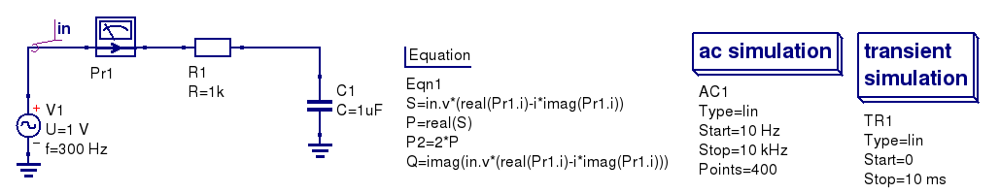
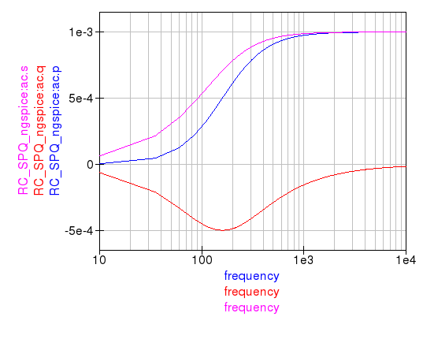
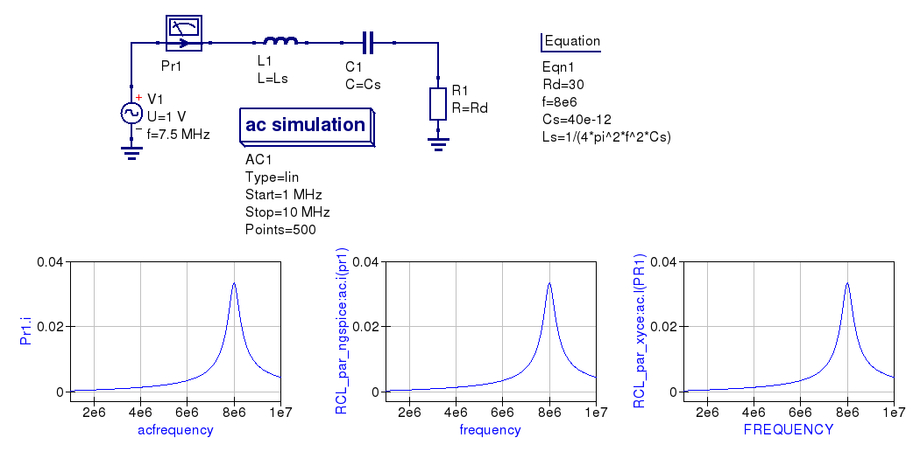
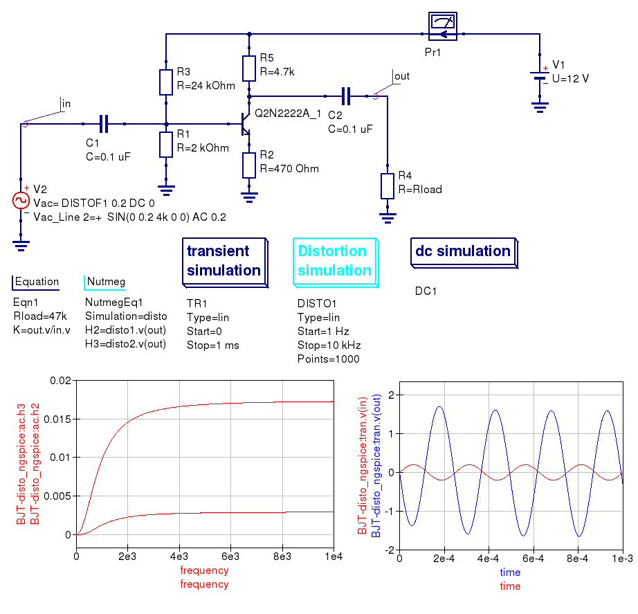
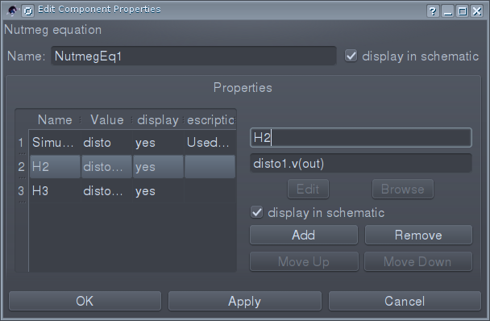
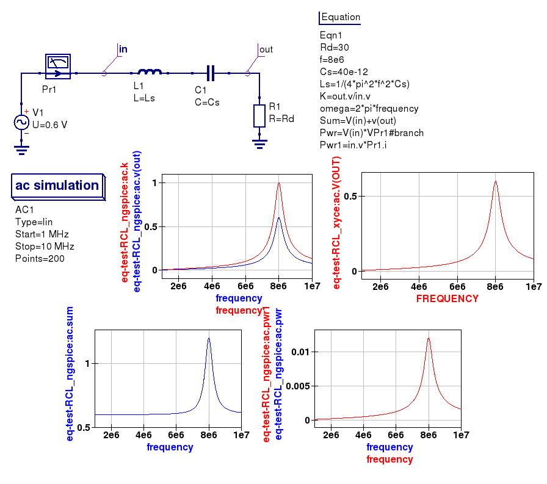
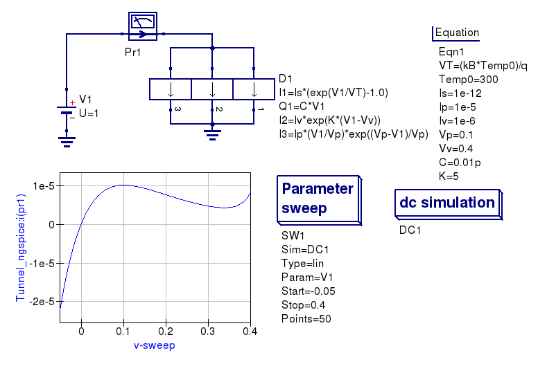
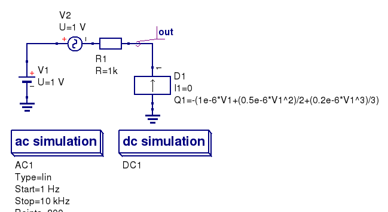
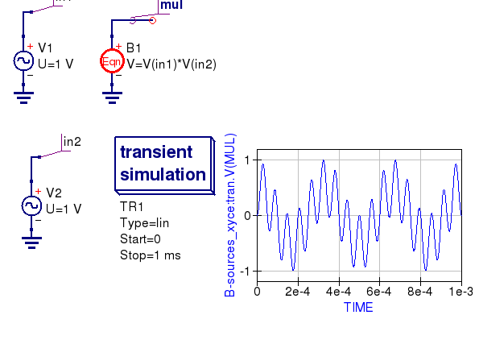

--------------------------------------------------------------------------------
Chapter 4. Device and component modelling with algebraic equations 
--------------------------------------------------------------------------------

4.1 The role of algebraic and numeric equations in circuit simulation
~~~~~~~~~~~~~~~~~~~~~~~~~~~~~~~~~~~~~~~~~~~~~~~~~~~~~~~~~~~~~~~~~~~~~~~~

Algebraic/numerical equations play the following important roles in circuit simulation:

#. Circuit device parametrization,
#. Post-processing of simulation data, and 
#. Definition of user-defined components.

With the spice4qucs subsystem the first and second operations in the above list and the third item can be 
performed easily. 

Spice4qucs supports the following algebraic/numeric equations:

1. The usual Qucs equations. These are converted automatically to SPICE ``.PARAM`` statements 
and ngnutmeg scripts. Equations that don't include simulation variables (for example, node voltages 
and device currents) are passed as ``.PARAM`` statements in the generated 
SPICE netlist. 
In contrast equations that include one or more simulation variables are placed 
in the SPICE simulation file between the ngspice ``.control`` and ``.endc`` statements. 
The  ``.control`` and ``.endc`` block is normally located following one or more SPICE simulation commands. 
Please NOTE equations which include simulation variables can only be processed with ngspice because Xyce 
is not equipped with a suitable post-processor for this purpose.

2. ``.PARAM`` items. Such statements are passed directly as a ``.PARAM`` entry in a generated SPICE netlist.

3. ``.GLOBAL_PARAM`` sections. This feature works in the same manner as a 
``.PARAM`` item.

4. ``.OPTIONS`` sections. This feature provides a way of changing the value of internal ngspice or Xyce 
defined variables, such as, for example ``GMIN``.

5. ``Ngnutmeg`` scripts. These are directly passed to the ``ngnutmeg`` post-processor after simulation.
Again please note this feature is not supported by Xyce. 

Icons representing the last four equation types can be found in the *Spice sections* group of the
*Components* palette. 

..  |imageQ_EN| image::   _static/en/Qucs.png

4.2 Qucs equations usage with ngspice and Xyce
~~~~~~~~~~~~~~~~~~~~~~~~~~~~~~~~~~~~~~~~~~~~~~

Ngspice fully supports equations. Only mathematical functions 
related to S-parameter simulation will (such as ``stoz()``, ``stoy()``, etc.) are niot implemented.
Complex number arithmetic is also supported.  Similarly, physical constants (``q``, 
``kB``, etc.) are also allowed. Qucs equations can be used for both 
parametrization and post-processing purposes. However, please remenber that SPICE variable names are not case 
sensitive but Qucsator is case dependent. Hence, ``Kv`` and ``KV`` refer to different variables for Qucsator 
and the same variable for ngspice and Xyce. Algebraic expressions are evaluated from the left to right with
brackets, in the normal fashion, determining evaluation order.

As mentioned above, equations that contain simulator variables, such as node 
voltages and device currents, are converted into ``ngnutmeg`` script. The following 
example (complex power calculation in RC-circuits, Fig 4.1) illustrates the 
usage of Qucs equations with ngspice. This circuit simulates correctly with both 
ngspice and Qucsator. 

|RC_EN|
Figure 4.1 Total power in an RC-circuit.

It's need to evaluate the following equations:

Total power

.. math::
    S = abs (\dot{U} \cdot \dot{I})

Active power:

.. math::
    P = \Re [\dot{U} \cdot \dot{I}]

    
Reactive power

.. math::
    Q = \Im [\dot{U} \cdot \dot{I}] 
    
The simulated results are shown in the Figure 4.2.

|resRC_EN|

Figure 4.2 Total, active, and reactive power curves.

The Xyce circuit simulator is distributed without a post-simulation data processor like ngnutmeg. Unfortunately, this implies that Xyce can 
only partial process Qucs equations. 
In particularly, Xyce only supports parametrization. Algebraic equations that include node voltages or device 
currents are ignored by Xyce.  

Here is a small example. It illustrates how parametrization could be used with 
all of three simulation back ends. Parametrisation is used to estimate the resonant 
frequency :math:`f_{res}` of the RCL circuit:

.. math::
    f_{res} = \frac{1}{2\pi\sqrt{LC}}

|RCL1_EN|

Figure 4.3 Parametrised RCL-circuit.

You can see that simulation results for all three circuits are identical.

**NOTE:**

There is an important note on equations order. SPICE simulators are succeptible 
to equations order, but equations order has not matter for Qucsator.  It 
concerns both parametric equations and postprocessor equations. ``Spice4qucs`` 
don't care on equations order. User should select proper equations order to 
avoid ``Undefined variable...`` simulation errors. This concern also two or 
more ``Equation`` components on schematic.

4.3 Manipulating simulation data with algebraic measurement scripts
~~~~~~~~~~~~~~~~~~~~~~~~~~~~~~~~~~~~~~~~~~~~~~~~~~~~~~~~~~~~~~~~~~~~~~

Post-processing of the simulation data is very important feature of a circuit 
simulator.  There are two general ways employ data postprocessing with ngspice 
and qucsator. 

Firstly, a special component *Nutmeg Equation* has been implemented. It works in a similar fashion to the established Qucs 
Equation component. It's properties dialog (Fig.4.4) is opened by double clicking on the *Nutmeg Equation* icon.

|DLG_EN|

Figure 4.4 The *Ngnutmeg Equation* properties dialog.

You need to specify (as first parameter) the type of simulation to which the ngnutmeg script 
is be linked. The following simulation types are allowed:

* AC 
* TRAN
* DISTORTION
* DC
* All simulations

If type *"All simulations"* is selected, equations will be evaluated for all 
simulations. You should use the standard SPICE notation for node voltages and device current, for example; 
node voltages are specified as ``v(node)`` or ``V(n1, n2)``. In a similar 
fashion probe currents are specified in SPICE terms as ``VPr1#branch`` which 
represents the current flowing in Qucs probe named ``Pr1``.
Spic4qucs allows the use of all of the ngnutmeg functions and operators without any limitations.  
However, please take into account that variables in ngnutmeg equations are case independent!

All other equations/parameters form ngnutmeg equations. These are converted into ngnutmeg ``let`` statements: 

.. code-block:: bash

   let Var1 = Expression1
   let Var2 = Expression2
   let VarN = ExpressionN
   
Expressions are evaluated from the first to last with brackets determining the order of priority. 
You should take into account expression order when writing ngspice equations.
  
The following example (Fig.4.5) illustrates how the two equation types are used.

|DIST_EN|

Figure 4.5 Distortion analysis with ngnutmeg simulation data postprocessing. 

The second way of postprocessing simulation output data uses the normal Qucs *Equation* component. 
However, please note thar spice4qucs allows the use of SPICE notation in Qucs 
equations. The following example shows how this feature can be utilized.

|Mix_EN|

Figure 4.6 Using SPICE notation in Qucs equations. 

4.4 Qucs Equation-Defined Device (EDD) models
~~~~~~~~~~~~~~~~~~~~~~~~~~~~~~~~~~~~~~~~~~~~~~~~~~~~

Qucs EDD models are described by current equations and charge equations. EDD has  
:math:`N` branches. Current equations bind current :math:`I_N` flowing through a
branch with voltage :math:`V_N` across branch :math:`N`:

.. math::
  \begin{eqnarray}
  & I_1 = f_1(V_1, \ldots ,V_N) & \\
  & \ldots & \nonumber \\
  &I_N = f_N(V_1, \ldots ,V_N)& 
  \end{eqnarray}

Charge equations bind charge :math:`Q_N` accumulated by a branch with voltage 
:math:`V_N` across branch :math:`N` and current :math:`I_N` flowing through branch :math:`N`:
  
.. math::
  \begin{eqnarray}
  & Q_1 = g_1(V_1, \ldots ,V_N) & \\
  & \ldots & \nonumber \\
  &Q_N = g_N(V_1, \ldots ,V_N, I_1, \ldots, I_N)& 
  \end{eqnarray}
  
Qucs equation notation must be used in EDD equations. Qucs notation is converted to 
SPICE notation automatically, where the Qucs EDD function is synthesised by a SPICE netlist builder 
to form an electrical equivalent circuit built around SPICE B-type sources. 
  
The Spice4qucs subsystem supports both EDD current and charge equations. You can 
simulate EDD models with ngspice and Xyce without any special adaptations. All SPICE mathematical 
functions are allowed. The following examples (Figures 4.7 and 4.8) demonstrate how EDD based circuits are simulated. 

The first example illustrates a set of IV-curves for a Tunnel diode, where the Tunnel diode IV-curve is 
approximated by the following equation:

.. math::
    I = I_s\left(e^{\frac{V}{\varphi_T}}-1\right) + I_ve^{k(V-V_v)} + 
     I_p\cdot\frac{V}{V_p}e^{\frac{V_p-V}{V_p}} 
     
|Tunn_EN|

Figure 4.7 Tunnel diode simulation using an EDD compact device model.

The second example illustrates how a nonlinear capacitor can be approximated by a polynomial that binds capacitor 
charge :math:`Q` with applied  voltage :math:`V`

.. math::
   Q = C_1V + \frac{C_2V^2}{2} + \frac{C_3V^3}{3} + \ldots + \frac{C_NV^N}{N}

|EDD-cap_EN|

Figure 4.8 A non-linear capacitor simulation using ngspice and Xyce

|EDD-cap_MR_EN|

Figure 4.9 The magnitude response of an RC circuit with a non-linear capacitor.

The spice4qucs special component called *Equation defined source* could be used as alternative to 
the Qucs EDD. This component is located in group *Spice components*. It implements a
behavioural B-type SPICE voltage or current source. See chapter 5.1 of ngspice 
manual for more information. The example introduced in Figure 4.10 shows how this source is 
used. Please note that SPICE notation must be used with B-source expressions. 

|B_src_EN|

Figure 4.10 A voltage multiplier model with B-type sources. 

..  |EDD-cap_MR_EN| image:: _static/en/chapter4/EDD-Q_res.png

4.5 Qucs Frequency Equation-Defined Device (FEDD) models
~~~~~~~~~~~~~~~~~~~~~~~~~~~~~~~~~~~~~~~~~~~~~~~~~~~~~~~~~~~

Qucs RFEDD devices is not yet supported by spice4qucs. As a temporary work around behavioural R,C,L 
models and B-type sources should be used instead. Moreover, the ngspice 
``hertz`` variable is defined
to represent signal frequency, allowing models with the same function as the Qucs RFEDD model to be synthesised. 
Refer to chapters 3.2.4, 3.2.8, 3.2.12, and 5.1 of the official ngspice manual for further information. 

4.6 ngspice and Xyce translation/synthesis of EDD and FEDD models
~~~~~~~~~~~~~~~~~~~~~~~~~~~~~~~~~~~~~~~~~~~~~~~~~~~~~~~~~~~~~~~~~~~~

   `back to the top <#top>`__

