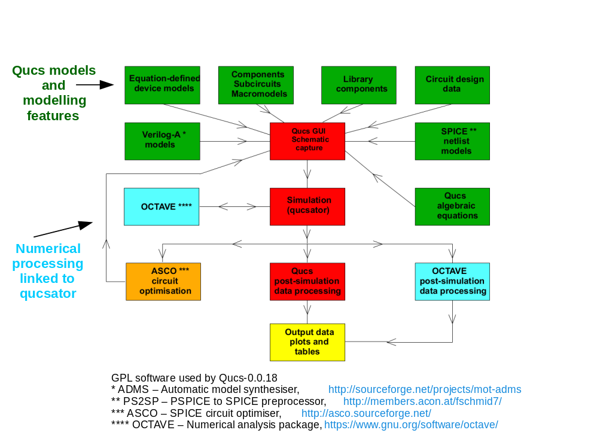

---------------------------------
Chapter 1. Introduction                 
---------------------------------    

|imageQ_EN|
 
Following the release of Qucs-0.0.18 in August 2014 the Qucs Development Team have considered in detail a number of possible directions that future versions of the software could take. Spice4qucs is one of these routes. It addresses a number of problems observed with the current version of Qucs while attempting to combine some of the best features of other GPL circuit simulation packages with Qucs. The project also aims to add additional model development tools to those currently available. Qucs was originally written as an RF and microwave engineering design tool which provided features not found in SPICE, like S parameter simulation, two and multiport small signal AC circuit analysis and RF network synthesis.  Since it was first release under the General Public License (GPL) in 2003 Qucs has provided users with a stable, flexible and reasonably functional circuit simulation package which is particularly suited for high frequency circuit simulation. In the years following 2003 the Qucs Development team added a number of additional simulation facilities, including for example, transient simulation,  device parameter sweep capabilities and single tone Harmonic Balance simulation, making Qucs functionality comparable to SPICE at low frequencies and significantly extended at high frequencies.  Considerable effort has also been made to improve the device modelling tools distributed with Qucs. The recent version of the software includes code for algebraic equation manipulation, Equation-Defined Device (EDD) modelling, Radio Frequency Equation-Defined Device (RFEDD) simulation and Verilog-A synthesised model development plus a range of compact and behavioural device modelling and post simulation data analysis tools that have become central features in an open source software package of surprising power and utility. 

One of the most often requested new Qucs features is for "better documentation", especially documentation outlining the use and limitations of the simulation and the modelling features built into Qucs.  Qucs is a large and complex package which is very flexible in the way that it can be used as a circuit design aid. Hence, however much documentation is written describing its functionality there are always likely be simulation and modelling examples that are missing from the Qucs documentation. In the future Qucs releases will be accompanied by two or more basic Qucs documents. The first of these, simply called "Qucs-Help", provides introductory information for beginners and indeed any other users, who require help in starting to use Qucs. The second Qucs document, called "Spice4qucs-Help", introduces more advanced simulation and modelling topics.  Both documents present a large number of typical circuit simulation and compact device modelling examples. In the text these are also linked to detailed sets of Qucs reference material.  Since 2003 the Qucs Development Team, and other authors, have published a body of work concerning Qucs and its applications. A bibliography of these publications can be found at the end of this document. Anyone interested in learning about Qucs is recommended to read these publications as they provide a wealth of information on basic and advanced Qucs topics.  Both the "Qucs_Help" and "Spice4qucs-Help" documents are very much work in progress.  Updated versions will be published with each new Qucs release. Moreover, to keep everyone up to date with Qucs current developments it is planned to updated them during the Qucs development phases.  The latest documentation can be found at https://github.com/Qucs/qucs-help. 

1.1 Background
~~~~~~~~~~~~~~~~
The current rate of Qucs downloads from http://qucs.sourceforge.net/ is around 3000 per week with roughly 1.5 million downloads since Qucs was first released in 2003. This figure does not however, imply that 1.5 million copies of Qucs are currently in regular use. It does perhaps give an indication of the popularity of the software, particularly amongst users interested in RF circuit design and simulation. For a high percentage of regular Qucs users the current distribution version (Qucs 0.0.18) provides a reasonably stable and accurate simulation tool equipped with more than enough facilities to meet their everyday needs. In reality Qucs is not perfect but includes a number of weaknesses and known limitations. The onward march of technology also makes it imperative that Qucs evolves from simply a circuit simulator to a design tool which can handle modelling and simulation of circuits which include devices from new emerging technologies. Today Qucs includes an impressive range of component, device and circuit modelling tools, allowing it to model and simulate circuits and systems built from standard components and new production devices.  

Three of the primary aims of the work undertaken by the Qucs Development Team are firstly to remove software bugs and improve the overall performance of the package, secondly to remove known weaknesses and limitations and thirdly to develop the package by adding new features which increase it's utility.  Readers who are not familiar with open source software development may be unaware of how the development process works.  By Qucs Development Team we mean a group of interested individuals who give both their time and expertise freely for the improvement of the GPL Qucs package.  The Qucs Development Team is not a fixed group but is a dynamic organisation where different people contribute, simultaneously or at different times, to the same part or different parts of the software.  The spice4qucs project group is one of a number of sub-groups within the overall Qucs Development Team. It was formed to address a number of the known limitations of the current Qucs release and to take advantage of the work done by other GPL circuit simulation teams working on the ngspice ( http://ngspice.sourceforge.net/ ) and Xyce simulators ( https://xyce.sandia.gov/ ).

The spice4qucs initiative is an ongoing project which attempts to:

1. Correct known weaknesses observed with the current Qucs analogue simulation engine "qucsator". Qucsator is based on classical numerical mathematics routines for the solution of electrical network linear and non-linear real and complex algebraic equations and time domain algebraic and differential equations. For small circuits qucsator works well in the DC and AC small signal domains. However, in the transient and Harmonic Balance simulation domains it often fails to converge to an acceptable solution.  Its performance is also often below that expected of a modern circuit simulator employing sparse matrix algorithms. However, qucsator works well for RF small signal AC simulation and will for some time remain the first choice for this simulation domain.

2. Provide Qucs users with a choice of simulation engine from qucsator, ngspice and Xyce. By selecting ngspice or Xyce as the simulation engine for a particular circuit simulation users may capitalise on all the features offered by the extensive SPICE developments which have taken place over the last forty years.  Both ngspice and Xyce offer improved transient simulation convergence and speed, particularly for large non-linear circuits. Xyce brings an alternative implementation of single tone Harmonic Balance simulation to Qucs which offers much improved convergence properties for both linear and non-linear components and devices. Future versions of Xyce are also likely to offer multi-tone Harmonic Balance simulation.

3. Extend Qucs subcircuit, EDD, RFEDD and Verilog-A device modelling capabilities. Future Qucs releases are planned which will offer much improved component and device modelling features that work as an interlinked structure, supporting model development as a continuous development flow from physical concepts to compiled C++ code.  This is an ambitious aim which the spice4qucs project is attempting to complete by adding the Berkeley "Model and Algorithm Prototyping Platform" (MAPP http://draco.eecs.berkeley.edu/dracotiki/tiki-index.php?page=MAPP ) to Qucs, adding synthesis of ngspice and Xyce SPICE code from Qucs EDD and RFEDD models and by adding the synthesis of Verilog-A models from Qucs EDD models.

4. Offer Qucs users access to the additional simulation tools and extra component and device models provided by ngspice and Xyce. This includes much improved component library facilities which allow the use of device manufacturers SPICE models.

5. Offer for the first time with Qucs a true mixed-mode analogue-digital circuit simulation capability using Qucs/ngspice/XSPICE simulation. 

The spice4qucs initiative is an on going project and must be considered as very much work in progress. In its early releases not all the features listed above will be available for public use. It is however, the intention of the Qucs Development Team to introduce them as quickly as possible over a short period of time. Other features not listed in the previous entries may also be introduced.   

1.2 Qucs-0.0.18 Structure
~~~~~~~~~~~~~~~~~~~~~~~~~~~~~~
A block diagram showing the main analogue modelling and simulation functions of the Qucs-0.0.18 package is illustrated in Figure 1.  For convenience, particularly easy identification, blocks with  similar modelling or similar simulation functions have been coded with identical colours, for example dark red indicates the GUI and qucsator analogue simulation engine and dark green major component and device modelling tools. The direction of the flow of data between blocks are also shown with directed arrows. Central to the operation of the Qucs-0.0.18 package is the Qucs graphical user interface (GUI), the qucsator simulation engine and a post simulation data processing feature (indicated by the yellow block in Figure 1) for the extraction of device and circuit parameters and the visualisation of simulated signal waveforms. Cyan blocks in Figure 1 identify the well known Octave numerical analysis package ( https://www.gnu.org/software/octave/ ). Qucs employs Octave for additional post simulation data processing and waveform visualisation plus an experimental circuit simulation process where qucsator and Octave undertake cooperative transient circuit simulation (cyan coloured blocks).  The single light brown block in Figure 1 represents the ASCO optimisation package which is used by Qucs for determining circuit component values and device parameters which result in specific circuit performance criteria.

Readers who are not familiar with the basic operation and use of the Qucs GUI, circuit simulator and output processing routines should consult the "Qucs-Help" document before proceeding further with this more advanced document.   

|image0_EN| 

Figure 1.  A block diagram showing the analogue modelling and simulation facilities provided by Qucs-0.0.18.   

1.3 Qucs Future Capabilities
~~~~~~~~~~~~~~~~~~~~~~~~~~~~~~
Figure 2. presents an extended version of the Qucs-0.0.18 functional diagram where the added blocks indicate areas chosen for future Qucs development. Two major extension to Qucs functionality are obvious, 
namely the addition of the ngspice and Xyce circuit simulators to Qucs and the increase in the Qucs device modelling capabilities through the addition of the MAPP software. In Figure 2. the same colour coding has been adopted as that in Figure 1. The MAPP modelling extension is colour coded cyan indicating it forms part of the Qucs software which is dependent on the Octave package for its function. Figure 2. only gives a rough picture of the proposed changes to Qucs being tackled in the spice4qucs project.  Much of the detail will become clearer later in the tutorial and reference sections that follow. At this point it does seem appropriate however, to introduce a short example which demonstrates how much Qucs has evolved since the release of version 0.0.18. This example has been deliberately chosen to present an overview of the major new Qucs features already developed by the spice4qucs project. To provide readers with adequate information to understand and make satisfactory use of the Qucs increased capabilities detailed instructions are described in the tutorial and reference sections found in later chapters of this document.
 
|image1_EN|

Figure 2. An extended block diagram outlining the extended form of Qucs simulation facilities and modelling tools under development by the spice4qucs initiative. 

.. only:: html

   `back to the top <#top>`__

.. |imageQ_EN| image::  _static/en/Qucs.png

