---------------------------------------------------------------------------------------------------------------
Chapter 6.  Ngspice, Xyce and SPICE OPUS post-simulation data processing with Qucs-S and Octave
---------------------------------------------------------------------------------------------------------------

6.1 Introduction to capabilities
~~~~~~~~~~~~~~~~~~~~~~~~~~~~~~~~~~~

In this chapter the Ngspice, Xyce and SPICE OPUS post-simulation data processing and visualization capabilities are introduced and applied to a number of example simulation case studies.
Qucs-S makes use of the existing Qucs post-simulation data processing facilities BUT modifies their operation to take into account the numerical and algebraic functions provided by Ngspice and SPICE OPUS 
nutmeg scripts and Xyce embedded equations in SPICE .PRINT statements.

The following list presents a resume of the data manipulation and plotting features implemented by Qucs and the spice4qucs additions central to Qucs-S. 

*  **Qucs** :
	Built in MATLAB style numerical data processing; GUI data visualization; Octave data processing and plotting 

*  **Ngspice** :      
	Spice nutmeg script controlled numerical data processing; Extended Qucs GUI style data visualization; H SPICE style .measurement post-simulation data processing;
	Octave data processing and plotting 

*  **SPICE OPUS** :   
	Spice nutmeg script controlled numerical data processing; Extended Qucs GUI style data visualization; Octave data processing and plotting 

*  **XYCE** :         
	Extended SPICE .PRINT statements with "algebraic and numeric" non-linear equations for numeric data processing; H SPICE style .measurement post-simulation data processing;
	Extended GUI style data visualization; Octave data processing and plotting 

Qucs-S post-simulation data processing is linked to the use of Qucs **Equation blocks** and Qucs-S **Nutmeg Equation blocks**. To understand how Qucs-S deals with post-simulation
data processing and visualization it is important that readers become aware of a number of critical, highly significant, facts concerning Qucs  **Equation blocks**. 
Figure 6.1 shows a very simple RC circuit who's performance is simulated with AC and transient simulation. 

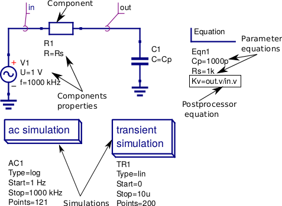

Figure 6.1 A basic RC test circuit with component values set by a Qucs **Equation block**: component properties, parameter equations and post processing equations
are shown marked with arrows.  

In Figure 6.1 **Equation block** *Eqn1* includes a mixture of variable assignments that are independent of simulation output data, component values *Cp* and *Rs*, and
variable assignments that are functions of output data, variable *Kv* which is a function of *out.v* and *in.v*.
All **Equation block** variables that are NOT functions of output data are actioned before the start of a simulation and their values remain constant throughout simulation.  
In contrast **Equation block** variables that are functions of output data are actioned AFTER a simulation is finished. 
Notice that if there are more than one **Equation block** placed on a schematic they are joined together to form one larger **Equation block** before processing by Qucs.  
With Qucs the order of the left hand variables in an  **Equation block** is not important because Qucs arranges the list into an order which gives the correct sequence during list processing. 
Readers need only remember that each named left hand side variable is allowed only one entry in the **Equation block** list. More than one entry with the same name flags an error message.
Notice also that for all types of Qucs simulation the output data processed by an **Equation block** is named with identification letters after the "full stop .", for example in Figure 6.1 there are both AC and transient icons BUT variable *Kv* is only defined for the SPICE AC simulation. Qucs  **Equation block** variable entries are defined by right hand equations which are a mixture of numerical constants,
named variables, functions, and mathematics operators defined in the "Qucs Help Index" documentation (see the section called "Short description of mathematical functions").  Please NOTE that 
all the functions in this list are only applicable to Qucs and ONLY a percentage are available with the Ngspice, Xyce and SPICE OPUS simulators.  The next few sections of this document provide more detail on
the Qucs functions that can be used with Ngspice, Xyce and SPICE OPUS.

6.2 Ngspice and SPICE OPUS output data post-processing
~~~~~~~~~~~~~~~~~~~~~~~~~~~~~~~~~~~~~~~~~~~~~~~~~~~~~~~~~~~~~~~~~

The Ngspice and SPICE OPUS circuit simulators also use **Nutmeg Equation blocks** for output data post-processing. 
Figure 6.2 illustrates how **Nutmeg Equation blocks** are applied to the data post-processing task.
Unlike Qucs **Equation blocks** the Qucs-S **Nutmeg Equation blocks** are characterised by being linked to each different type of Qucs-S SPICE simulation, for example
in Figure 6.2 there are two **Nutmeg Equation blocks** one for AC simulation and one for transient simulation. 
Qucs-S **Nutmeg Equation block** entries result in SPICE nutmeg *let* statements being placed between the relevant SPICE *.control* and *.endc* statements in a synthesised SPICE netlist
generated by Qucs-S prior to simulation by Ngspice or SPICE OPUS.  Notice that one *let* statement is generated per **Nutmeg Equation block** entry and that the order of the variables is important because
ALL named variables must be defined before they are used in subsequent variable assignments. 
Opposite to Qucs these variables are NOT arranged by Qucs-S in an order that ensures all left hand variables can be evaluated correctly prior to use in other statements during post-simulation data processing.
In most cases these entries will represent some form of post-simulation output data processing action, where the right hand equation entry can be a function of numeric constants, previously defined
variables, device parameters, Ngspice or SPICE OPUS nutmeg operators and functions and data output item names. 
The latter need to be expressed in SPICE format rather than the standard Qucs format described previously.
Node voltages are selected using the SPICE notation *V(n)* or *V(n1,n2)*, where voltage *V(n)* is referenced to ground and *V(n1,n2)* indicates the voltage difference between nodes
*n1* and  *n2*. 
Currents flowing in a circuit are recorded through the use of a zero value independent voltage source, via the SPICE notation *Vxxx#branch* (see Figure 6.2), or by placing a Qucs current probe in the circuit being simulated and recording its value using *VPrxxx#branch* (see following examples).
Also notice that in the version of the RC test circuit introduced in Figure 6.2 the component values *Cp* and *Rs* are no longer set by a Qucs **Equation block** but are allocated numerical values at component symbol level.   

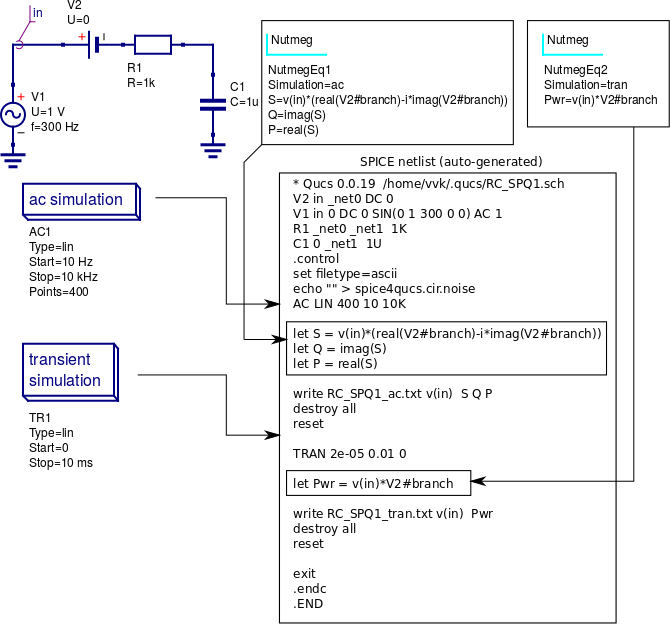

Figure 6.2 The basic RC test circuit introduced in Figure 6.1 with post-simulation controlled by Qucs-S **Nutmeg Equation blocks**  NutmegEq1 and NutmegEq2.

  
6.3 Ngspice, SPICE OPUS and XYCE data post-processing operators and functions
~~~~~~~~~~~~~~~~~~~~~~~~~~~~~~~~~~~~~~~~~~~~~~~~~~~~~~~~~~~~~~~~~~~~~~~~~~~~~~~~~~~

Ngspice and SPICE OPUS both use extended versions of the SPICE 3f5 nutmeg software for manipulating
and visualizing simulation output data.  Xyce does NOT include a version of SPICE nutmeg BUT employs
an extension of the SPICE .PRINT statement to generate tables of output values for post simulation processing.  
At a first reading of the Xyce manuals the lack of nutmeg would appear to be a serious omission.  
However, by adding equations composed of numerical values, output variables, mathematical operators and "Analogue behavioural modelling" functions as arguments to 
SPICE .PRINT statements it becomes possible to manipulate output data in a fashion similar to SPICE nutmeg. 
The Xyce extended form of .PRINT statement allows "Analogue behavioural modelling (ABM)" equations embedded in *{ .... }*. 
Such equations ONLY operate on real quantities and hence some restrictions apply to AC and HB simulataion, see later notes. 

The following list presents a summary of the operators and functions implemented by the Ngspice, SPICE OPUS and Xyce circuit simulators. 
These can be used for simulation output data manipulation using Ngspice and SPICE OPUS nutmeg scripts and Xyce .PRINT netlist statements.
A more detailed explanation of their function can be found in the individual simulator manuals listed in the reference section at the end
of spice4qucs-help document.

* **Ngspice**

  - **Operators**

    +  -,+,*,/, ^, %,  ,

    +  gt, lt, ge, le, ne, and, or, not, eq
 
    +  >,  <,  >=, <=, <>,  &,  |,   !,  =

  - **Functions**

    + mag(), ph(), cph(), unwrap(),j(), real(), imag(), db(), log(), ln(), exp(), abs() sqrt(), sin(). cos(), tan(), atan(), sinh(), cosh(), tanh(),

    + floor(), ceil(), name(), mean(), arg(), group-delay(), vector(), initvec(), length(), interpolate(), deriv(), vecd(), vecmin(), minimum(),

    + vecmax(), maximum(), fft(), ifft(), sortorder(), rnd, sgauss(), sunif(), poisson(), exponential()

  - **Constants**

    + pi, e, c, i, kelvin, echarge, boltz, planck, yes, no, TRUE, FALSE

* **SPICE OPUS**

  - **Operators**

    + -,+,  *,/, ^, %, , 

    +  gt, lt, ge, le, ne, and, or, not, eq. ;, [], [%]

  - **Functions** 

    + abs(), mag(), magnitude(), db(), ph(), phase(), unwrap(), real(), re(), imag(), im(), j(), ln(), log(), log10(), exp(), sqrt(), sin(),

    + cos(), tan(), atan(), floor(), ceil(), round(), length(), mean(), sum(), min(), max(), vector(), unitvec(), rnd(), rndunif(), rndgauss(),

    + interpolate(), deriv(), integrate(), timer, clock(), area()

  - **Constants**

    + pi, e, c, i, kelvin, echarge, boltz, planck, yes, no, true, false

* **Xyce**

  - **Operators**

    + -,+ , *, /, **

    + ==, !=, >, >=, <, <=
 
  - **Functions** 

    + abs(), agauss(), gauss(), ddt(), ddx(), if(), int(), limit(), m(), min(), max(), pwr(), pow(), pwrs(), rand(), sgn(), stp(),sqrt(),

    + table(), uramp(), acos(), acosh(), arctan(), asin(), asinh(), atan(), atanh(), atan2(), cos(), cosh(), exp(), ln(), log(), log10(),

    + sin(), sinh(), tan(), tanh()

  - **Constants**

    + PI, EXP

Comparing the above lists with the Qucs list of post processing functions readers will observe that many of the Qucs RF data manipulation functions and
electronic data analysis and plotting functions, like for example function PlotVs(), are NOT supported by Ngspice, SPICE OPUS and Xyce.  
Normally, this is not a particular problem because other means for generating these missing functions have been implemented by Xyce and Qucs-S Development Teams.  
This topic is expanded further in sections 6.5 and 6.6. 
One additional point to note concerning the above list is that all the operator, function and constant names are reserved words and must NOT be used for other purposes, like for example, naming circuit nodes.  If they are used out of context the SPICE engines often fail when passing circuit netlists. 
In the case of misuse in "naming circuit nodes" Qucs-S will report an error and stop passing a circuit netlist. 

Figures 6.3 and 6.4 introduce a single stage BJT common emitter amplifier circuit set up for AC small signal simulation with Ngspice.  
The **Nutmeg equation block** demonstrates the basic use of  post simulation scripts for extracting circuit properties from output data. 
Results obtained with SPICE OPUS are identical to those shown in Figure 6.5 when Ngspice function :math:`cph()` is replaced by SPICE OPUS function :math:`phase()`.  
Please note only one **Nutmeg equation block** of each simulation type, for example *ac*, is allowed per schematic. 

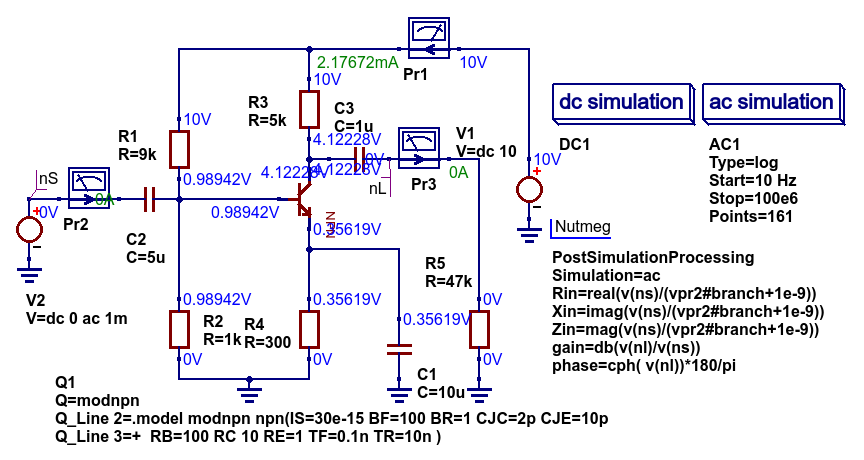

Figure 6.3 Test circuit for a single stage BJT common emitter amplifier and post simulation **Nutmeg equation** script.

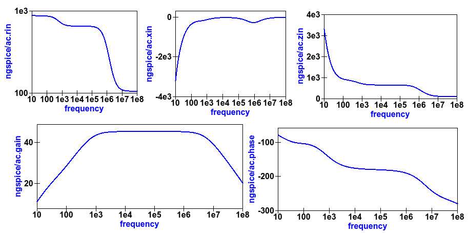

Figure 6.4 Plots of the single stage common emitter amplifier, *Rin* (in OHM), *Xin* (in Ohm), *Zin* (in Ohm), voltage *gain* (in dB) and  *phase* (in degrees) against frequency.

  
6.4 Xyce simulation output data post processing with the **Xyce script** component and SPICE .PRINT statements
~~~~~~~~~~~~~~~~~~~~~~~~~~~~~~~~~~~~~~~~~~~~~~~~~~~~~~~~~~~~~~~~~~~~~~~~~~~~~~~~~~~~~~~~~~~~~~~~~~~~~~~~~~~~~~~~~~~

Xyce simulation output data post processing uses an entirely different approach to that adopted by Ngspice and SPICE OPUS.
Xyce is a circuit simulator developed from scratch some time after the release of SPICE 3f5.  
This route has allowed the Xyce Development Team to make software decisions which are not constrained except that the
Xyce circuit simulator netlist should be compatible with the SPICE 3f5 netlist structure and statements.  
In contrast to both Ngspice and SPICE OPUS the Xyce .PRINT statement has been extended to allow additional types of output variables and embedded algebraic and numeric equations designated by a wrapping of brackets {    }.  
In this section the extended form of the Xyce .PRINT statement is introduced, for each of the different simulation types, and its features and limitations explained.  
At the time of writing these notes Xyce AC node voltage data simulation data can only be manipulated using the real and imaginary components of individual variables
and the basic mathematical operators ( +, -, * and / ), see the Xyce documentation for further details.  
However, embedded AC and HB equations are allowed provided they ONLY apply to variables represented by real data, for example the magnitude or phase of a node voltage.
Xyce .PRINT statements use ABM to evaluate embedded data processing equations. 
However, the ABM package does not use complex numbers but only returns real numbers when calculating algebraic expressions.  
Xyce .PRINT statements are entered in a SPICE netlist between the netlist title on the first line and the last line .END entry.
To generate a Xyce SPICE netlist, from a Qucs-S circuit schematic, which allows users to add simulation commands (AC, tran etc), .PRINT statements, and any other valid SPICE statement
requires the addition of a specific control icon to Qucs-S.  
This component icon is called an **Xyce script**.
Figure 6.5 shows a basic example of its use to set up and simulate the AC performance of a twin-tee notch filter circuit.  

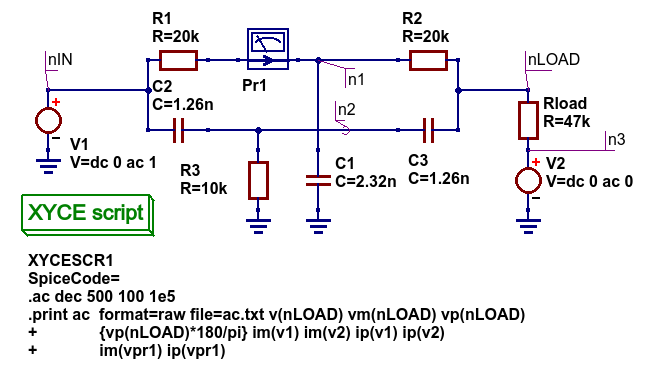

Figure 6.5 Xyce AC simulation of a twin-tee notch filter controlled by a **Xyce script**.

Figures 6.6 and 6.7 give the Xyce SPICE netlist and plotted waveforms requested by the .PRINT statement shown in Figure 6.5.

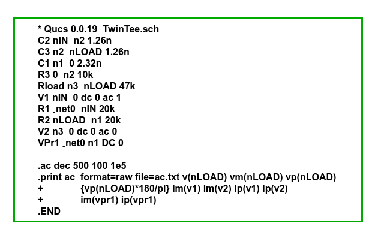

Figures 6.6 Xyce twin-tee SPICE netlist generated by Qucs-S.

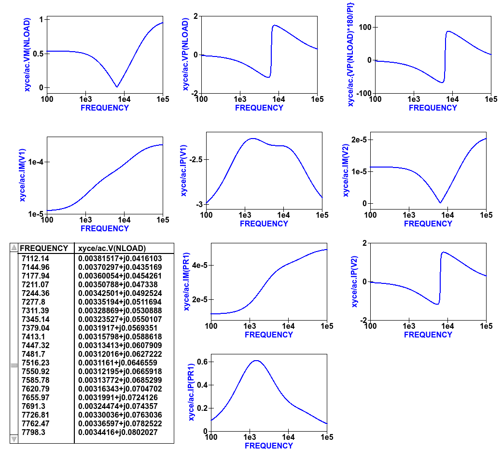

Figures 6.7 Qucs-S plotted waveforms for variables listed in the twin-tee .PRINT statement. 

The Qucs-S processing of the AC version of the Xyce .PRINT statement allows the following types of output variable to be either tabulated (when complex numbers), or manipulated and plotted (when real numbers):

*  **v(nx)** or **v(n1,n2)**

   + Node voltage with respect to ground or node voltage difference; complex number, tabulated by Qucs-S,

*  **vr(nx)** or **vr(n1,n2)**

   + Node voltage real component with respect to ground or node voltage difference real part; real number, plotted by Qucs-S,

*  **vi(nx)** or **vi(n1,n2)**

   + Node voltage imaginary component with respect to ground or node voltage difference imaginary part; real number, plotted by Qucs-S,

*  **Vm(nx)** or **vm(n1,n2)**

   + Magnitude of a node voltage with respect to ground or magnitude of node voltage differences; real number, plotted by Qucs-S, 

*  **vp(nx)** or **vp(n1,n2)**

   + Phase of a node voltage with respect to ground or phase of node voltage differences; real number in radians, plotted by Qucs-S, 

*  **vdb(nx)** or **vdb(n1,n2**

   + Magnitude of a node voltage with respect to ground or magnitude of node voltage differences; real number in dB, plotted by Qucs-S, 

*  **im(vx)**

   + Magnitude of current flowing in voltage source vx (it may be an independent voltage source or Qucs-S current probe); real number, plotted by Qucs-S,

*  **ip(vx)**

   + Phase of current flowing in voltage source vx (it may may be an independent voltage source or Qucs-S current probe); real number in radians, plotted by Qucs-S,

*  **idb(vx)**

   + Magnitude of current flowing in voltage source vx (it may be an independent voltage source or Qucs-S current probe): real number in dB, plotted by Qucs-S.

Examples of these output data types are given in Figure 6.7.  
Figure 6.7 also shows readers how Xyce ABM equations can used to convert phase data from radians to degrees.
When using Xyce equations in .PRINT statements it is important to remember that ABM mathematical operators and functions ONLY work correctly with real numbers.

Post processing of Xyce HB simulation data is similar to AC data post processing in that the information outline above also applies to Xyce HB data.
Figures 6.8 presents a typical HB simulation example. 
In this figure a single stage BJT amplifier, with feedback via an RC network, is driven by an AC signal of 50mV peak and 100kHZ frequency. 
The HB simulation output data to be stored in an output file, hb.txt in Figure 6.8, is set by the .PRINT statement entered as part of the **Xyce script** icon.  
Figure 6.8 gives a selection of the resulting HB output data plots. 
Notice these are all represented by a complex conjugate style of graph.  
More details of this format and other aspects of Xyce HB simulation can be found in Chapter 13 section 4.
All Xyce HB .PRINT statement variables must be of the same format to those introduced in the earlier paragraphs referencing Xyce AC simulation.  
Although multiple **Xyce script** icons are allowed this can result in problems during the post processing of AC and HB simulation data due to uncertainties 
in determining which frequency scale applies to each type of simulation.
Hence, it is suggested that Xyce AC and HB **Xyce script** controlled simulations are not requested at the same time.  
Similarly, multiple .PRINT statements attached to a single **Xyce script** icon can result in simulation failure.  
A better approach is to use a single .PRINT statement and multiple SPICE continuation lines, see Figure 6.8.

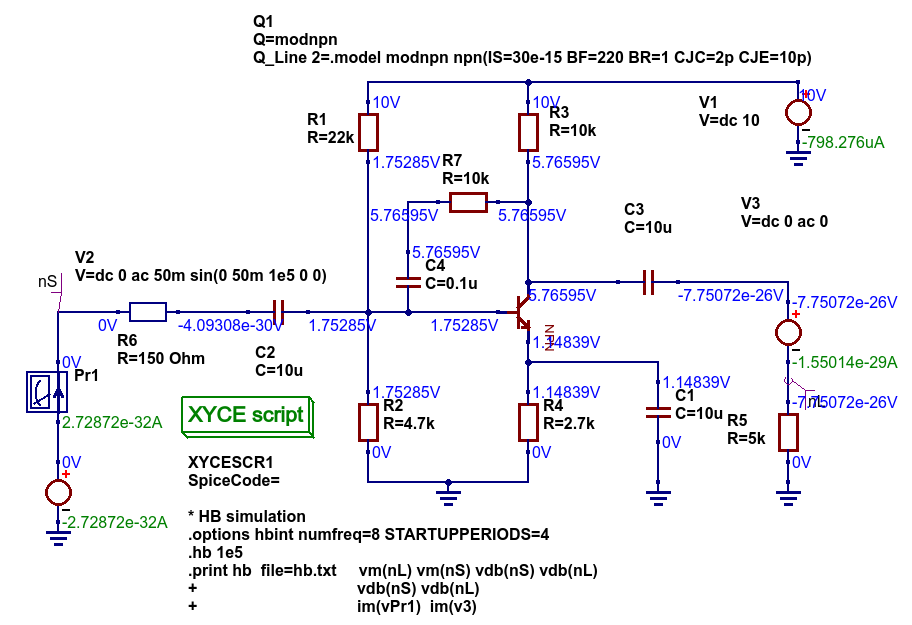

Figure 6.8 Xyce HB simulation of a single stage BJT amplifier with collector to base RC feedback network.

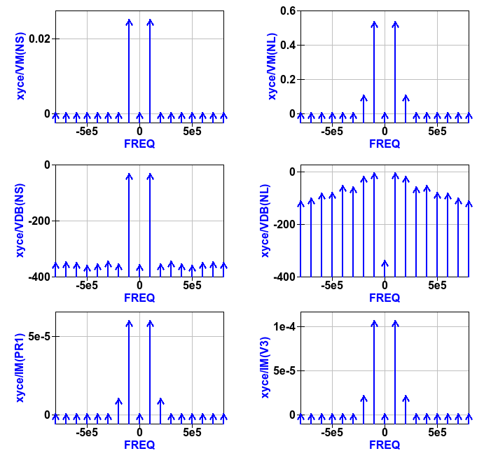

Figure 6.9  Plotted Xyce voltage and current output data for the BJT amplifier introduced in Figure 6.8.

In contrast to AC simulation the Xyce tran .PRINT statement allows the full range of built-in ABM mathematical functions to be employed when computing
expressions that include node voltage and component current simulation data, see section 6.3. 
These functions only work correctly with real arguments; any variables represented by complex numbers with real and imaginary parts will cause an error. 
Bracketed, {.....} expressions can be functions of constants, predefined variables, mathematical operators, implemented functions, node voltages, Qucs-S style probe currents, 
and the current flowing in SPICE style independent voltage sources.  
Xyce also allows B style non-linear dependent voltage and current sources to be used to compute transient simulation output data, like for example behavioural multiplication where the
inputs are node voltages or component currents.
Although this is a valid use of Xyce B sources the practice does have a number of disadvantages, namely that Xyce B sources do NOT work correctly with AC simulation, and 
secondly that the circuitry used to generate additional functions often adds nodes to the circuit under test, which as a consequence can slow down simulation.  
Hence, it is suggested that Xyce B sources should only be used when no other solution can be found. 

The Qucs-S version of the Xyce transient .PRINT statement has the following syntax:

*  **.PRINT tran format=raw file=tran.txt V(n1)  {------} V(d1) .... vpr1#branch   .........**

where **tran.txt** is the name of the output data file generated by a **.PRNT** statement, and

*	**V(nx), V(n1,n2)** are functions of circuit node voltages, 

*       **vprx#branch** or **vx#branch** are probe currents,

*       **{------}** represents an equation for computing an output quantity; Qucs-S identifies different quantities by their bracketed equation names at the top of the columns of data in file **tran.txt**,

*       **I(two-terminal device)** where the two-terminal device can be one of V, I, B, E, G, H, D, R, L,C, and YMEMRESISTOR,

*       **Ik(three-or-more-termnal-device)**, see Xyce Reference Guide,

*       **P(two-terminal-device)** or **W(two-terminal-device)** is the power dissipated in a two-terminal device,

*       A full list of the allowed tran .PRINT output variables can be found in the Xyce User and Reference Guides.

The Xyce transient simulation shown in Figures 6.10 and 6.11 illustrate how the .PRINT statement syntax is used to 
store and plot circuit voltages, currents and equations.  Notice that the test circuit in Figure 6.10 also demonstrates
how the SPICE non-linear B style current source can be used to generate a function of circuit data.
 
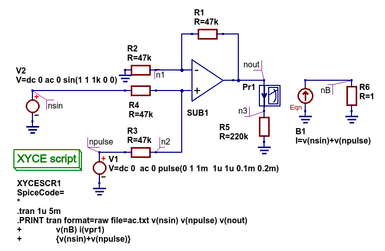

Figure 6.10 An ideal OPAMP adder test circuit which demonstrates the Xyce transient .PRINT statement syntax. 
 
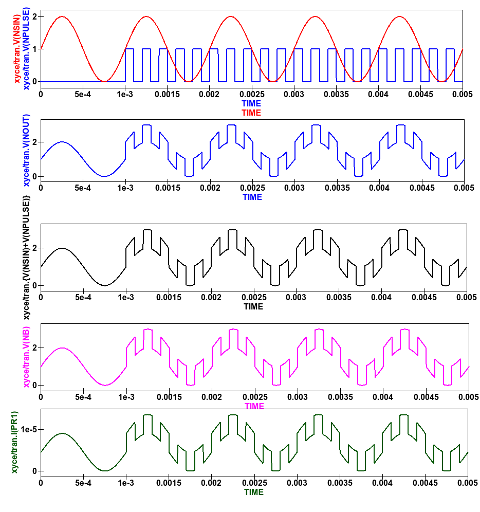

Figure 6.11 Qucs-S/Xyce plotted data illustrating different types of .PRINT argument.

The **Xyce script** component is designed to allow users to embed a Xyce SPICE netlist on a Qucs-S circuit schematic.
The main purpose of this feature is to allow users to construct Xyce simulation netlists which contain the fundamental
simulation commands, like .ac, .tran and .hb, and less common simulation statements, like .four, and .sens,
plus other SPICE netlist statements, including data write statements.  Anyone interested in exploring this topic further should 
read the Xyce user and reference documentation then experiment with a few trial simulations.  
In the future it is possible that the Qucs-S developers will add to this document a series of example simulations which demonstrate additional 
uses of the **Xyce script**.  

6.5 Ngspice and Xyce H SPICE style **.measurement** output data processing
~~~~~~~~~~~~~~~~~~~~~~~~~~~~~~~~~~~~~~~~~~~~~~~~~~~~~~~~~~~~~~~~~~~~~~~~~~~~~~~~~~~~~~~

6.6 Qucs-S emulation of the Qucs **PlotVs()** function
~~~~~~~~~~~~~~~~~~~~~~~~~~~~~~~~~~~~~~~~~~~~~~~~~~~~~~~~~~~~~~~~~~~~~~~~

The Qucs PlotVs() function allows users to select a specific output data vector as a plot X variable
and to plot a different output data vector as the Y variable, for example  
in AC simulation users may require a plot where the X axis is in angular
form :math:`\omega` in radians, where :math:`\omega = 2 \cdot \pi \cdot f` rather than frequency :math:`f` in Hz.
Figure 6.12 gives a simple RC low pass filter circuit with different output data visualization plots.  
In this example graph (a) shows a Qucs **locus** plot of node voltage *V(nout)*, graph (b) shows a Qucs **polar** plot of
node voltage *V(nout)*, graph (c) shows a Qucs-S  simulated **PlotVs()** plot of the imaginary part of voltage *V(nout)*
plotted against the real part of voltage *V(nout)*, and finally graph (d) presents the voltage transfer function :math:`V(nout)/V(nin)`
plotted against frequency. 
Notice that graphs (a) and (c) are identical.
Figure 6.12 also illustrates how Qucs **Equation** blocks and Qucs-S **Nutmeg** blocks can be used to set different properties on a single
circuit schematic: remember **Equation** blocks are actioned before simulation and **Nutmeg** blocks after simulation.
Unfortunately, the Qucs PlotVs() function is not implemented by Ngspice, SPICE OPUS or Xyce. 
To eliminate this deficiency the Qucs-S Development Team have added program code which simulates **PlotVs()** allowing users to select which Y axis output vector is plotted
against a chosen X axis data vector. 
Figure 6.13 shows the Qucs-S drop-down menu which allows users to select both the X and Y data vector variables. 
On Qucs-S plots the simulated Qucs style PlotVs() graphs are indicated by an *@* sign leading the X axis variable name.
Notice that the key tab *New Graph* adds the user specified *Y@X* item to the plot list on clicking it with the left-hand
mouse button.
     

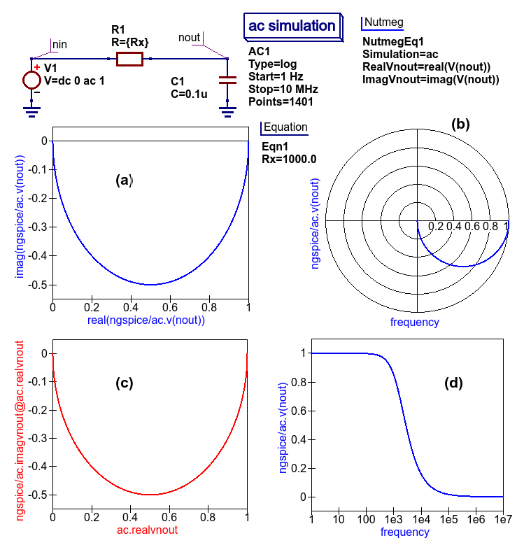

Figure 6.12 A simple RC low pass filter illustrating a number of different output data visualization plot styles.

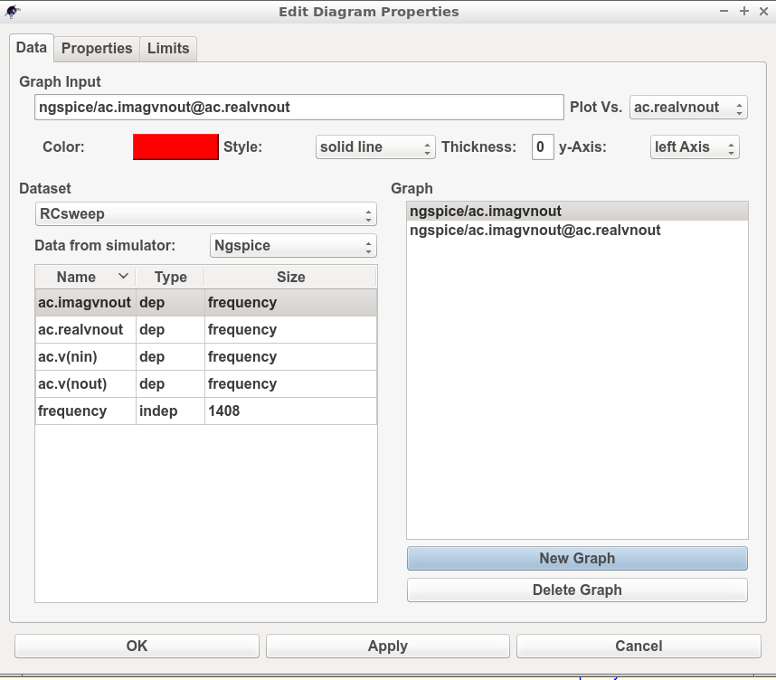

Figure 6.13 The Qucs-S drop-down menu showing The **Edit Diagram Properties** output data list and key tabs for generating a list of *Y* variables,
for plotting against the default *X* variable, and composite *Y@X* plot variables.

6.7 Qucs-S output data processing with the Octave numerical analysis and visualization package
~~~~~~~~~~~~~~~~~~~~~~~~~~~~~~~~~~~~~~~~~~~~~~~~~~~~~~~~~~~~~~~~~~~~~~~~~~~~~~~~~~~~~~~~~~~~~~~~~~~~~~~~~~~~~~~

   

   `back to the top <#top>`__

