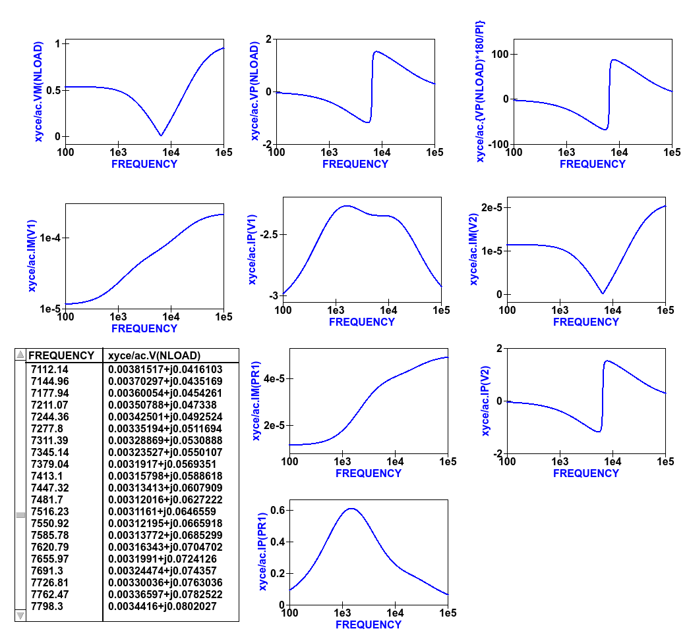

---------------------------------------------------------------------------------------------------------------
Chapter 6.  Ngspice, Xyce and SPICE OPUS post-simulation data processing with Qucs-S and Octave
---------------------------------------------------------------------------------------------------------------

6.1 Introduction to capabilities
~~~~~~~~~~~~~~~~~~~~~~~~~~~~~~~~~~~

In this chapter the Ngspice, Xyce and SPICE OPUS post-simulation data processing and visualization capabilities are introduced and applied to a number of example simulation case studies.
Qucs-S makes use of the existing Qucs post-simulation data processing facilities BUT modifies their operation to take into account the numerical and algebraic functions provided by Ngspice and SPICE OPUS 
nutmeg scripts and Xyce embedded equations in SPICE .PRINT statements.

The following list presents a resume of the data manipulation and plotting features implemented by Qucs and the spice4qucs additions central to Qucs-S. 

*  **Qucs** :
	Built in MATLAB style numerical data processing; GUI data visualization; Octave data processing and plotting 

*  **Ngspice** :      
	Spice nutmeg script controlled numerical data processing; Extended Qucs GUI style data visualization; H SPICE style .measurement post-simulation data processing;
	Octave data processing and plotting 

*  **SPICE OPUS** :   
	Spice nutmeg script controlled numerical data processing; Extended Qucs GUI style data visualization; Octave data processing and plotting 

*  **XYCE** :         
	Extended SPICE .PRINT statements with "algebraic and numeric" non-linear equations for numeric data processing; H SPICE style .measurement post-simulation data processing;
	Extended GUI style data visualization; Octave data processing and plotting 

Qucs-S post-simulation data processing is linked to the use of Qucs **Equation blocks** and Qucs-S **Nutmeg Equation blocks**. To understand how Qucs-S deals with post-simulation
data processing and visualization it is important that readers become aware of a number of critical, highly significant, facts concerning Qucs  **Equation blocks**. 
Figure 6.1 shows a very simple RC circuit who's performance is simulated with AC and transient simulation. 

Figure 6.1 A basic RC test circuit with component values set by a Qucs **Equation block**: component properties, parameter equations and post processing equations
are shown marked with arrows.  

In Figure 6.1 **Equation block** *Eqn1* includes a mixture of variable assignments that are independent of simulation output data, component values *Cp* and *Rs*, and
variable assignments that are functions of output data, variable *Kv* which is a function of *out.v* and *in.v*.
All **Equation block** variables that are NOT functions of output data are actioned before the start of a simulation and their values remain constant throughout simulation.  
In contrast **Equation block** variables that are functions of output data are actioned AFTER a simulation is finished. 
Notice that if there are more than one **Equation block** placed on a schematic they are joined together to form one larger **Equation block** before processing by Qucs.  
With Qucs the order of the left hand variables in an  **Equation block** is not important because Qucs arranges the list into an order which gives the correct sequence during list processing. 
Readers need only remember that each named left hand side variable is allowed only one entry in the **Equation block** list. More than one entry with the same name flags an error message.
Notice also that for all types of Qucs simulation the output data processed by an **Equation block** is named with identification letters after the "full stop .", for example in Figure 6.1 there are both AC and transient icons BUT variable *Kv* is only defined for the SPICE AC simulation. Qucs  **Equation block** variable entries are defined by right hand equations which are a mixture of numerical constants,
named variables, functions, and mathematics operators defined in the "Qucs Help Index" documentation (see the section called "Short description of mathematical functions").  Please NOTE that 
all the functions in this list are only applicable to Qucs and ONLY a percentage are available with the Ngspice, Xyce and SPICE OPUS simulators.  The next few sections of this document provide more detail on
the Qucs functions that can be used with Ngspice, Xyce and SPICE OPUS.

6.2 Ngspice and SPICE OPUS output data post-processing
~~~~~~~~~~~~~~~~~~~~~~~~~~~~~~~~~~~~~~~~~~~~~~~~~~~~~~~~~~~~~~~~~

The Ngspice and SPICE OPUS circuit simulators also use **Nutmeg Equation blocks** for output data post-processing. 
Figure 6.2 illustrates how **Nutmeg Equation blocks** are applied to the data post-processing task.
Unlike Qucs **Equation blocks** the Qucs-S **Nutmeg Equation blocks** are characterised by being linked to each different type of Qucs-S SPICE simulation, for example
in Figure 6.2 there are two **Nutmeg Equation blocks** one for AC simulation and one for transient simulation. 
Qucs-S **Nutmeg Equation block** entries result in SPICE nutmeg *let* statements being placed between the relevant SPICE *.control* and *.endc* statements in a synthesised SPICE netlist
generated by Qucs-S prior to simulation by Ngspice or SPICE OPUS.  Notice that one *let* statement is generated per **Nutmeg Equation block** entry and that the order of the variables is important because
ALL named variables must be defined before they are used in subsequent variable assignments. 
Opposite to Qucs these variables are NOT arranged by Qucs-S in an order that ensures all left hand variables can be evaluated correctly prior to use in other statements during post-simulation data processing.
In most cases these entries will represent some form of post-simulation output data processing action, where the right hand equation entry can be a function of numeric constants, previously defined
variables, device parameters, Ngspice or SPICE OPUS nutmeg operators and functions and data output item names. 
The latter need to be expressed in SPICE format rather than the standard Qucs format described previously.
Node voltages are selected using the SPICE notation *V(n)* or *V(n1,n2)*, where voltage *V(n)* is referenced to ground and *V(n1,n2)* indicates the voltage difference between nodes
*n1* and  *n2*. 
Currents flowing in a circuit are recorded through the use of a zero value independent voltage source, via the SPICE notation *Vxxx#branch* (see Figure 6.2), or by placing a Qucs current probe in the circuit being simulated and recording its value using *VPrxxx#branch* (see following examples).
Also notice that in the version of the RC test circuit introduced in Figure 6.2 the component values *Cp* and *Rs* are no longer set by a Qucs **Equation block** but are allocated numerical values at component symbol level.   

Figure 6.2 The basic RC test circuit introduced in Figure 6.1 with post-simulation controlled by Qucs-S **Nutmeg Equation blocks**  NutmegEq1 and NutmegEq2.

  
6.3 Ngspice, SPICE OPUS and XYCE data post-processing operators and functions
~~~~~~~~~~~~~~~~~~~~~~~~~~~~~~~~~~~~~~~~~~~~~~~~~~~~~~~~~~~~~~~~~~~~~~~~~~~~~~~~~~~

Ngspice and SPICE OPUS both use extended versions of the SPICE 3f5 nutmeg software for manipulating
and visualizing simulation output data.  Xyce does NOT include a version of SPICE nutmeg BUT employs
an extension of the SPICE .PRINT statement to generate tables of output values for post simulation processing.  
At a first reading of the Xyce manuals the lack of nutmeg would appear to be a serious omission.  
However, by adding equations composed of numerical values, output variables, mathematical operators and "Analogue behavioural modelling" functions as arguments to 
SPICE .PRINT statements it becomes possible to manipulate output data in a fashion similar to SPICE nutmeg. 
The Xyce extended form of .PRINT statement allows "Analogue behavioural modelling (ABM)" equations embedded in ``{ .... }``. 
Such equations ONLY operate on real quantities and hence some restrictions apply to AC and HB simulataion, see later notes. 

The following list presents a summary of the operators and functions implemented by the Ngspice, SPICE OPUS and Xyce circuit simulators. 
These can be used for simulation output data manipulation using Ngspice and SPICE OPUS nutmeg scripts and Xyce .PRINT netlist statements.
A more detailed explanation of their function can be found in the individual simulator manuals listed in the reference section at the end
of spice4qucs-help document.

* **Ngspice**

  - **Operators**::

    +  -,+,*,/, ^, %,  ,
    +  gt, lt, ge, le, ne, and, or, not, eq
    +  >,  <,  >=, <=, <>,  &,  |,   !,  =

  - **Functions**::

    + mag(), ph(), cph(), unwrap(), j(), real(), imag(), db(), log(), ln(), 
    + exp(), abs() sqrt(), sin(). cos(), tan(), atan(), sinh(), cosh(), tanh(),
    + floor(), ceil(), name(), mean(), arg(), group-delay(), vector(), initvec(), 
    + length(), interpolate(), deriv(), vecd(), vecmin(), minimum(),
    + vecmax(), maximum(), fft(), ifft(), sortorder(), rnd, 
    + sgauss(), sunif(), poisson(), exponential()

  - **Constants**::

    + pi, e, c, i, kelvin, echarge, boltz, planck, yes, no, TRUE, FALSE

* **SPICE OPUS**

  - **Operators**::

    + -,+,  *,/, ^, %, , 
    +  gt, lt, ge, le, ne, and, or, not, eq. ;, [], [%]

  - **Functions**::

    + abs(), mag(), magnitude(), db(), ph(), phase(), unwrap(), real(), re(), 
    + imag(), im(), j(), ln(), log(), log10(), exp(), sqrt(), sin(),
    + cos(), tan(), atan(), floor(), ceil(), round(), length(), mean(), sum(), 
    + min(), max(), vector(), unitvec(), rnd(), rndunif(), rndgauss(),
    + interpolate(), deriv(), integrate(), timer, clock(), area()

  - **Constants**::

    + pi, e, c, i, kelvin, echarge, boltz, planck, yes, no, true, false

* **Xyce**

  - **Operators**::

    + -,+ , *, /, **
    + ==, !=, >, >=, <, <=
 
  - **Functions**::

    + abs(), agauss(), gauss(), ddt(), ddx(), if(), int(), limit(), m(), min(), max(), 
    + pwr(), pow(), pwrs(), rand(), sgn(), stp(),sqrt(),
    + table(), uramp(), acos(), acosh(), arctan(), asin(), asinh(), atan(), atanh(), 
    + atan2(), cos(), cosh(), exp(), ln(), log(), log10(),
    + sin(), sinh(), tan(), tanh()

  - **Constants**::

    + PI, EXP

Comparing the above lists with the Qucs list of post processing functions readers will observe that many of the Qucs RF data manipulation functions and
electronic data analysis and plotting functions, like for example function ``PlotVs()``, are NOT supported by Ngspice, SPICE OPUS and Xyce.  
Normally, this is not a particular problem because other means for generating these missing functions have been implemented by Xyce and Qucs-S Development Teams.  
This topic is expanded further in sections 6.5 and 6.6. 
One additional point to note concerning the above list is that all the operator, function and constant names are reserved words and must NOT be used for other purposes, like for example, naming circuit nodes.  If they are used out of context the SPICE engines often fail when passing circuit netlists. 
In the case of misuse in "naming circuit nodes" Qucs-S will report an error and stop passing a circuit netlist. 

Figures 6.3 and 6.4 introduce a single stage BJT common emitter amplifier circuit set up for AC small signal simulation with Ngspice.  
The **Nutmeg equation block** demonstrates the basic use of  post simulation scripts for extracting circuit properties from output data. 
Results obtained with SPICE OPUS are identical to those shown in Figure 6.5 when Ngspice function ``cph()`` is replaced by SPICE OPUS function ``phase()``.  
Please note only one **Nutmeg equation block** of each simulation type, for example *ac*, is allowed per schematic. 

Figure 6.3 Test circuit for a single stage BJT common emitter amplifier and post simulation **Nutmeg equation** script.

Figure 6.4 Plots of the single stage common emitter amplifier, *Rin* (in OHM), *Xin* (in Ohm), *Zin* (in Ohm), voltage *gain* (in dB) and  *phase* (in degrees) against frequency.

  
6.4 Xyce simulation output data post processing with the **Xyce script** component and SPICE .PRINT statements
~~~~~~~~~~~~~~~~~~~~~~~~~~~~~~~~~~~~~~~~~~~~~~~~~~~~~~~~~~~~~~~~~~~~~~~~~~~~~~~~~~~~~~~~~~~~~~~~~~~~~~~~~~~~~~~~~~~

Xyce simulation output data post processing uses an entirely different approach to that adopted by Ngspice and SPICE OPUS.
Xyce is a circuit simulator developed from scratch some time after the release of SPICE 3f5.  
This route has allowed the Xyce Development Team to make software decisions which are not constrained except that the
Xyce circuit simulator netlist should be compatible with the SPICE 3f5 netlist structure and statements.  
In contrast to both Ngspice and SPICE OPUS the Xyce .PRINT statement has been extended to allow additional types of output variables and embedded algebraic and numeric equations designated by a wrapping of brackets {    }.  
In this section the extended form of the Xyce .PRINT statement is introduced, for each of the different simulation types, and its features and limitations explained.  
At the time of writing these notes Xyce AC node voltage data simulation data can only be manipulated using the real and imaginary components of individual variables
and the basic mathematical operators ( +, -, * and / ), see the Xyce documentation for further details.  
However, embedded AC and HB equations are allowed provided they ONLY apply to variables represented by real data, for example the magnitude or phase of a node voltage.
Xyce .PRINT statements use ABM to evaluate embedded data processing equations. 
However, the ABM package does not use complex numbers but only returns real numbers when calculating algebraic expressions.  
Xyce .PRINT statements are entered in a SPICE netlist between the netlist title on the first line and the last line .END entry.
To generate a Xyce SPICE netlist, from a Qucs-S circuit schematic, which allows users to add simulation commands (AC, tran etc), .PRINT statements, and any other valid SPICE statement
requires the addition of a specific control icon to Qucs-S.  
This component icon is called an **Xyce script**.
Figure 6.5 shows a basic example of its use to set up and simulate the AC performance of a twin-tee notch filter circuit.  

Figure 6.5 Xyce AC simulation of a twin-tee notch filter controlled by a **Xyce script**.

Figures 6.6 and 6.7 give the Xyce SPICE netlist and plotted waveforms requested by the .PRINT statement shown in Figure 6.5.

Figures 6.6 Xyce twin-tee SPICE netlist generated by Qucs-S.

Figures 6.7 Qucs-S plotted waveforms for variables listed in the twin-tee .PRINT statement. 

The Qucs-S processing of the AC version of the Xyce .PRINT statement allows the following types of output variable to be either tabulated (when complex numbers), or manipulated and plotted (when real numbers):

**v(nx)** or **v(n1,n2)**

   + Node voltage with respect to ground or node voltage difference; complex number, tabulated by Qucs-S,

**vr(nx)** or **vr(n1,n2)**

   + Node voltage real component with respect to ground or node voltage difference real part; real number, plotted by Qucs-S,

**vi(nx)** or **vi(n1,n2)**

   + Node voltage imaginary component with respect to ground or node voltage difference imaginary part; real number, plotted by Qucs-S,

**Vm(nx)** or **vm(n1,n2)**

   + Magnitude of a node voltage with respect to ground or magnitude of node voltage differences; real number, plotted by Qucs-S, 

**vp(nx)** or **vp(n1,n2)**

   + Phase of a node voltage with respect to ground or phase of node voltage differences; real number in radians, plotted by Qucs-S, 

**vdb(nx)** or **vdb(n1,n2)**

   + Magnitude of a node voltage with respect to ground or magnitude of node voltage differences; real number in dB, plotted by Qucs-S, 

**im(vx)**

   + Magnitude of current flowing in voltage source vx (it may be an independent voltage source or Qucs-S current probe); real number, plotted by Qucs-S,

**ip(vx)**

   + Phase of current flowing in voltage source vx (it may may be an independent voltage source or Qucs-S current probe); real number in radians, plotted by Qucs-S,

**idb(vx)**

   + Magnitude of current flowing in voltage source vx (it may be an independent voltage source or Qucs-S current probe): real number in dB, plotted by Qucs-S.

Examples of these output data types are given in Figure 6.7.  
Figure 6.7 also shows readers how Xyce ABM equations can used to convert phase data from radians to degrees.
When using Xyce equations in .PRINT statements it is important to remember that ABM mathematical operators and functions ONLY work correctly with real numbers.

Post processing of Xyce HB simulation data is similar to AC data post processing in that the information outline above also applies to Xyce HB data.
Figures 6.8 presents a typical HB simulation example. 
In this figure a single stage BJT amplifier, with feedback via an RC network, is driven by an AC signal of 50mV peak and 100kHZ frequency. 
The HB simulation output data to be stored in an output file, hb.txt in Figure 6.8, is set by the .PRINT statement entered as part of the **Xyce script** icon.  
Figure 6.8 gives a selection of the resulting HB output data plots. 
Notice these are all represented by a complex conjugate style of graph.  
More details of this format and other aspects of Xyce HB simulation can be found in Chapter 13 section 4.
All Xyce HB .PRINT statement variables must be of the same format to those introduced in the earlier paragraphs referencing Xyce AC simulation.  
Although multiple **Xyce script** icons are allowed this can result in problems during the post processing of AC and HB simulation data due to uncertainties 
in determining which frequency scale applies to each type of simulation.
Hence, it is suggested that Xyce AC and HB **Xyce script** controlled simulations are not requested at the same time.  
Similarly, multiple .PRINT statements attached to a single **Xyce script** icon can result in simulation failure.  
A better approach is to use a single .PRINT statement and multiple SPICE continuation lines, see Figure 6.8.

Figure 6.8 Xyce HB simulation of a single stage BJT amplifier with collector to base RC feedback network.

Figure 6.9  Plotted Xyce voltage and current output data for the BJT amplifier introduced in Figure 6.8.

In contrast to AC simulation the Xyce tran .PRINT statement allows the full range of built-in ABM mathematical functions to be employed when computing
expressions that include node voltage and component current simulation data, see section 6.3. 
These functions only work correctly with real arguments; any variables represented by complex numbers with real and imaginary parts will cause an error. 
Bracketed, {.....} expressions can be functions of constants, predefined variables, mathematical operators, implemented functions, node voltages, Qucs-S style probe currents, 
and the current flowing in SPICE style independent voltage sources.  
Xyce also allows B style non-linear dependent voltage and current sources to be used to compute transient simulation output data, like for example behavioural multiplication where the
inputs are node voltages or component currents.
Although this is a valid use of Xyce B sources the practice does have a number of disadvantages, namely that Xyce B sources do NOT work correctly with AC simulation, and 
secondly that the circuitry used to generate additional functions often adds nodes to the circuit under test, which as a consequence can slow down simulation.  
Hence, it is suggested that Xyce B sources should only be used when no other solution can be found. 

The Qucs-S version of the Xyce transient .PRINT statement has the following syntax:

*  ``.PRINT tran format=raw file=tran.txt V(n1)  {------} V(d1) .... vpr1#branch   .........``

where ``tran.txt`` is the name of the output data file generated by a ``.PRNT`` statement, and

*	``V(nx), V(n1,n2)`` are functions of circuit node voltages, 

*       ``vprx#branch`` or ``vx#branch`` are probe currents,

*       ``{------}`` represents an equation for computing an output quantity; Qucs-S identifies different quantities by their bracketed equation names at the top of the columns of data in file ``tran.txt``,

*       ``I(two-terminal device)`` where the two-terminal device can be one of V, I, B, E, G, H, D, R, L,C, and YMEMRESISTOR,

*       ``Ik(three-or-more-termnal-device)``, see Xyce Reference Guide,

*       ``P(two-terminal-device)`` or ``W(two-terminal-device)`` is the power dissipated in a two-terminal device,

*       A full list of the allowed tran .PRINT output variables can be found in the Xyce User and Reference Guides.

The Xyce transient simulation shown in Figures 6.10 and 6.11 illustrate how the .PRINT statement syntax is used to 
store and plot circuit voltages, currents and equations.  Notice that the test circuit in Figure 6.10 also demonstrates
how the SPICE non-linear B style current source can be used to generate a function of circuit data.
 

Figure 6.10 An ideal OPAMP adder test circuit which demonstrates the Xyce transient .PRINT statement syntax. 
 

Figure 6.11 Qucs-S/Xyce plotted data illustrating different types of .PRINT argument.

The **Xyce script** component is designed to allow users to embed a Xyce SPICE netlist on a Qucs-S circuit schematic.
The main purpose of this feature is to allow users to construct Xyce simulation netlists which contain the fundamental
simulation commands, like .ac, .tran and .hb, and less common simulation statements, like .four, and .sens,
plus other SPICE netlist statements, including data write statements.  Anyone interested in exploring this topic further should 
read the Xyce user and reference documentation then experiment with a few trial simulations.  
In the future it is possible that the Qucs-S developers will add to this document a series of example simulations which demonstrate additional 
uses of the **Xyce script**.  

6.5 Ngspice and Xyce H SPICE style **.measurement** output data processing
~~~~~~~~~~~~~~~~~~~~~~~~~~~~~~~~~~~~~~~~~~~~~~~~~~~~~~~~~~~~~~~~~~~~~~~~~~~~~~~~~~~~~~~

6.6 Qucs-S emulation of the Qucs **PlotVs()** function
~~~~~~~~~~~~~~~~~~~~~~~~~~~~~~~~~~~~~~~~~~~~~~~~~~~~~~~~~~~~~~~~~~~~~~~~

The Qucs PlotVs() function allows users to select a specific output data vector as a plot X variable
and to plot a different output data vector as the Y variable, for example  
in AC simulation users may require a plot where the X axis is in angular
form :math:`\omega` in radians, where :math:`\omega = 2 \cdot \pi \cdot f` rather than frequency :math:`f` in Hz.
Figure 6.12 gives a simple RC low pass filter circuit with different output data visualization plots.  
In this example graph (a) shows a Qucs **locus** plot of node voltage *V(nout)*, graph (b) shows a Qucs **polar** plot of
node voltage *V(nout)*, graph (c) shows a Qucs-S  simulated **PlotVs()** plot of the imaginary part of voltage *V(nout)*
plotted against the real part of voltage *V(nout)*, and finally graph (d) presents the voltage transfer function :math:`V(nout)/V(nin)`
plotted against frequency. 
Notice that graphs (a) and (c) are identical.
Figure 6.12 also illustrates how Qucs **Equation** blocks and Qucs-S **Nutmeg** blocks can be used to set different properties on a single
circuit schematic: remember **Equation** blocks are actioned before simulation and **Nutmeg** blocks after simulation.
Unfortunately, the Qucs PlotVs() function is not implemented by Ngspice, SPICE OPUS or Xyce. 
To eliminate this deficiency the Qucs-S Development Team have added program code which simulates **PlotVs()** allowing users to select which Y axis output vector is plotted
against a chosen X axis data vector. 
Figure 6.13 shows the Qucs-S drop-down menu which allows users to select both the X and Y data vector variables. 
On Qucs-S plots the simulated Qucs style PlotVs() graphs are indicated by an *@* sign leading the X axis variable name.
Notice that the key tab *New Graph* adds the user specified *Y@X* item to the plot list on clicking it with the left-hand
mouse button.
     

Figure 6.12 A simple RC low pass filter illustrating a number of different output data visualization plot styles.

Figure 6.13 The Qucs-S drop-down menu showing The **Edit Diagram Properties** output data list and key tabs for generating a list of *Y* variables,
for plotting against the default *X* variable, and composite *Y@X* plot variables.

6.7 Qucs-S output data processing with the Octave numerical analysis and visualization package
~~~~~~~~~~~~~~~~~~~~~~~~~~~~~~~~~~~~~~~~~~~~~~~~~~~~~~~~~~~~~~~~~~~~~~~~~~~~~~~~~~~~~~~~~~~~~~~~~~~~~~~~~~~~~~~

6.7.1 Introduction
~~~~~~~~~~~~~~~~~~~~

The Qucs output data post-processing package provides a sophisticated, and very practical, computer aided tool for analysing, and reporting, simulated performance of electronic systems 
and circuit designs.
The fact that it allows schematics, data tables, two and three dimensional graphics plus blocks of user input text to be displayed simultaneously on an interactive graphical interface window,
makes the tool suitable for generating "eye catching" slides, reports, theses ,books and indeed any other equivalent media.  
Qucs output data post-processing has a structure and features which are similar to that available with the well known GPL Octave program.  
Octave is a numerical analysis and visualization package with an extensive range of optional **Tool Boxes**.
However, the Qucs data post-processing tool was never intended to be a replacement for packages like Octave.
Today, Qucs post-processing has evolved into a facility which allows simple every day data analysis and visualization tasks to be done with ease.
Moreover, the post-processing capabilities can be easily learned and applied to most simulation data, making
the Qucs data post-processing routines ideal for both beginners and more knowledgeable users. 
Qucs-S also makes use of a high percentage of the Qucs post-processing capabilities.
Throughout this document readers will find numerous examples of Qucs-S output data processing.
In most circuit simulations the Qucs style output data processing is more than adequate for analysing and presenting simulation data.
For those cases where a more sophisticated, and often more complex, form of simulation data analysis and visualization is required the Qucs/Qucs-S Development
Teams have provided a link between output simulation data and the Octave package.
This section introduces this link and describes how it is set up and employed.
In order to use Octave with Qucs-S the Octave package must be installed on the computer running Qucs-S.
Users are advised to install the Octave 4 series package (at time of writing the current release is Octave 4.0.3) because this includes a Qt based plotting system which
interfaces well with Qucs-S.
Once Octave is installed and working correctly Qucs-S must be informed by registering the location of the Octave binary on a Qucs-S menu.
Firstly, click on the Qucs-S "File" tab (top right hand of GUI window). 
Secondly, click on menu item **Application Settings** or press keys ctrl+,.
This action should result in the display of the menu window shown in Figure 6.14.
Thirdly, click on the **Locations** menu tab.
This action causes the display of the menu window shown in Figure 6.15.
Enter the absolute directory location of the installed Octave program in the box labelled **Octave Path:**, for example */usr/bin*.
If the above sequence is followed correctly Qucs-S and Octave should be linked and ready for post-processing of Qucs-S output data by Octave.

  

 .. image:: _static/en/chapter6/Chap6Fig14.png
   :align: center

Figure 6.14 File :math:`->`  Edit Qucs Properties :math:`->` **Application Settings** menu.

.. image:: _static/en/chapter6/Chap6Fig15.png
   :align: center  
    
Figure 6.15  :math:`->` **Locations** menu.  

6.7.2 Using Octave for numerical analysis and visualization of Qucs-S simulation output data
~~~~~~~~~~~~~~~~~~~~~~~~~~~~~~~~~~~~~~~~~~~~~~~~~~~~~~~~~~~~~~~~~~~~~~~~~~~~~~~~~~~~~~~~~~~~~~~~~
By combining Qucs-S schematics with Octave script files (*name.m* style files) the post-simulation data processing
provided by Qucs-S is extended to include significant extra facilities.  
Octave not only adds full numerical analysis and programming capabilities but also makes available all the features provided by the optional Octave **Tool Boxes**.
To use Octave with Qucs-S for output data processing two Qucs-S files are required; firstly a Qucs-S schematic file called *xxxxxx.sch*, and
secondly an Octave script file called *xxxxxx.m*, where name "xxxxxx" must be identical for both files. By using the same name
Qucs-S assumes that script file *xxxxxx.m* is to be used to control the post-simulation processing of the output data generated by the
simulation of file *xxxxxx.sch*.
Figures 6.16 and 6.17 show examples of the *xxxxxx.sch* and *xxxxxx.m* files.
Figure 6.16 presents a Qucs-S schematic of a basic RC low pass filter driven from an AC voltage signal comprising a series of
independent AC current generators of one ampere magnitude and differing frequencies driving a one Ohm resistor.  
This circuit generates and filters a composite time domain signal with differing input (node nin) and output (node nout) voltage spectra.
Figure 6.17 illustrates how *xxxxxx.m* files can be entered and edited using the Qucs-text editor. 
In this example the Octave file is called *S4Q_FFT2V_Test.m* and the Qucs-S schematic file *S4Q_FFT2V_Test.sch*.
Figure 6.17 also shows the location of the (1) the Qucs-S window where Octave displays output data and messages and
(2) the Qucs-S window (bottom **Octave Dock** window) where Octave commands/statements can be entered by users. 
Note that saved *xxxxxx.m* files are listed under the Octave subsection of the **Content** tab in the **Main Dock** window on
the left-hand side of the Qucs-S GUI. 
   

    
Figure 6.16  Qucs-S circuit schematic *S4Q_FFT2V_Test.sch*.
 

    
Figure 6.17 Octave post processing script *S4Q_FFT2V_Test.m*.  

Once the *xxxxxx.sch* and *xxxxxx.m* files are entered they can be run by Qucs-S to generate circuit simulation output and
undertake output processing with Octave.
Qucs-S allows this to be done in two ways; firstly *manually* controlled by users and secondly *automatically* controlled by Qucs-S.
Both methods require users to load the *xxxxxx.sch* file into the main Qucs-S GUI window before undertaking circuit simulation and
output data post-processing:

**Manual method**

    + Load *xxxxxx.sch** into Qucs-GUI window
    + Simulate circuit (press key F2)
    + Type the name of the *xxxxxx.m* file without the *.m* extension in the **Octave Dock** command window
    + If both the *xxxxxxx.sch* and *xxxxxx.n* files are error free Qucs-S simulates the loaded circuit and undertakes the requested output data post-processing with Octave.
    + Any requested visualization plots are displayed using Qt in new windows superimposed on the Qucs-S GUI

**Automatic method**

    + Load *xxxxxx.sch** into Qucs-GUI window
    + Simulate circuit (press key F2)
    + If both the *xxxxxxx.sch* and *xxxxxx.n* files are error free Qucs-S simulates the loaded circuit and undertakes the requested output data post-processing with Octave.
    + Any requested visualization plots are displayed using Qt in new windows superimposed on the Qucs-S GUI

Please note only one of the two Qucs-S/Octave simulation data post-processing methods can be active at any one time.
To select which *tick* the correct boxes in the **Edit File Properties** window located under **File -> Document Settings**, see Figure 6.18.   
For example when box **open data display after simulation** is *ticked* and box **run script after simulation** is NOT ticked then the **Manual method** is selected.
Reversing which box is ticked results in selection of the **Automatic method** of Octave post-simulation data processing. 
 

    
Figure 6.18  The **Edit File Properties** window.

Before introducing the structure and function of the Octave *xxxxxx.m* file the simulation post-processing results for the *S4Q_FFT2V_Test* example are introduced and briefly explained.
This allows a number of the basic features required for an Octave *m* file to successfully process Qucs-S simulation output data to be listed before presenting the more complex features of
individual Octave numerical analysis and plotting functions, and hopefully help all Qucs-S users understand the background and requirements for writing functioning Octave post-processing *m* scripts.
Figure 6.16 shows a selection of the tabulated and graphical results for the RC filter circuit represented by schematic *S4Q_FFT2_Test.sch*.
Octave simulation data post-processing scripts are required to undertake a number of basic tasks if they are to successfully extract useful data from simulation performance results: firstly they
must be able to read the numerical output data generated by Qucs-S and convert this information into a numerical format which Octave can read and process, secondly they must instruct Octave as to the
data processing tasks that it is required to undertake and thirdly they must be able to tabulate, and/or plot the transformed data in a format that can be easily understood by Qucs-S
users.  How this is done forms the central topic of the next part of this document.
 
.. image:: _static/en/chapter6/Chap6Fig19.png
   :align: center  
 
   
Figure 6.19 Qucs-S/Octave output data results for example circuit illustrated in Figure 6.16.

6.7.3 The structure and content of Octave *xxxxxx.m* script files 
~~~~~~~~~~~~~~~~~~~~~~~~~~~~~~~~~~~~~~~~~~~~~~~~~~~~~~~~~~~~~~~~~
Octave *xxxxxx.m* script files are one of the principle tools available to Qucs-S users for controlling the post-processing of Qucs-S output data.
They allow the resources provided by the Octave numerical analysis and visualization package, and its optional **Tool Boxes**, to be used as an advanced output data analysis tool, 
allowing detailed analysis of circuit and system performance.  
Applying Octave for this purpose is very worth while but does however, require users to be proficient with MATLAB/Octave numerical analysis and programming.
Figure 6.20 shows a copy of the Octave post-process output data processing script *S4Q_FFT2V_Test.m* previously introduced in section 6.7.2.
On the right-hand side of Figure 6.20 is snapshot of the Qucs-S **Main Dock** window where a numbered set of notes outlining each major section of the *S4Q_FFT2V_Test.m* script.
The list of headings on the right-hand side of Figure 6.20 indicates where the files referenced in the *S4Q_FFT2V_Test.m* script are stored in the current Qucs-S project.
Notice that copies of specific Octave functions written to process script *xxxxxx.m* are also stored in the current Qucs-S project directory, alongside *xxxxxxx.sch* schematic files.
Octave post-simulation output data processing scripts consist of a series of sections which are actioned as a sequence of sequential stages, typically these are

**Section 1**

     + This section is at the start of a *xxxxxx.m* script. In most instances it consists of a group of comment statements which outline script specification and its use

**Section 2**

     + Section 2 consists of a series of statements which define the name of the Qucs-S simulation output data file , *S4Q_FFT2V_.Test.dat.spopus* in Figure 6.20, 
       and the name of the Octave variable (qdset) that stores the Octave version of Qucs-S Data converted by function loadQucsDataSet().
       In this example names, types and sizes of individual Octave variables held by qdset are displayed in the **Octave Dock** output window by calling Octave function *ShowQucsDataSet(qdset)*.
       Notes 1. to 3., Figure 6.20, provide more detail.

**Section 3**

      + Section 3 is primarily made up of a series of Octave statements which extract individual Qucs-S output quantities from qdset. The Octave function *GetQucsVariable()* is used for this purpose,
        see Notes 4. and 5., Figure 6.20.  In many instances Section 3 would also include additional Octave statements for calculating values characterizing the properties of the circuit/model being
        simulated. The full power of the Octave matrix based numerical analysis programming language and its optional **Tool Boxes** are available for this purpose.

**Section 4**

      + Section 4, the last section in the *xxxxxx.m* script is normally reserved for Octave code which outputs the calculated results from Section 3, see notes 6. and 7. Figure 6.20.
        In the majority of cases this output takes the form of plotted graphs, tabulated data or files.  The exact form of the generated output data is entirely under the control of individual
        users and its form will largely depend a users Octave programming skills.

Figure 6.20 An example Octave *xxxxxx.m* script file.

Qucs simulation output data is stored in files designated by *xxxxxx.dat* where *xxxxxx* denotes the name of the schematic illustrating the circuit/model under simulation test.
Individual *xxxxxx.dat* files are stored in project files, named *name_prj* and are  listed in the **Main Dock** window under subheading **Datasets**.
Qucs-S uses a variation of this procedure.  
This change is necessary because Qucs-S can undertake simulations with any of the external SPICE simulators Ngspice, SPICE OPUS and Xyce currently linked to Qucs-S. 
Output simulation data from each of these simulators are identified by adding an extra naming tag attached to the end of the original Qucs *xxxxxx.dat* name,
yielding

+ **Ngspice** : *xxxxxx.dat.ngspice*

+ **SPICE OPUS** : *xxxxxx.dat.spopus*

+ **Xyce** : *xxxxxx.dat.xyce*

These modified Qucs-S output data files are listed under the **Main Dock** window subheading **Others**,
If the schematic under test includes more than one type of circuit simulation, for example see the schematic shown in Figure 6.16, the Qucs-S output data file
will include output data for all types of simulation,
Displaying the content of a Qucs-S data file lists individual output data items, including their simulation type, name and the numerical data,
To assist Qucs and Qucs-S users apply Octave in post-processing simulation output data a number of Octave functions are distributed with each package. 
These functions are grouped into two main categories.

**Group 1 : - Data extraction utilities**

**Function:  [x] = getQucsVariable(Data, "yyy")**, where

  + *x* is the Octave name of the extracted data variable,
  + *Data* is the name of the Qucs/Qucs-S data set, and
  + *"yyy"* is the Qucs/Qucs-S name of the extracted data variable.

**Function:  dataSet = loadQucsDataSet(dataSETFile)**, where *dataSet* is an array of structures containing the information from the Qucs/Qucs-S data file, and each structure contains the following fields

   + *name* is the name of the variable associated with the data in the *data* field of the structure, 
   + *nameDep* is the name of the dependent variable associated with the data, for example in a transient simulation this will be *time* with another structure holding the *time* data as a variable,
   + *dep* is 0 (FALSE) or 1 (TRUE) and flags if the data in the data field is dependent on another variable, 
   + *data* is a vector of values containing the numerical data for a specified variable.

**Function:  showQucsDataSet(dataSet)**, where

   + *dataset* is the name of the Octave data set which is to be displayed in the **Octave Dock** window.

 
**Group 2 : - Visualization utilities**

**Function S4Q_plotCartesian2D(Type, XName, YName, Xlabel, Ylabel, Xstart, Xstop, Linewidth)**, where

   + *Type* is the plot style;  "semilogx", or "semilogy" or "loglog" else "plot",
   + *XName* is the X variable name,
   + *YName* is the Y variable name,
   + *Xlabel* is the X axis label,
   + *Ylabel* is the Y axis label,
   + *Xstart* is the X axis start value,
   + *Xstop* is the X axis stop value, and
   + *Linewidth* is the thickness of plotted line in pixels.

**Function S4Q_plotCarteaian2D2V(XName, Xlabel, Xstart, Xstop, Y1Name, Y1label, Y1Colour, Y2Name, Y2label, Y2Colour, Linewidth)**, where
  
   + *XName* is the X variable name,
   + *Xlabel* is the X axis label,
   + *Xstart* is the X axis start value,
   + *Xstop* is the X axis stop value,
   + *Y1Name* is the Y1 variable name,
   + *Y1label* is the Y1 axis label,
   + *Y1Colour* is the Y1 plot colour,
   + *Y2Name* is the Y2 variable name,
   + *Y2label* is the Y2 axis label,
   + *Y2Colour* is the Y2 plot colour, and
   + *Linewidth* is the thickness of plotted line in pixels.

**Function S4Q_plotFFT(Type, VName, Xlabel,Xstart, Xstop, Ylabel,YColour, Linewidth)**, where

   + *Type* is the plot style; "Line" else "stem",
   + *VName* is Y variable plot variable name,
   + *Xlabel* is the X axis label,
   + *Xstart* is the X start value,
   + *Xstop* is the X axis stop value,
   + *Ylabel* is the Y axis label,
   + *YColour* is the colour of the plot,
   + *Linewidth* is the thickness of plotted line or stem curve in pixels.
  
**Function S4Q_plotFFT2V(Type, Freq, Xlabel, Y1Name, Y1label, Y1Colour, Y2Name, Y2label, Y2Colour, Linewidth)**, where

   + *Type* is the plot style; "Line" else "Stem"
   + *Freq* is the X axis frequency vector,
   + *Xlabel* i the X axis label,
   + *Y1Name* is the Y1 variable name,
   + *Y1label* is the Y1 axis label,
   + *Y1Colour* is the Y1 plot colour,
   + *Y2Name* is the Y2 variable name,
   + *Y2label* is the Y2 axis label,
   + *Y2Colour* is the Y2 plot colour,
   + *Linewidth* is the thickness of plotted line or stem curve in pixels.

These Octave functions are distributed with the Qucs-S software package. In the future more will be added as 
the Qucs-S simulation and modelling community develops further useful analysis and visualization functions and 
sends them to the Qucs-S Development Team for publication as GPL Octave software.

6.7.4 A second  Octave *xxxxxx.m* script file 
~~~~~~~~~~~~~~~~~~~~~~~~~~~~~~~~~~~~~~~~~~~~~~

Figure 6.21 A two stage low power BJT amplifier schematic *testTwoStageBJT.sch*.

Figure 6.22 Xyce synthesised netlist and Octave script file.

Figure 6.23 Octave plotted transient and Harmonic Balance performance graphs for the two stage low power BJT amplifier..

         

       

   `back to the top <#top>`__

