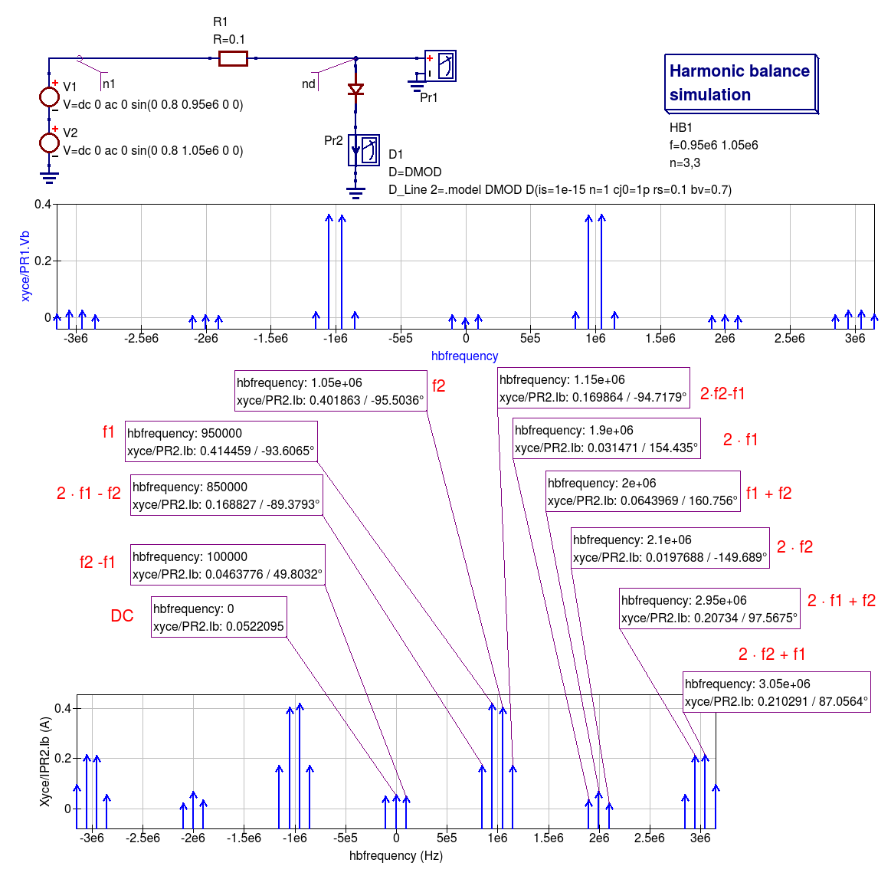

------------------------------------------------------------------
Chapter 13. RF simulation with Ngspice, Xyce and SPICE OPUS
------------------------------------------------------------------

13.1 Introduction to capabilities
~~~~~~~~~~~~~~~~~~~~~~~~~~~~~~~~

The original motivation behind the development of Qucs was the need for an open source
RF circuit simulator which was freely available to all interested in RF and microwave
circuit and system design. Today, Qucs has become a relatively stable simulation
package with good high frequency analysis capabilities like small signal AC two port and multi-port S parameter
analysis, noise analysis and rudimentary single tone Harmonic Balance (HB) circuit simulation.  For anyone
interested in RF circuit design Qucs is distributed with a selection of built-in RF component models, including
microstrip and coplanar technology components, making the package a good choice for investigation
the performance of high frequency circuits.  At RF, Qucs implements models and analysis features not included in the traditional SPICE 2g6
and 3f5 circuit simulators. In contrast to SPICE 3f5 the Ngspice, Xyce and SPICE OPUS GPL simulators have been extended
with features which are designed specifically for RF circuit simulation. These include single tone and multi-tone HB
simulation (Xyce) and a transient simulation shooting method (SPICE OPUS) for large signal AC steady state simulation. 
These RF simulation techniques, when coupled with the fact that Ngspice, Xyce and SPICE OPUS support small signal AC two port network analysis 
via the spice4qucs extension, makes the Qucs-S version of Qucs a useful addition to the GPL RF circuit simulation scene.  

HB is a circuit simulation method that solves for the steady state solution of nonlinear circuits in the frequency domain. 
In HB simulation, the voltages and currents in a nonlinear circuit are represented by truncated Fourier series. HB computes the frequency spectrum
of circuit voltages and currents when signals reach a steady state, following excitation with an external signal source. 
This source can be a large signal AC signal. In practice the HB simulation technique is often more efficient than transient analysis, particularly in situations where 
transient analysis can take a long time to reach a steady state solution due to widely differing frequency signals present in a circuit, for example amplitude 
or frequency modulated communications signals. 
HB is particularly suited to the simulation of analogue RF and microwave circuits.

In this chapter the Qucs-S RF capabilities are introduced and described.  To demonstrate these new features 
a number of example RF circuit simulations are presented together with a new **Template** element which allows libraries of analysis
and post-simulation data processing **Nutmeg** scripts to be stored and embedded in Qucs schematics. The idea  of a predefined **Test Bench** is
also outlined and applied to RF circuit simulation case studies. 

The Qucs-S version of Qucs includes spice4qucs extensions which allow the package to be used for analysis of RF circuits. 
The central features of the spice4qucs RF elements are:

* Small signal AC two port S-parameter simulation (Ngspice, XYCE and SPICE OPUS)
* Small signal AC two port Y,Z etc. network simulation/analysis (Ngspice, Xyce and SPICE OPUS)
* Single and multi-tone large signal AC Harmonic Balance simulation (Xyce only)
* Large signal AC transient simulation with steady state shooting methods (SPICE OPUS only) 
* Emulation of Qucs RFEDD components (limited support at this time)

Where needed each of the above can make use of Octave scripts and functions in the analysis of simulation data.

Readers will have probably noticed from the list presented above that multi-port S-parameter modelling and RF simulation features
are not implemented in Qucs-S. Currently, there are no plans to add this extension to the existing Qucs-S simulation
and modelling features. Anyone interested in multi-port S-parameter RF circuit analysis is advised to use the standard Qucs package. 

13.2 Small signal AC S-parameter simulation
~~~~~~~~~~~~~~~~~~~~~~~~~~~~~~~~~~~~~~~~~~~~~
S-parameter two port and multi-port RF and microwave circuit simulation are not implemented in traditional SPICE 2g6 and 3f5 simulators.
This is a serious omission because at RF frequencies  S-parameter and two-port network parameters are widely used in circuit analysis and design.
To overcome this limitation four small signal AC analysis probes have been added to the spice4qucs RF extensions.  When combined with signal sources
they form a **Two-port S-parameter circuit test bench**.  This test bench is shown in Figure 13.1. Its main features are space on the test bench 
schematic to place the device under test (DUT) circuit diagram, input AC signal sources with :math:`Z0` characteristic impedance, :math:`Z0` load
impedances and the S-parameter measurement probes.  Notice that two copies of the DUT are require; firstly to measure :math:`S11` and :math:`S12` and
secondly :math:`S22` and :math:`S21`.  The test bench also includes a detailed set of instructions on how to use it to measure simulated two-port S-parameters.
The two-port S-parameter test bench illustrated in Figure 13.1 will work with the Ngspice, Xyce and SPICE OPUS circuit simulators.     

|small_signal_S_EN|

Figure 13.1 A small signal AC S-parameter test bench with S-parameter probes.

The schematic shown in Figure 13.2 demonstrates the use of the S-parameter test bench.  In this example two identical copies of a Butterworth passive low pass filter
circuit with :math:`fc` = 100 kHZ and :math:`Z0` = 50 Ohms are connected between the pairs of DUT terminals labelled **IN** and **OUT**. Notice that the orientation of both DUT is the same.
The outputs from the S-parameter probes are called :math:`nS11, nS12, nS21` and :math:`S22` being represented as voltages specified by complex numbers.  Figure 13.2 
also shows typical plots of the magnitudes of the simulated S-parameters. For convenience the test-bench instructions have been deleted from Figure 13.3.  Also, if
required the size of the area allocated to each DUT can be changed, provided the test-bench signal and load circuit connections are not changed. Similarly, the value of :math:`Z0` 
and the load resistors can be changed from 50 Ohms. 

|small_signal_S2_EN|

Figure 13.2 Extraction of a low pass filter small signal S-Parameters using a Qucs-S test-bench.

13.3 Small signal AC two port network simulation/analysis
~~~~~~~~~~~~~~~~~~~~~~~~~~~~~~~~~~~~~~~~~~~~~~~~~~~~~~~~~~

13.4 Single tone large signal AC Harmonic Balance simulation
~~~~~~~~~~~~~~~~~~~~~~~~~~~~~~~~~~~~~~~~~~~~~~~~~~~~~~~~~~~~

The Spice4qucs subsystem supports Xyce single tone and multi-tone Harmonic Balance (HB). 
Unlike the rudimentary version of HB simulation implemented in Qucs the Xyce version can simulate circuits
with a full range of SPICE components, it is also faster and much more stable. In general no changes to the SPICE
semiconductor device or component models are required. To invoke single tone HB just place 
the Qucs-S ``HB simulation`` icon on a circuit schematic, define the number of harmonics and 
simulate the circuit with Xyce. The spice4qucs output data parser automatically converts output variable names to Qucs notation.

For example, for node voltage ``out`` plot ``out.Vb``. 
Figure 13.3 shows the schematic and Figure 13.4 the simulation output plots for a basic diode circuit similar to the original Qucs HB example found
on the Qucs web site. For comparison Figure 13.4 presents the output voltage spectrum plots generated by Qucs and Qucs-S/Xyce.

|diode_HB_EN|

Figure 13.3 Diode clipper harmonic balance simulation

Th HB simulation results for the diode clipper circuit are shown in the Figure 13.4.

|diode_HB_res_EN|

Figure 13.4 Output voltage spectrum at Node2 for Qucs (left plot), and measured with voltage probe Pr1 for Xyce (right plot).

Comparing these two plots highlights an obvious difference in the plot frequency scales.
The Qucs-S/Xyce output plot is represented as a function of negative and positive frequency components.
In this example there are eight harmonics (``n=8``) arranged as 8 positive frequencies and eight
negative frequencies plus a DC component. 

.. |small_signal_S_EN| image:: _static/en/chapter13/Fig13p1.png 
.. |small_signal_S2_EN| image:: _static/en/chapter13/Fig13p2.png

.. |diode_HB_EN| image:: _static/en/chapter13/diode_HB.png
.. |diode_HB_res_EN| image:: _static/en/chapter13/diode_HB_res.png

Qucs HB simulation data are output as a plot of frequency domain spectral amplitude components :math:`|H|`, where   

.. math::     
    |H| = U(0),|U(f1)|, |U(f2)|, |U(f3)|, ......

and :math:`|U(fn)|` is the magnitude of a harmonic component at frequency :math:`fn` and :math:`n=1, 2, 3, 4,...`.
In contrast to the Qucs circuit simulator Xyce outputs HB simulation data as a plot of complex conjugate spectral components :math:`H`
in the negative :math:`(-f)` and positive :math:`(f)` frequency domains, where

.. math::     
    |H| = U(0), 2 \cdot sqrt(U(-f1) \cdot \overline{U(f1)} ), 2 \cdot sqrt(U(-f2) \cdot \overline{U(f2)} ),.....   
    
Yielding, eight very similar harmonic spectra magnitude values to Qucs :math:`|H|`.

13.5 Multi-tone Large signal AC HB simulation
~~~~~~~~~~~~~~~~~~~~~~~~~~~~~~~~~~~~~~~~~~~~~

Since Xyce release 6.3 the package has supported multi-tone HB simulation. You can specify more 
than one tone frequency in the ``HB simulation component`` properties box.  
Perform the following steps to setup multi-tone Xyce HB simulation:

* Specify a list of space separated frequencies in the ``f`` parameter box.
* Specify a comma separated list of the number of harmonic frequencies for each of the source signals in the ``n`` parameter box.
* Construct an input signal generator using two or more series AC voltage sources, with the required frequencies and amplitudes,
or two or more parallel AC current sources driving a one Ohm resistor.

Normally, multi-tone HB simulation signal sources consist of two or three AC sources with different frequencies and similar amplitudes. 
With two AC signal sources with nearly equal frequencies, that are not integer related, circuit modulation components can be extracted from circuit output spectra.
A multi-tone HB example illustrating this feature is given in Figure 13.5, where two AC signals of 0.8 V peak and frequencies 0.95 MHz and 1.05 MHz  are applied to a simple diode circuit.
The frequencies of individual spectral components are show as combinations of signal frequencies :math:`f1` and :math:`f2` and marked in red on Figure 13.5.
|diode_HB_2t_EN|

Figure 13.5 An example diode 2-tone HB simulation circuit plus voltage and current simulation spectra
  

13.6 The SPICE OPUS large signal AC steady state transient shooting method
~~~~~~~~~~~~~~~~~~~~~~~~~~~~~~~~~~~~~~~~~~~~~~~~~~~~~~~~~~~~~~~~~~~~~~~~~~~

13.7 Emulation of Qucs RFEDD components
~~~~~~~~~~~~~~~~~~~~~~~~~~~~~~~~~~~~~~~~~
RFEDD passive components (RCL) and B-type sources could be represented using 
``hertz`` variable in equations. See official Ngspice manual for additional 
information.

13.8 More example RF circuit simulations
~~~~~~~~~~~~~~~~~~~~~~~~~~~~~~~~~~~~~~~~~

   `back to the top <#top>`__

