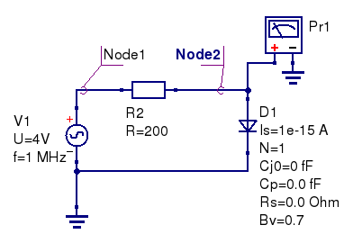
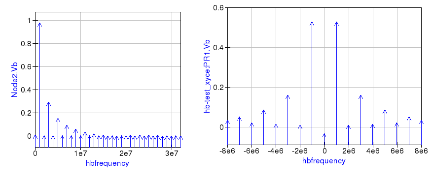

-----------------------------------------------------------------------
Chapter 8. RF simulation with Qucs, ngspice and Xyce
-----------------------------------------------------------------------

8.1 Introduction to capabilities
~~~~~~~~~~~~~~~~~~~~~~~~~~~~~~~~~

Spice4qucs could be used for analysis of RF circuits. It contains the following 
features:

* Harmonic balance simulation (Xyce only)
* S-parameter probes (Ngspice and Xyce)
* RFEDD components (Ngspice, limited support)

RFEDD passive components (RCL) and B-type sources could be represented using 
``hertz`` variable in equations. See official Ngspice manual for additional 
information.

8.2 Two port networks
~~~~~~~~~~~~~~~~~~~~~~~~~~

8.3 S parameter simulation
~~~~~~~~~~~~~~~~~~~~~~~~~~~~

8.4 RF noise simulation
~~~~~~~~~~~~~~~~~~~~~~~~~~~

8.5 Harmonic Balance simulation with Qucs and Xyce
~~~~~~~~~~~~~~~~~~~~~~~~~~~~~~~~~~~~~~~~~~~~~~~~~~

Spice4qucs subsystem supports Harmonic Balance (HB) simulation only for Xyce 
Ngspice will not work. HB simulation component properties don't require any 
special adaptation for simulation with Xyce. You need just place 
``HB simulation`` component on schematic, define number of harmonics and 
simulate circuit with Xyce. Spice4qucs output data parser automatically 
converts output variable names to Qucs notation. For example for node voltage 
``out`` you need to plot ``out.Vb``. Let's consider a small example (diode 
clipper, Figure 8.1). 

|diode_HB_EN|

Figure 8.1 Diode clipper harmonic balance simulation

Simulation results are shown in the Figure 8.2

|diode_HB_res_EN|

Figure 8.2 Output spectrum form Qucs (left) and Xyce (right)

There are the following important difference between Qucs and Xyce. Xyce output 
contains image components (negative frequencies). So, for given ``n=17`` 
harmonics you obtain 8 harmonics, 8 image harmonics and DC component (Figure 
8.2).

8.6 Example RF circuit simulations
~~~~~~~~~~~~~~~~~~~~~~~~~~~~~~~~~~~~

   `back to the top <#top>`__

