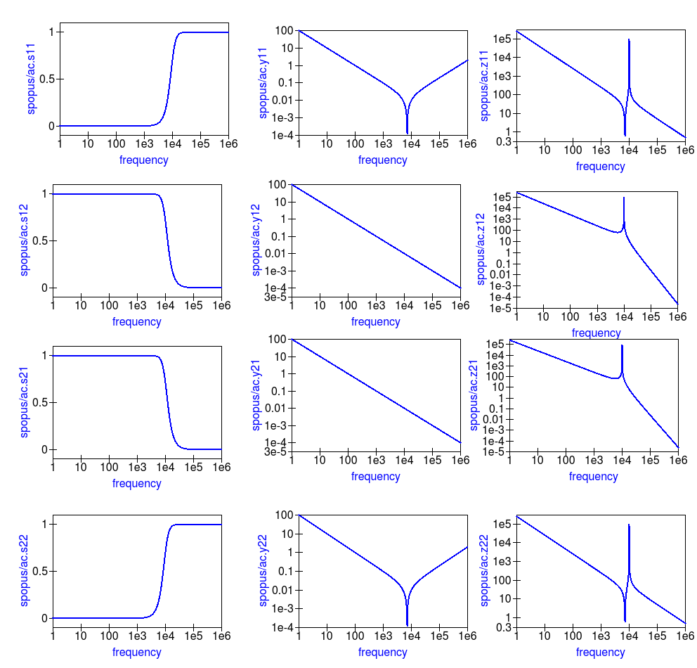

------------------------------------------------------------------
Chapter 13. RF simulation with Ngspice, Xyce and SPICE OPUS
------------------------------------------------------------------

13.1 Introduction to capabilities
~~~~~~~~~~~~~~~~~~~~~~~~~~~~~~~~~~~

The original motivation behind the development of Qucs was the need for an open source
RF circuit simulator which was freely available to all interested in RF and microwave
circuit and system design. Today, Qucs has become a relatively stable simulation
package with good high frequency analysis capabilities like small signal AC two port and multi-port S parameter
analysis, noise analysis and rudimentary single tone Harmonic Balance (HB) circuit simulation.  For anyone
interested in RF circuit design Qucs is distributed with a selection of built-in RF component models, including
microstrip and coplanar technology components, making the package a good choice for investigation
the performance of high frequency circuits.  At RF, Qucs implements models and analysis features not included in the traditional SPICE 2g6
and 3f5 circuit simulators. In contrast to SPICE 3f5 the Ngspice, Xyce and SPICE OPUS GPL simulators have been extended
with features which are designed specifically for RF circuit simulation. These include single tone and multi-tone HB
simulation (Xyce) and a transient simulation shooting method (SPICE OPUS) for large signal AC steady state simulation. 
These RF simulation techniques, when coupled with the fact that Ngspice, Xyce and SPICE OPUS support small signal AC two port network analysis 
via the spice4qucs extension, makes the Qucs-S version of Qucs a useful addition to the GPL RF circuit simulation scene.  

HB is a circuit simulation method that solves for the steady state solution of nonlinear circuits in the frequency domain. 
In HB simulation, the voltages and currents in a nonlinear circuit are represented by truncated Fourier series. HB computes the frequency spectrum
of circuit voltages and currents when signals reach a steady state, following excitation with an external signal source. 
This source can be a large signal AC signal. In practice the HB simulation technique is often more efficient than transient analysis, particularly in situations where 
transient analysis can take a long time to reach a steady state solution due to widely differing frequency signals present in a circuit, for example amplitude 
or frequency modulated communications signals. 
HB is particularly suited to the simulation of analogue RF and microwave circuits.

In this chapter the Qucs-S RF capabilities are introduced and described.  To demonstrate these new features 
a number of example RF circuit simulations are presented together with a new **Template** element which allows libraries of analysis
and post-simulation data processing **Nutmeg** scripts to be stored and embedded in Qucs schematics. The idea  of a predefined **Test Bench** is
also outlined and applied to RF circuit simulation case studies. 

The Qucs-S version of Qucs includes spice4qucs extensions which allow the package to be used for analysis of RF circuits. 
The central features of the spice4qucs RF elements are:

* Small signal AC two port S-parameter simulation (Ngspice, XYCE and SPICE OPUS)
* Small signal AC two port Y,Z etc. network simulation/analysis (Ngspice and SPICE OPUS)
* Single and multi-tone large signal AC Harmonic Balance simulation (Xyce only)
* Large signal AC transient simulation with steady state shooting methods (SPICE OPUS only) 
* Emulation of Qucs RFEDD components (limited support at this time)

Where needed each of the above can make use of Octave scripts and functions in the analysis of simulation data.

Readers will have probably noticed from the list presented above that multi-port S-parameter modelling and RF simulation features
are not implemented in Qucs-S. Currently, there are no plans to add this extension to the existing Qucs-S simulation
and modelling features. Anyone interested in multi-port S-parameter RF circuit analysis is advised to use the standard Qucs package. 

The S-parameter probes, templates and examples introduced in this chapter can be found in the Qucs-S examples directory. They are stored as project
spice4qucs-helpChapter13_prj.

 

13.2 Small signal AC S-parameter simulation
~~~~~~~~~~~~~~~~~~~~~~~~~~~~~~~~~~~~~~~~~~~~~
S-parameter two port RF and microwave circuit simulation is not implemented in traditional SPICE 2g6 and 3f5 simulators.
This is a serious omission because at RF frequencies  S-parameter and other two-port network parameters are widely used in circuit analysis and design.
To overcome this limitation four small signal AC analysis probes have been added to the spice4qucs RF extensions.  When combined with signal sources
they form a **Two-port S-parameter circuit test bench**.  This test bench is shown in Figure 13.1. Its main features are space on the test bench 
schematic to place the device under test (DUT) circuit diagram, input AC signal sources with :math:`Z_0` characteristic impedance, :math:`Z_0` load
impedances and the S-parameter measurement probes.  Notice that two copies of the DUT are require; firstly to measure :math:`S_{11}` and :math:`S_{12}` and
secondly :math:`S_{22}` and :math:`S_{21}`.  The test bench also includes a detailed set of instructions on how to use it to measure simulated two-port S-parameters.
The two-port S-parameter test bench illustrated in Figure 13.1 will work with the Ngspice, Xyce and SPICE OPUS circuit simulators.     

Figure 13.1 A small signal AC S-parameter test bench with S-parameter probes.

The schematic shown in Figure 13.2 demonstrates the use of the S-parameter test bench.  In this example two identical copies of a Butterworth passive low pass filter
circuit with :math:`f_c` = 100 kHZ and :math:`Z_0` = 50 Ohms are connected between the pairs of DUT terminals labelled **IN** and **OUT**. Notice that the orientation of both DUT is the same.
The outputs from the S-parameter probes are called ``nS11``, ``nS12``, ``nS21`` and ``S22`` being represented as voltages specified by complex numbers.  Figure 13.2 
also shows typical plots of the magnitudes of the simulated S-parameters. For convenience the test-bench instructions have been deleted from Figure 13.3.  Also, if
required the size of the area allocated to each DUT can be changed, provided the test-bench signal and load circuit connections are not changed. Similarly, the value of :math:`Z_0` 
and the source and load resistors (:math:`R_1`, :math:`R_2`, :math:`R_3` and :math:`R_4` in Figure 13.2) can be changed from 50 Ohms. 

|small_signal_S2_EN|

Figure 13.2 Extraction of a low pass filter small signal S-Parameters using a Qucs-S test-bench.

13.3 Small signal AC two port network simulation/analysis
~~~~~~~~~~~~~~~~~~~~~~~~~~~~~~~~~~~~~~~~~~~~~~~~~~~~~~~~~~
The spice4qucs extensions introduce post-simulation data conversion for two-port networks centred 
around Qucs-S **Nutmeg scripts** and Qucs-S **Nutmeg equation** blocks. These are designed specifically to
work with Ngspice and Xyce. Conversion of two port parameters from
one format to another format is simply one example of the application of Qucs-S embedded nutmeg scripts for the
control of circuit simulation and the extraction of circuit parameters from output data.
The Xyce circuit simulator is more limited in that it does not have a post-processing scripting language
for extracting transfer function parameters and other data from simulation output. However, it
does allow SPICE style AC .PRINT statements which can include equations provided these  are
written in a form constructed from the real and imaginary components of circuit voltages and
currents. In practice this is not very convenient, particularly when these equations involve many
algebraic terms.  At this time the Xyce facilities for the extraction of AC data items are at a rudimentary stage in the
packages development and for this reason are not considered further in this document. 

|small_signal_S3_EN| 

Figure 13.3 **Nutmeg script** controlled simulation and two-port parameter extraction.

Figure 13.3 presents an S-parameter test bench used to extract the S parameters of the same low pass filter
introduced in Figure 13.1.  However, unlike Figure 13.1 Qucs/Qucs-S simulation icons are NOT attached to the
test-bench circuit schematic.  Instead a Qucs-S **Nutmeg script** is used.  This script controls the simulation sequence
and provides post processing algebraic equations which generate small signal AC :math:`Y` and :math:`Z` parameters from the data 
output by the S-parameter probes. Figure 13.4 shows a set of simulation plots obtained with the Nutmeg script and SPICE OPUS.  Identical
data was recorded with Ngspice.  However, one difference was noticed when simulating circuits via the **Nutmeg script** route.  SPICE OPUS
requires that the code words, like for example ac and let, must be entered with lower case letters, otherwise the SPICE OPUS simulation fails.
Chapter 8 presents much more detail on how to set up **Nutmeg scripts** and gives a number of additional examples of their use in Qucs-S circuit
simulation.

|small_signal_S4_EN|

Figure 13.4 Typical S-parameter, :math:`Y` parameter and :math:`Z` parameter data for the test circuit given in Figure 13.3.

One of the pioneering circuit simulation features implemented by Qucs is the **Equation** block.  This allows blocks of algebraic equations to be attached
to a circuit schematic.  Any equations which do NOT include quantities computed during simulation, like circuit voltages and currents, are evaluated prior to the start of simulation. 
These quantities remain fixed during simulation and may be referenced by the simulator when calculating voltages and currents. In contrast, if an **Equation** block includes 
variables which are functions of simulation variables these are evaluated, based on the stored simulation output data, after a simulation finishes.
Qucs has a Octave style numerical analysis package built into the software for this purpose.  

Qucs-S uses a slightly different approach to post simulation data processing.  Both Ngspice and Xyce use an extended form of the  SPICE nutmeg software for post-simulation data processing.  
Unfortunately, because Xyce does not include a feature equivalent to SPICE nutmeg, AC post-simulation data processing is not possible with Xyce.
To setup and use a Qucs-S **Nutmeg** equation block place the **Nutmeg** icon on an empty schematic sheet and enter the individual variable equations in a 
similar fashion to Qucs **Equation** blocks.  Once complete copy the **Nutmeg** equation black to the current work circuit schematic.
Such **Nutmeg** equation blocks are called **Templates** by the Qucs-S Development Team. These templates can be saved in a project and used over and over again.
Templates add a new and important facility to Qucs-S which allows users to develop libraries of-post simulation data processing scripts and store them for future use. 
See Chapters 7 and 8 for more details and examples of the use of Qucs-S **Custom Simulation** technology and **Nutmeg** equation blocks. 
Figure 13.5 shows Qucs-S **Templates** for the conversion of S-parameters to :math:`Y` and :math:`Z` two port parameters. Note that these do NOT include commands for
simulations, for example ac ......, and do not have the same named variable defined more than ONCE. 

|small_signal_S5_EN|

Figure 13.5 Qucs-S **Nutmeg** equation block templates for :math:`S` to :math:`Y` and :math:`Z` parameter conversion.

13.4 Single tone large signal AC Harmonic Balance simulation
~~~~~~~~~~~~~~~~~~~~~~~~~~~~~~~~~~~~~~~~~~~~~~~~~~~~~~~~~~~~

The Spice4qucs subsystem supports Xyce single tone and multi-tone Harmonic Balance (HB). 
Unlike the rudimentary version of HB simulation implemented in Qucs the Xyce version can simulate circuits
with a full range of SPICE components. It is also faster and much more stable. In general no changes to the SPICE
semiconductor device or component models are required. To invoke single tone HB just place 
the Qucs-S ``HB simulation`` icon on a circuit schematic, define the number of harmonics and 
simulate the circuit with Xyce. The spice4qucs output data parser automatically converts output variable names to Qucs notation.
For example, for node voltage ``out`` plot ``out.Vb``. 

Figure 13.6 shows the schematic and Figure 13.7 the simulation output plots for a basic diode circuit similar to the original Qucs HB example found
on the Qucs web site. For comparison Figure 13.7 presents the output voltage spectrum plots generated by Qucs and Qucs-S/Xyce.

|diode_HB_EN|

Figure 13.6 Diode clipper harmonic balance simulation.

The HB simulation results for the diode clipper circuit are shown in the Figure 13.7.

|diode_HB_res_EN|

Figure 13.7 Output voltage spectrum at Node2 for Qucs (left plot), and measured with voltage probe Pr1 for Xyce (right plot).

Comparing these two plots highlights an obvious difference in the plot frequency scales.
The Qucs-S/Xyce output plot is represented as a function of negative and positive frequency components.
In this example there are eight harmonics (``n=8``) arranged as 8 positive frequencies and eight
negative frequencies plus a DC component. 

.. |small_signal_S2_EN| image:: _static/en/chapter13/Fig13p2.png

.. |diode_HB_res_EN| image:: _static/en/chapter13/diode_HB_res.png

.. |ssseFig2_EN|  image:: _static/en/chapter13/chap13ssseFig2.png

Qucs HB simulation data are output as a plot of frequency domain spectral amplitude components :math:`|H|`, where   

.. math::     
    |H| = U(0),U(f_1), U(f_2), U(f_3), ......

:math:`U(0)` is the DC spectral component, :math:`U(f_n)` is the magnitude of a harmonic component at frequency :math:`f_n` and :math:`n=1, 2, 3, 4,...`.
In contrast to Qucs,  Xyce outputs HB voltage and current simulation data as plots of complex conjugate spectral components, where

.. math::     
    |H| = U(0), 2 \cdot \sqrt {U(-f_1) \cdot \overline{U(f_1)} }, 2 \cdot \sqrt{U(-f_2) \cdot \overline{U(f_2)} },.....   
    
yielding, eight very similar magnitude harmonic spectra values to Qucs :math:`|H|`. If required the phase at each harmonic frequency can be extracted
from the Xyce HB simulation data.

13.5 Multi-tone Large signal AC HB simulation
~~~~~~~~~~~~~~~~~~~~~~~~~~~~~~~~~~~~~~~~~~~~~

Since Xyce release 6.3 the package has supported multi-tone HB simulation. Xyce multi-tone allows more 
than one tone frequency in the ``HB simulation component`` properties box.  
Perform the following steps to setup a multi-tone Xyce HB simulation:

* Specify a list of space separated frequencies in the ``f`` parameter box.
* Specify a comma separated list of the number of harmonic frequencies for each of the source signals in the ``n`` parameter box.
* Construct an input signal generator using two or more series AC voltage sources, with the required frequencies and amplitudes, or 
* construct an input signal generator using two or more parallel AC current sources driving a one Ohm resistor.

Normally, multi-tone HB simulation signal sources consist of two or three AC sources with different frequencies and similar amplitudes. 
With two AC signal sources with nearly equal frequencies, that are not integer related, circuit modulation components can be extracted from circuit output spectra.
A multi-tone HB example illustrating this feature is given in Figure 13.8, where two AC signals of 0.8 V peak and frequencies 0.95 MHz and 1.05 MHz  are applied to a simple diode circuit.
The frequencies of individual diode curreny spectral components are show as combinations of signal frequencies :math:`f_1` and :math:`f_2` and marked in red on Figure 13.9.

|diode_HB_2t_EN|

Figure 13.8 An example diode 2-tone Xyce HB simulation circuit plus diode voltage spectra.
  

|diode_HB_2t2_EN|

Figure 13.9 Diode 2-tone Xyce HB simulation current spectra. 

13.6 The SPICE OPUS large signal AC steady state transient shooting method
~~~~~~~~~~~~~~~~~~~~~~~~~~~~~~~~~~~~~~~~~~~~~~~~~~~~~~~~~~~~~~~~~~~~~~~~~~~
Fourier analysis of circuits driven by periodic AC input signals works well at low to moderate frequencies provided that they have a period similar to the circuit time constants. 
Unfortunately, high frequency RF signals normally have very small periods, implying that an RF transient simulation has to 
run for a very large number of signal cycles before a steady state circuit response is reached.  
This can result in a prohibitively long simulation time which can grow at an alarming rate as the circuit size is increased. 
One way to reduce simulation time is to  undertake the simulation of RF communication circuits in the AC domain.  
This approach forms the basis for the single and multi-tone Harmonic Balance methods introduced in previous sections of this chapter.

A second method, which is particularly suited to simulating RF communication circuits, is the so called "shooting method". 
This is a modified form of time domain transient simulation.
In the shooting method it is assumed that a non-linear circuit has a periodic solution which can be found from the circuit state where transients are NOT present. 
This state is called a steady state circuit solution.  
If :math:`x(t)` is a set of circuit variables obtained by time domain simulation at time t, then for periodicity :math:`x(t) = x(t+T)`, where T is the period of the input signal. 
The time domain simulation starts by  calculating the initial state :math:`x(0)`, often using DC simulation when the input signal is zero. 
Using :math:`x(0)` as an initial state, a circuit under test is simulated in the time domain from :math:`t` = 0 to :math:`t` = :math:`T` than an estimate of the circuit state is made.
This process is repeated, increasing time by :math:`T` at each iteration, until :math:`x(t+n \cdot T) = x(t+(n+1) \cdot T)` is satisfied within a reasonable tolerance.
Unlike direct transient methods a circuit is only simulated over one period per solution iteration cycle.
Hence, the shooting method can be more more efficient, provided that a steady state solution can be found in a number of iterations that are smaller than the
number of periods simulated by direct transient simulation. 

The SPICE OPUS implementation of the shooting method was first released with software version 2.25 in December 2006.
It can be used to simulate the performance of linear and non-linear circuits with either small or large amplitude periodic input signals.
It can be launched by Qucs-S using the new **Custom simulation** feature.
SPICE OPUS steady response analysis in the transient domain is implemented as an additional nutmeg command called **ssse**.
Nutmeg command **ssse** runs a time domain shooting method with extrapolation via the following statement:

.. code-block:: Bash

 ssse v([,]) [level] [step] [skip] [period] [history]

where v([,]) indicates the observed response of a voltage at a circuit node, referenced to ground, or a voltage difference between two nodes, for example v(n1) or v(n1,n2) respectively;
level indicates the circuit hierarchical at which the shooting method data is calculated, level=0 is a circuit expanded to component level, default=0;
step is the time step for transient simulation (same meaning as the nutmeg tran command), default=1;
skip is the time skipped before the shooting method starts sampling response v([,]), default=0;
period is the number of periods taken into account for sampling, default=2;
history is a flag which if set causes nutmeg to record data from all transient iterations. If history is NOT set then only the final steady state solution is recorded.
In the above SPICE OPUS nutmeg ``ssse`` statement the brackets ``[ ]`` indicate optional quantities.  
Also note that SPICE OPUS option ``sssetol`` can be changed, if required, to improve simulation convergence.

Figure 13.20 introduces a simple test circuit designed to test the performance of a DC forward biassed semiconductor diode subjected to an AC input voltage signal.  The SPICE OPUS nutmeg
script is shown in Figure 13.20 attached tp a Qucs-S **Nutmeg script** icon.  This script follows the statement rules required by the SPICE OPUS extended form of SPICE 
nutmeg.  For comparison the example script shown in Figure 13.20 and Figure 13.21 includes entries for launching and saving the simulation data from transient, Fourier and **ssse** simulations.  
Notice that each set of simulated data is written to separate named files.  
The names of these files are registered by pressing the "Find all outputs" tab on the Qucs-S Custom simulation control script editing window, see Figure 13.21.  
Variables for post-simulation visualization can be found in a similar way by pressing the "Find all variables" tab. 
More details of the use of Qucs-S Custom simulation can be found in Chapter 8.
Pressing key "F2" causes Qucs-S to simulate the current circuit schematic; firstly generating a Qucs circuit netlist, secondly synthesizing a SPICE style netlist from the Qucs netlist
(Figure 13.22  shows the SPICE OPUS netlist generated by Qucs-S for the diode test circuit Custom simulation), and finally simulates the circuit netlist using the nutmeg statements 
located between the SPICE ``.control`` and ``.endc`` statements. Following successful simulation Qucs-S visualization features can be used to plot the transient and frequency domain
data output.  A typical set of plots is illustrated in Figure 13.23. Notice that the Fourier and **ssse** spectral data for the diode current are identical.  

 |ssseFig1_EN|

Figure 13.20   SPICE OPUS shooting method test circuit for a semiconductor diode. 

 |ssseFig2_EN|

Figure 13.21  Qucs-S **Custom simulation** control script editing window.

 |ssseFig2A_EN|

Figure 13.22  SPICE OPUS netlist for semiconductor diode transient, Fourier and ssse simulation.

 |ssseFig3_EN|

Figure 13.23 Transient, Fourier and **ssse** semiconductor diode current plots in the time and frequency domains.

 
13.7 Emulation of Qucs RFEDD components
~~~~~~~~~~~~~~~~~~~~~~~~~~~~~~~~~~~~~~~~~
RFEDD passive components (RCL) and B-type sources could be represented using 
``hertz`` variable in equations. See official Ngspice manual for additional 
information.

13.8 More example RF circuit simulations
~~~~~~~~~~~~~~~~~~~~~~~~~~~~~~~~~~~~~~~~~

   `back to the top <#top>`__

