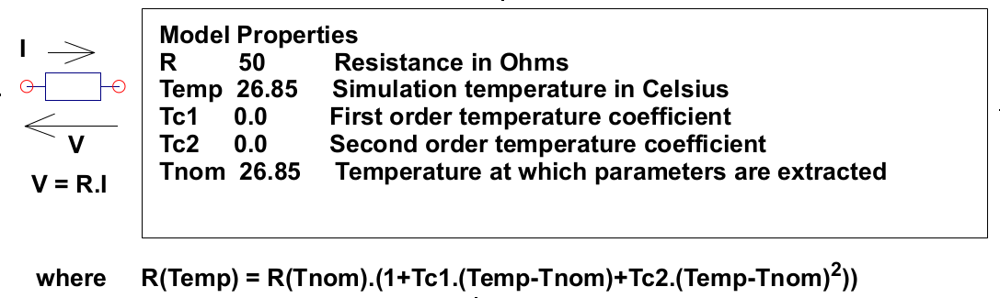
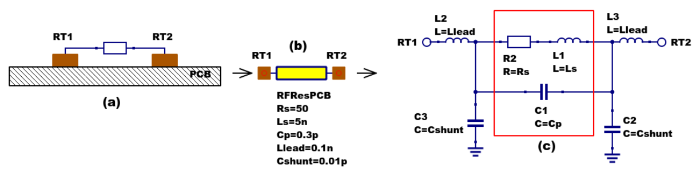
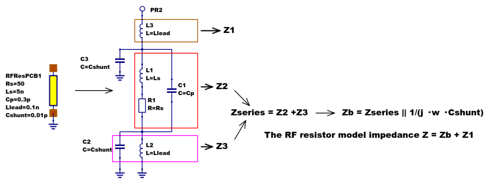
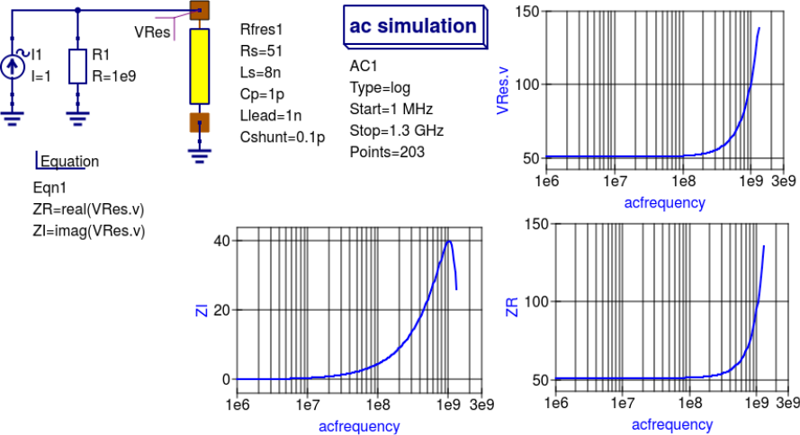
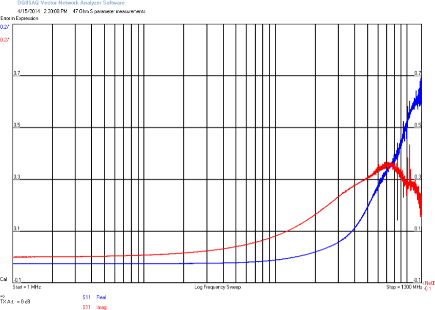
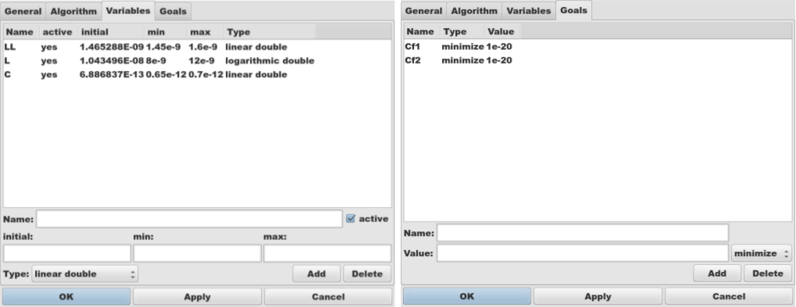
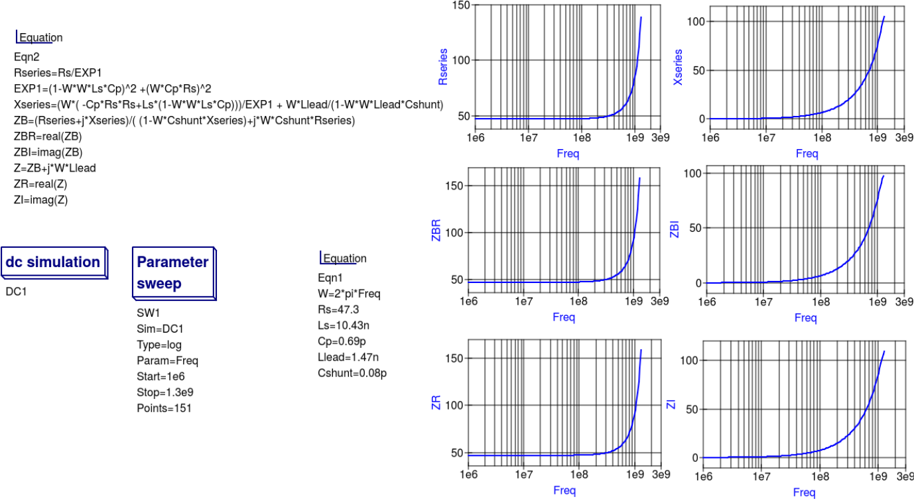
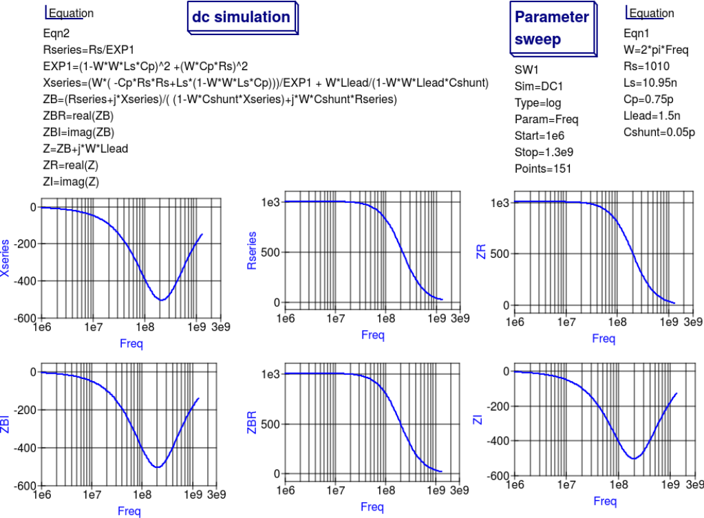
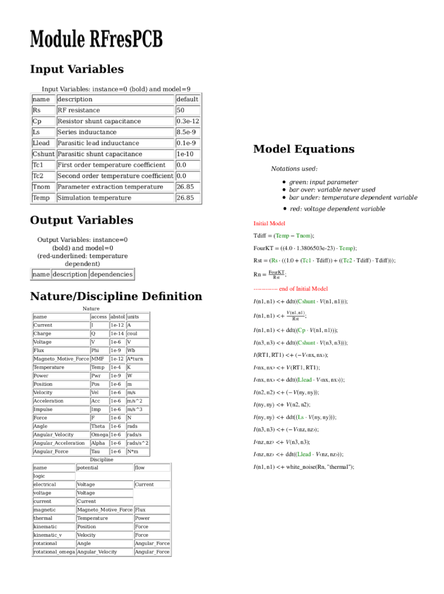

Subcircuit and Verilog-A RF Circuit Models for Axial and Surface Mounted Resistors
===============================================================================================================
**Mike Brinson**

Copyright 2014, 2015 Mike Brinson, Centre for Communications Technology, London Metropolitan University, London, UK.   (`<mbrin72043@yahoo.co.uk>`_)

Permission is granted to copy, distribute and/or modify this document under the terms of the GNU Free Documentation License, Version 1.1 or any later version published by the Free Software Foundation.

Introduction
-------------------
Resistors are one of the fundamental building blocks in electronic circuit design. In most instances conventional resistor circuit simulation models are characterized by I/V characteristics specified by Ohm’s law. In reality the impedance of RF resistors is frequency dependent, being determined by component physical properties, component manufacturing technology and how components are connected in a circuit.  At low frequencies fixed resistors have a nominal value at roomtemperature and can be modelled accurately by Ohm’s law.  At RF frequencies the fact that a resistor acts more like an inductance or a capacitance can play a crucial role in determining whether or not a circuit operates as designed.  Similarly, if a resistor is modelled as an ideal component at a frequency where it exhibits significant reactive properties then the resulting simulation data are likely to be incorrect. The subcircuit and Verilog-A compact resistor models introduced in this Qucs note are designed to give good performance from low frequencies to RF frequencies not greater than a few GHz.  

RF Resistor Models
-----------------------------
The schematic symbol,  I/V equation and parameters of the Qucs linear resistor model are shown in Figure 1.  In contrast to this model Figure 2 illustrates the structure of a printed circuit board (PCB) mounted metal film (MF) axial RF resistor (a),  its Qucs schematic symbol (b) and its equivalent circuit model (c).   A thin film surface mounted (SMD) resistor can also be represented by the model shown in Figure 2 (c).  

|image0_EN|
Figure 1 - Qucs built-in resistor model.

At signal frequencies where the largest dimension of an axial or SMD resistor is less than approximately 20 times the smallest signal wavelength a resistor can be modelled by a lumped passive circuit consisting of a resistor **Rs** in series with a small inductance **Ls** with the combination shunted by parasitic capacitor **Cp**. In Figure 2 **Rs** is the nominal value of resistor at its parameter extraction temperature **Tnom**, **Ls** represents the inductance associated with **Rs** where the value of **Ls** is largely determined by the trimming method employed during component manufacture to set the value of **Rs** to a specified tolerance. Similarly, capacitor **Cp** models a parasitic capacitance associated with **Rs** where the value of **Cp** is a function of the physical size of **Rs**.  At RF frequencies it is important, for accurate operation, to add lead parasitic elements to the intrinsic equivalent circuit model shown within the red box draw in Figure 2. In Figure 2 **Llead** and **Cshunt** represent resistor series lead inductance and shunt capacitance to ground respectively.

|image1_EN|
Figure 2 - PCB mounted resistor: (a) axial component mounting, (b) Qucs symbol and (c) equivalent circuit model.

A typical set of model parameters for a 51  :math:`\Omega` 5 % MF axial resistor are (1) **Ls  = 8nH**, **Cp = 1pF**, **Llead  = 1nH** and **Cshunt = 0.1pF**. Illustrated in Figure 3 is a basic S parameter test bench circuit for measuring the S parameters of an RF resistor over a frequency range 1 MHz to 1.3 GHz. This example also demonstrates how the real and imaginary parts of a resistor model impedance can be extracted from S parameter simulation data. The graphs in Figure 3 clearly demonstrate that the impedance of the typical MF RF resistor described in previous text and modelled by the equivalent circuit shown in Figure 2 is a strong function of frequency at higher frequencies in the band 1 MHz to 1.3 GHZ.

|image2_EN|
Figure 3 - Qucs S parameter simulation test circuit and plotted output data for a MF axial resistor: *Rs*\ =51\ :math:`\Omega`, *Ls*\ =8nH, *Cp*\ =1pF, *Llead*\ =1nH and *Cshunt*\ =0.1pF.

Analysis of the RF resistor model
-----------------------------------------------------
A component level version of the proposed RF resistor model is shown in Figure 4, where

.. math:: Z1 = j \cdot \omega \cdot Llead

.. math:: Z2 =\dfrac{Rs+j \cdot \omega \cdot Ls \cdot(1-\omega^{2} \cdot Cp \cdot Ls) -j \cdot \omega \cdot Cp \cdot Rs^{2}}{(1-\omega^{2} \cdot Cp \cdot Ls )^{2} + (\omega \cdot Cp \cdot Rs)^{2}}

.. math:: Z3 = \dfrac{j \cdot \omega \cdot Llead}{(1-\omega^{2} \cdot Llead \cdot Cshunt )}

.. math:: Zseries = Z1 + Z2 = Rseries + j \cdot Xseries

.. math:: Zb = Zseries || XCshunt = \dfrac{Zseries}{(1 + j \cdot \omega \cdot Cshunt \cdot Zseries)} = ZBR + j \cdot \omega \cdot ZBI,

.. math:: Z = j \cdot \omega \cdot Llead + Zb = ZR + j \cdot \omega \cdot ZI.

|image3_EN|
Figure 4 - RF resistor model rotated through 90 degrees and connected with one terminal grounded, similar to the test circuit in Figure. Sections of the model are shown grouped for calculation of the model impedance Z.

Figure 5 illustrates how a set of theoretical equations can be converted into Qucs equations for model simulation and post simulation data processing. In this example Qucs equation **Eqn1** holds values for RF resistor model parameters and Qucs equation **Eqn2** lists the model equations introduced at the start of this section. Figure 5 also gives a set of cartesian graphs of post simulation output data which illustrate how **ZR** and **ZI**, and other calculated items, vary with frequency over the range 1 MHz to 1.3 GHz. 

|image4_EN|
Figure 5- Theoretical analysis of RF resistance impedance Z using Qucs post processing facilities: note a dummy simulation icon, in this example DC simulation, is required to force Qucs to complete the analysis calculations.

Direct measurement of RF resistor impedance using a simulated impedance meter
----------------------------------------------------------------------------------------------------------------------
A simple impedance meter for measuring the real and imaginary components of component and circuit impedance, using small signal AC simulation, is shown in Figure 6. The impedance measuring technique uses a 1 Amp AC constant current source applied to one terminal of a two port electrical network. The second terminal is grounded. A parallel high resistance resistor (1E9 :math:`\Omega` in Figure 6) shunts the network under measurement to ensure that there is always a direct current path to ground as required by the Qucs simulator during the calculation of simulation results. If required the 1 Amp AC source can be set at a lower value. In such cases the value of **VRes** must also be scaled to give the network impedance.

|image5_EN|
Figure 6 -A simple Qucs test circuit for demonstrating the use of an AC constant current source to measure electrical network impedance.

Extraction of RF resistance data  from measured S parameters
-----------------------------------------------------------------------------------------
In the past the cost of Vector Network Analyser systems for measuring S parameters has been prohibitively expensive for individual engineers to purchase. However, this scene is changing with the introduction of low cost systems like the DGSAQ Vector Network Analyser (VNWA)  [1]_ . This instrument operates over a frequency band width of 1.3 GHz, providing a
range of useful functions with highest accuracy at frequencies up to 500 MHz. This form of VNWA is particularly suited to Radio Amateur requirements and Qucs users interested in RF circuit analysis and design. Such equipment is ideal for measuring RF circuit S parameters and providing measured data for subcircuit and Verilog-A compact devicemodel parameter extraction. Shown in Figure 7 is a graph of measured S parameter data for a nominal 47 :math:`\Omega` resistor [2]_ . As well as displaying, and printing, measured data the DGSAQ Vector Network Analyser software can output data tabulated in Touchstone\`\`SnP“  [3]_ file format. These files can be read by Qucs and their contents attached to an S parameter file icon for inclusion in circuit schematic diagrams. Figure 8 shows this process as part of an RF resistor model parameter extraction technique involving DGSAQ VNWA measured S parameter data and Qucs simulated S parameter data. 

The brown “Test circuits” box shows test circuits for firstly reading and processing the DGSAQ VNWA measured data listed in file mike3.s1p, and for secondly generating simulated S parameter data for an RF resistor specified by parameters **Ls =L**,  **Cp = C**,  **Llead = LL**, **Cshunt = 0.08 pF**, and  **Rs = 47.3**  :math:`\Omega`. 
Presented in Figure 9 are the Qucs Optimization controls” which are used to set the range of** L**, **C** and **LL** values that optimizer ASCO will select from to obtain the best fit between the measured and simulated S parameter data. Note in this parameter extraction system that **S[1,1]** refers to measured S parameter data and **S[2,2]** to simulated S parameter data. Two least squares cost functions called **CF1** and **CF2** are used as targets in the minimisation process. Values for **CF1** and **CF2** can be found in the red box called \`\`Simulation Controls\`\`. In this parameter extraction example the least squares cost function **CF1** is employed to minimize the square of the difference between the real values of the S parameters and least squares cost function **CF2** is employed to minimize the square of the difference between the imaginary values of the S parameters. Qucs post-simulation processing is also used to extract values for the real and imaginary components of the RF resistor impedance. Both the S parameter data and the impedance data are displayed as graphs in Figure 8. 

Notice in this example the SPICE optimizer ASCO is used to find the values of **L**, **C** and **LL** which minimize **CF1** and **CF2**. Also note that **Rs** and **Cshunt** are held at fixed values during optimization. In the case of *Rs* its nominal value can be found from DC or low frequency AC measurements. Similarly the value selected for *Cshunt* has been chosen to give a very small but representative value of the parasitic shunt capacitance.. After optimization finishes the minimized values of **L**, **C** and **LL** are given in the initial value column of the Qucs optimization Variables list, see Figure 9. For the 47 :math:`\Omega` resistor the post-minimization RF resistor model parameters are **Rs = 47.3** :math:`\Omega`, **Ls =   10.43 nH**, **Cp = 0.69 pF**, **Llead = 1.46 nH** and **Cshunt  = 0.08 pF**. The theoretical simulation data illustrated in Figure 10 shows good agreement with the measured and the optimized simulation data.

|image6_EN|
Figure 7 - DGSAQ Vector Network Analyser S parameter measurements for a 47 :math:`\Omega` axial RF resistor.

|image7_EN|
Figure 8 - Qucs device model parameter extraction system applied to a nominal 47 :math:`\Omega` resistor represented by the subcircuit model illustrated in Figure 2 (c). Fixed model parameter values: **Rs = Rm = 47.3** :math:`\Omega`, **CShunt = 0.08pF**; Optimised values: **Ls = L = 10.43nH**, **Llead =  LL  = 1.47nH**, **Cp = C  = 0.69pF**. To reduce simulation time the ASCO cost variance was set to 1e-3. The ASCO method was set to DE/best/1/exp.

|image8_EN|
Figure 9 - Qucs Minimization Icon drop down menus: left ”Variables“ and right ”Goals\`\`.

|image9_EN|
Figure 10 - Qucs simulation of nominal 47 :math:`\Omega` resistor based on theoretical analysis.| 

|image10_EN|
Figure 11 - Qucs device model parameter extraction system applied to a nominal 1000 :math:`\Omega` resistor represented by the subcircuit model illustrated in Figure 2(c).

|image11_EN|
Figure 12 - Qucs simulation of nominal 1000 :math:`\Omega` resistor based on theoretical analysis.

Extraction of RF resistor parameters from measured S data for a nominal 1000 :math:`\Omega` axial resistor
------------------------------------------------------------------------------------------------------------------------------------------------------
At low resistance values the impedance of an RF resistor becomes inductive as the signal frequency is increased. This is due to the fact that the inductance **Ls** contribution dominates any reactance effects by **Cp**, **Llead** and **Cshunt**. However, as Rs is increased above a few hundred Ohm’s the reverse becomes true with reactive effects dominated by contributions from **Cp**. Figures 11 and 12 demonstrate the dominance of **Cp** reactive effects at low to mid-range frequencies. 

One more example: extraction of RF resistor parameters fro measured S data for a nominal 100 :math:`\Omega` SMD resistor
----------------------------------------------------------------------------------------------------------------------------------------------------------------------------------
Figure 13 is included in this Qucs note purely for comparison purposes. SMD resistors are in general physically very small when compared to axial resistors. This results in lower values for the inductive and capacative parasitics which in turn ensures that the high frequency performance of SMD resistors is much improved.

|image12_EN|
Figure 13 - Qucs device model parameter extraction system applied to a nominal 100 :math:`\Omega` SMD resistor represented by the subcircuit model illustrated in Figure 2 (c).

A Verilog-A RF resistor model
-------------------------------------------------
Listed below is an example Verilog-A code model for the RF resistor model introduced in Figure 2 (c). Due to the limitations of the Verilog-A language subset provided by version 2.3.4 of the ”Analogue Device Model Synthesizer\`\` (ADMS)  [4]_ inductors **Ls** and **Llead** are modelled by gyrators and capacitors with values identical to **Ls** or **Llead**.

::

    //  Verilog-A module statement.
    //
    // RFresPCB.va  RF resistor (Thin film resistor, axial type, PCB mounting)
    //
    //   This is free software; you can redistribute it and/or modify
    //   it under the terms of the GNU General Public License as published by
    //   the Free Software Foundation; either version 2, or (at your option)
    //   any later version.
    //
    //   Copyright (C), Mike Brinson, mbrin72043@yahoo.co.uk, April 2014.
    //
    `include "disciplines.vams"
    `include "constants.vams"
    //  Verilog-A module statement.
    module RFresPCB(RT1, RT2);
    inout RT1, RT2;              // Module external interface nodes.
    electrical RT1, RT2;
    electrical n1, n2, n3, nx, ny, nz;          // Internal nodes.
    `define attr(txt) (*txt*)
    parameter real Rs = 50         from [1e-20 : inf)
     `attr(info="RF resistance" unit="Ohm's");
    parameter real Cp = 0.3e-12    from [0 : inf)
     `attr(info="Resistor shunt capacitance" unit="F");
    parameter real Ls = 8.5e-9     from [1e-20 : inf)
     `attr(info="Series induuctance" unit="H");
    parameter real Llead = 0.1e-9  from [1e-20 : inf)
     `attr(info="Parasitic lead induuctance" unit="H");
    parameter real Cshunt = 1e-10  from [1e-20 : inf)
     `attr(info="Parasitic shunt capacitance" unit="F");
    parameter real Tc1 = 0.0       from [-100  : 100]
     `attr(info="First order temperature coefficient" unit ="Ohm/Celsius");
    parameter real Tc2 = 0.0       from [-100  : 100]
     `attr(info="Second order temperature coefficient" unit ="(Ohm/Celsius)^2");
    parameter real Tnom  = 26.85   from [-273.15 : 300]
     `attr(info="Parameter extraction temperature" unit="Celsius");
    parameter real Temp  = 26.85   from [-273.15 : 300]
     `attr(info="Simulation temperature" unit="Celsius");
    branch (RT1, n1)  bRT1n1;    // Branch statements
    branch (n1, n2)   bn1n2;
    branch (n1, n3)   bn1n3;
    branch (n2, n3)   bn2n3;
    branch (n3, RT2)  bn3RT2;
    real Rst, FourKT, n, Tdiff, Rn;
    analog begin  // Start of analog code
    @(initial_model)
     begin
       Tdiff = Temp-Tnom;   FourKT =4.0*`P_K*Temp;
       Rst = Rs*(1.0+Tc1*Tdiff+Tc2*Tdiff*Tdiff);  Rn     = FourKT/Rst;
     end
     I(n1)     <+ ddt(Cshunt*V(n1));   I(bn1n2)  <+ V(bn1n2)/Rst;
     I(bn1n3)  <+ ddt(Cp*V(bn1n3));    I(n3)     <+ ddt(Cshunt*V(n3));
     I(bRT1n1)  <+ -V(nx); I(nx)      <+ V(bRT1n1);   // Llead
     I(nx)      <+ ddt(Llead*V(nx));
     I(bn2n3)   <+ -V(ny);  I(ny)      <+ V(bn2n3);  // Ls
     I(ny)      <+ ddt(Ls*V(ny));
     I(bn3RT2)  <+ -V(nz);  I(nz)      <+ V(bn3RT2);   // Llead
     I(nz)      <+ ddt(Llead*V(nz));
     I(bn1n2)    <+ white_noise(Rn, "thermal");  // Noise contribution
    end  // End of analog code
    endmodule

|image13_EN|
Figure 14 - Details of the proposed RF resistor model: equations, variables and other data.

Extraction of Verilog-A RF resistor model parameters from measured S data for a 100 :math:`\Omega` axial resistor
----------------------------------------------------------------------------------------------------------------------------------------------------------------
This example demonstrates the use of ASCO for extracting Verilog-A model parameters from measured S parameter data. ASCO optimization yields a figure of 4nH for **L** in the model shown in Figure 2 (c). Other model parameter values are given with the test circuit, see Figure 15.

|image14_EN|
Figure 15 - Verilog-A models parameter data extraction for a 100 :math:`\Omega` axial thin film resistor. Fixed model parameter values: **Rs =  Rm  =101**  :math:`\Omega`, **CShunt = 1e-15 F**, **Llead = LL =  0.5nH**, **Cp = C = 0.43pF**; Optimised values: **Ls = L = 3.99nH**. To reduce simulation time the ASCO cost variance was set to 1e-3. The ASCO method was set to DE/best/1/exp.

End Notes
----------------------
This brief Qucs note outlines the fundamental properties of subicircuit and verilog-A compact component models for RF resistors. The use of optimization for the extraction of subcircuit and Verilog-A compact model parameters from measured S parameters is also demonstrated. The presented techniques form part of the simulation and device modelling capabilities available with the latest Qucs release  [5]_.

.. [1]
     DG8SAQ VNWA 3 & 3E- Vector Network Analysers, SDR Kits Limited, Grangeside Business Centre, 129 Devizes Road, Trowbridge, Wilts, BA14-7sZ, United Kingdom, 2014.   
     

.. [2]
    See DG8SAQ VNWA 3 & 3E- Vector Network Analysers- Getting Started Manual for Windows 7, Vista and Windows XP.

.. [3]
      (`<http://www.vhdl.org/ibis/connector/touchstone_spec11.pdf>`_). 

.. [4]
      (`<http://sourceforge.net/projects/mot-adms/>`_).

.. [5]
     Qucs release 0.0.18, or greater.

.. only:: html

   `back to the top <#top>`__

.. |image2_EN| image:: _static/en/RFresFig2.png

.. |image4_EN| image:: _static/en/RFresFig4.png

.. |image7_EN| image:: _static/en/RFresFig7.png

.. |image10_EN| image:: _static/en/RFresFig10.png

.. |image12_EN| image:: _static/en/RFresFig12.png

.. |image14_EN| image:: _static/en/RFresFigVextract.png
