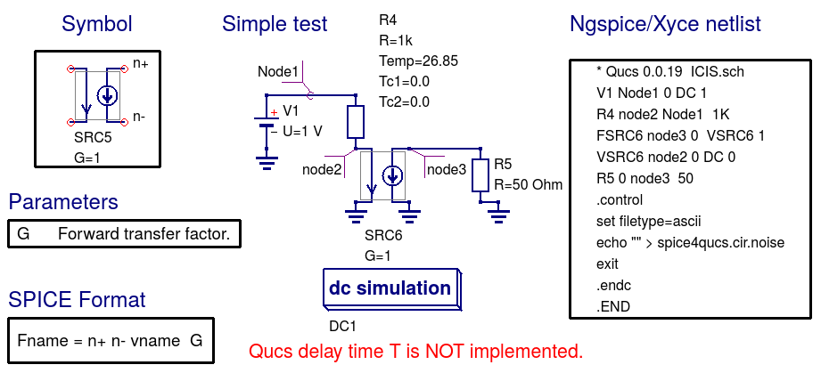
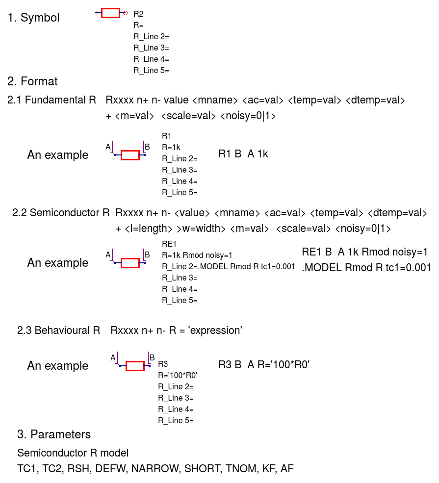
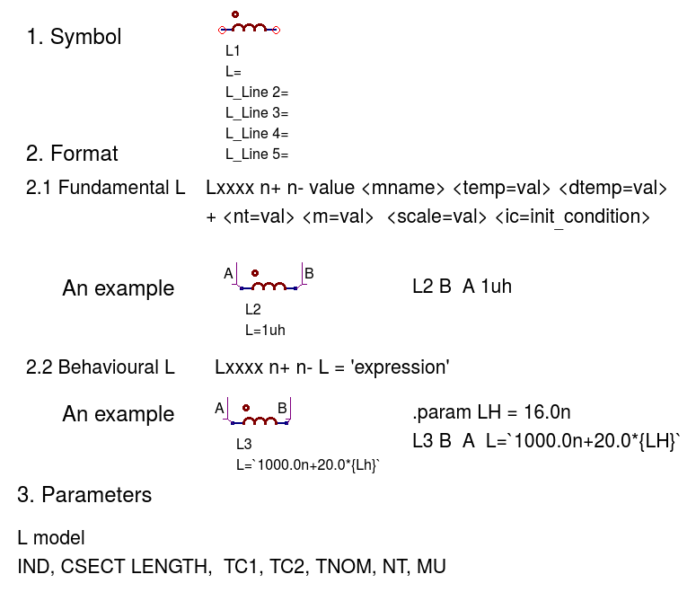

|imageQ_EN|

------------------------------------------------------------------------------------------
Chapter 7. An outline of Qucs and SPICE simulation models that work with ngspice and Xyce
------------------------------------------------------------------------------------------

7.1 Introduction
~~~~~~~~~~~~~~~~~~
For a circuit simulator to be a useful circuit design aid it must be able to simulate
a range of analogue and digital circuits which include passive components, semiconductor devices, 
integrated circuits and non-electrical devices when needed. By combining Qucs with ngspice and Xyce 
the number of available simulation models has increased significantly, making the spice4qucs version 
of Qucs more flexible and powerful, when compared to earlier Qucs releases. 
One of the primary motives behind the development of spice4qucs was to provide Qucs
users with access to published SPICE component models while keeping all the existing Qucs models and simulation  
capabilities unchanged.  With the first release of spice4qucs, as Qucs-0.0.19S, this aim has largely
been achieved.  However, there are still significant gaps in the Qucs-0.0.19S simulation capabilities 
(for example no SPICE 3f5 .PZ simulation yet) and model coverage (for example the 
number of power analogue and digital models are limited). More work is planned on model development 
for later releases of the software, including improvements to power device models and the introduction of 
XSPICE digital models for true mixed-mode analogue-digital simulation. Any improvements and additions 
to the Qucs-0.0.19S model complement will be recorded in this document as they are introduced by the  
Qucs Development Team. 

This chapter of the spice4qucs-help document consists of two parts; firstly a brief component specification and 
a more detailed technical reference, and secondly a selection of typical simulation examples which illustrate the use of 
the various component models.  Part two has been added as an aid to help Qucs users appreciate 
the new style software and the differences between Qucs-0.0.19S and earlier releases of Qucs. 

No two circuit simulators are equipped with an identical number, and the same identical types, of circuit simulation models. 
This is even true with the various implementations of SPICE developed from SPICE 3f5. Hence, by combining Qucs, ngspice and 
Xyce within one 
circuit simulation software package there has to be a way of identifying which models work with which simulator. 
A second feature that further complicates model selection is the fact that supposedly identical models representing 
the same generic device, for example a BJT, may be based on different physical device equations and a different number 
of device parameters. In an attempt to identify which model works with which simulator the Qucs Development Team have 
adopted the following model symbol colouring scheme; existing Qucs models are coloured dark blue (no change), 
SPICE models which work with both ngspice and Xyce are coloured red, SPICE models 
that only work with ngspice are coloured cyan and SPICE models that only work with Xyce are coloured dark green.  This scheme
is not perfect because a number of the original Qucs models also work with ngspice and Xyce.  However, for legacy reasons the
Qucs Development Team has decided not to change the colours of these models at this time.  This decision will probably be 
reviewed in later releases of Qucs. 

The models shown in Figure 7.1 are the original Qucs-0.18 models which can be included in ngspice and Xyce simulations. Please
NOTE that for those Qucs users who do not wish to simulate circuits with either ngspice or Xyce all the models distributed with 
Qucs-0.0.18 work with Qucs-0.0.19S without any modification via the usual *Simulation* (key F2) command. So far no attempt 
has been
made to interface Qucs Verilog-A models with ngspice or Xyce. This task is scheduled for a later spice4qucs development phase. 

|image1_EN| 

Figure 7.1. Qucs-0.0.18 models that work with ngspice and (sometimes) Xyce.

7.2 Spice4qucs component specifications and technical reference
~~~~~~~~~~~~~~~~~~~~~~~~~~~~~~~~~~~~~~~~~~~~~~~~~~~~~~~~~~~~~~~~~~~~~~~~~~~~~~~~~~~~~~~~~~~

^^^^^^^^^^^^^^^^^^
**Capacitor (C)**
^^^^^^^^^^^^^^^^^^
|image3_EN|
**____________________________________________________________________________________________________________________________**

^^^^^^^^^^^^^^^^^^
**Inductor (L)**
^^^^^^^^^^^^^^^^^^
|image4_EN|
**____________________________________________________________________________________________________________________________**

^^^^^^^^^^^^^^^^^^
**Resistor (R)**
^^^^^^^^^^^^^^^^^^
|image2_EN|
**____________________________________________________________________________________________________________________________**

^^^^^^^^^^^^^^^^^^^^^^^^^^^^^^^^^^^^^^^^^
**Independent AC Current Source (I)**
^^^^^^^^^^^^^^^^^^^^^^^^^^^^^^^^^^^^^^^^^
|image15_EN|
**____________________________________________________________________________________________________________________________**

^^^^^^^^^^^^^^^^^^^^^^^^^^^^^^^^^^^^^^^^^
**Independent AC Voltage Source (V)**
^^^^^^^^^^^^^^^^^^^^^^^^^^^^^^^^^^^^^^^^^
|image13_EN|
**____________________________________________________________________________________________________________________________**

^^^^^^^^^^^^^^^^^^^^^^^^^^^^^^^^^^^^^^^^^
**Independent DC Current Source (I)**
^^^^^^^^^^^^^^^^^^^^^^^^^^^^^^^^^^^^^^^^^
|image14_EN|
**____________________________________________________________________________________________________________________________**

^^^^^^^^^^^^^^^^^^^^^^^^^^^^^^^^^^^^^^^^^
**Independent DC Voltage Source (V)**
^^^^^^^^^^^^^^^^^^^^^^^^^^^^^^^^^^^^^^^^^
|image5_EN|
**____________________________________________________________________________________________________________________________**

^^^^^^^^^^^^^^^^^^^^^^^^^^^^^^^^^^^^^^^^^^^^^^^^^^
**Linear Current Controlled Current Source (F)**
^^^^^^^^^^^^^^^^^^^^^^^^^^^^^^^^^^^^^^^^^^^^^^^^^^
|image9_EN|
**____________________________________________________________________________________________________________________________**

^^^^^^^^^^^^^^^^^^^^^^^^^^^^^^^^^^^^^^^^^^^^^^^^^^
**Linear Current Controlled Voltage Source (H)**
^^^^^^^^^^^^^^^^^^^^^^^^^^^^^^^^^^^^^^^^^^^^^^^^^^
|image8_EN|
**____________________________________________________________________________________________________________________________**

^^^^^^^^^^^^^^^^^^^^^^^^^^^^^^^^^^^^^^^^^^^^^^^^^^
**Linear Voltage Controlled Current Source (G)**
^^^^^^^^^^^^^^^^^^^^^^^^^^^^^^^^^^^^^^^^^^^^^^^^^^
|image6_EN|
**____________________________________________________________________________________________________________________________**

^^^^^^^^^^^^^^^^^^^^^^^^^^^^^^^^^^^^^^^^^^^^^^^^^^^
**Linear Voltage Controlled Voltage Source (E)**
^^^^^^^^^^^^^^^^^^^^^^^^^^^^^^^^^^^^^^^^^^^^^^^^^^^
|image7_EN|
**____________________________________________________________________________________________________________________________**

^^^^^^^^^^^^^
**Probes**
^^^^^^^^^^^^^
|image10_EN|

^^^^^^^^^^^^^^^^^
**Qucs Netlist**
^^^^^^^^^^^^^^^^^
|image11_EN|

^^^^^^^^^^^^^^^^^^^^^^
**Ngspice Netlist**
^^^^^^^^^^^^^^^^^^^^^^
|image12_EN|

NOTE: To make the Qucs and ngspice netlists readable single lines of width greater than a page width have been
indented and continued on one or more lines after the initial entry. 
**____________________________________________________________________________________________________________________________**

^^^^^^^^^^^^^^^^^^^^^^^^^^^^^^^^^^^^^^^^^^^^^^^^^^^^^^^^^^^^^^^^^^^^^^
**Relay (Voltage controlled switch) (S)**
^^^^^^^^^^^^^^^^^^^^^^^^^^^^^^^^^^^^^^^^^^^^^^^^^^^^^^^^^^^^^^^^^^^^^^
|image16_EN|

**____________________________________________________________________________________________________________________________**

^^^^^^^^^^^^^^^^^^^^^^^^^^^^^^^^^^^^^^^^^^^^^^^^^^^^^^^^^^^^^^^^^^^^^^
**Diode (D)**
^^^^^^^^^^^^^^^^^^^^^^^^^^^^^^^^^^^^^^^^^^^^^^^^^^^^^^^^^^^^^^^^^^^^^^
|image17_EN|
**____________________________________________________________________________________________________________________________**

^^^^^^^^^^^^^^^^^^^^^^^^^^^^^^^^^^^^^^^^^^^^^^^^^^^^^^^^^^^^^^^^^^^^^^
**BJT npn (Qucs T, ngspice Q)**
^^^^^^^^^^^^^^^^^^^^^^^^^^^^^^^^^^^^^^^^^^^^^^^^^^^^^^^^^^^^^^^^^^^^^^
|image18_EN|
**____________________________________________________________________________________________________________________________**

^^^^^^^^^^^^^^^^^^^^^^^^^^^^^^^^^^^^^^^^^^^^^^^^^^^^^^^^^^^^^^^^^^^^^^
**Ngspice diode (D)**
^^^^^^^^^^^^^^^^^^^^^^^^^^^^^^^^^^^^^^^^^^^^^^^^^^^^^^^^^^^^^^^^^^^^^^
|image19_EN|
**____________________________________________________________________________________________________________________________**

^^^^^^^^^^^^^^^^^^^^^^^^^^^^^^^^^^^^^^^^^^^^^^^^^^^^^^^^^^^^^^^^^^^^^^
**Ngspice resistor (R)**
^^^^^^^^^^^^^^^^^^^^^^^^^^^^^^^^^^^^^^^^^^^^^^^^^^^^^^^^^^^^^^^^^^^^^^
|image20_EN|
**____________________________________________________________________________________________________________________________**

^^^^^^^^^^^^^^^^^^^^^^^^^^^^^^^^^^^^^^^^^^^^^^^^^^^^^^^^^^^^^^^^^^^^^^
**Ngspice capacitor (C)**
^^^^^^^^^^^^^^^^^^^^^^^^^^^^^^^^^^^^^^^^^^^^^^^^^^^^^^^^^^^^^^^^^^^^^^
|image21_EN|
**____________________________________________________________________________________________________________________________**

^^^^^^^^^^^^^^^^^^^^^^^^^^^^^^^^^^^^^^^^^^^^^^^^^^^^^^^^^^^^^^^^^^^^^^
**Ngspice inductor (L)**
^^^^^^^^^^^^^^^^^^^^^^^^^^^^^^^^^^^^^^^^^^^^^^^^^^^^^^^^^^^^^^^^^^^^^^
|image22_EN|
**____________________________________________________________________________________________________________________________**

^^^^^^^^^^^^^^^^^^^^^^^^^^^^^^^^^^^^^^^^^^^^^^^^^^^^^^^^^^^^^^^^^^^^^^
**Ngspice mutual inductor (K)**
^^^^^^^^^^^^^^^^^^^^^^^^^^^^^^^^^^^^^^^^^^^^^^^^^^^^^^^^^^^^^^^^^^^^^^
|image24_EN|
**____________________________________________________________________________________________________________________________**

^^^^^^^^^^^^^^^^^^^^^^^^^^^^^^^^^^^^^^^^^^^^^^^^^^^^^^^^^^^^^^^^^^^^^^
**Ngspice independent AC voltage source (V)**
^^^^^^^^^^^^^^^^^^^^^^^^^^^^^^^^^^^^^^^^^^^^^^^^^^^^^^^^^^^^^^^^^^^^^^
|image23_EN|
**____________________________________________________________________________________________________________________________**

7.3 Example simulations that demonstrate the use of spice4qucs models
~~~~~~~~~~~~~~~~~~~~~~~~~~~~~~~~~~~~~~~~~~~~~~~~~~~~~~~~~~~~~~~~~~~~~~~

   `back to the top <#top>`__

.. |imageQ_EN|  image:: _static/en/Qucs.png

.. |image7_EN|  image:: _static/en/chapter7/VCVS.png
.. |image8_EN|  image:: _static/en/chapter7/ICVS.png

.. |image15_EN| image:: _static/en/chapter7/ACCurrentSource.png

