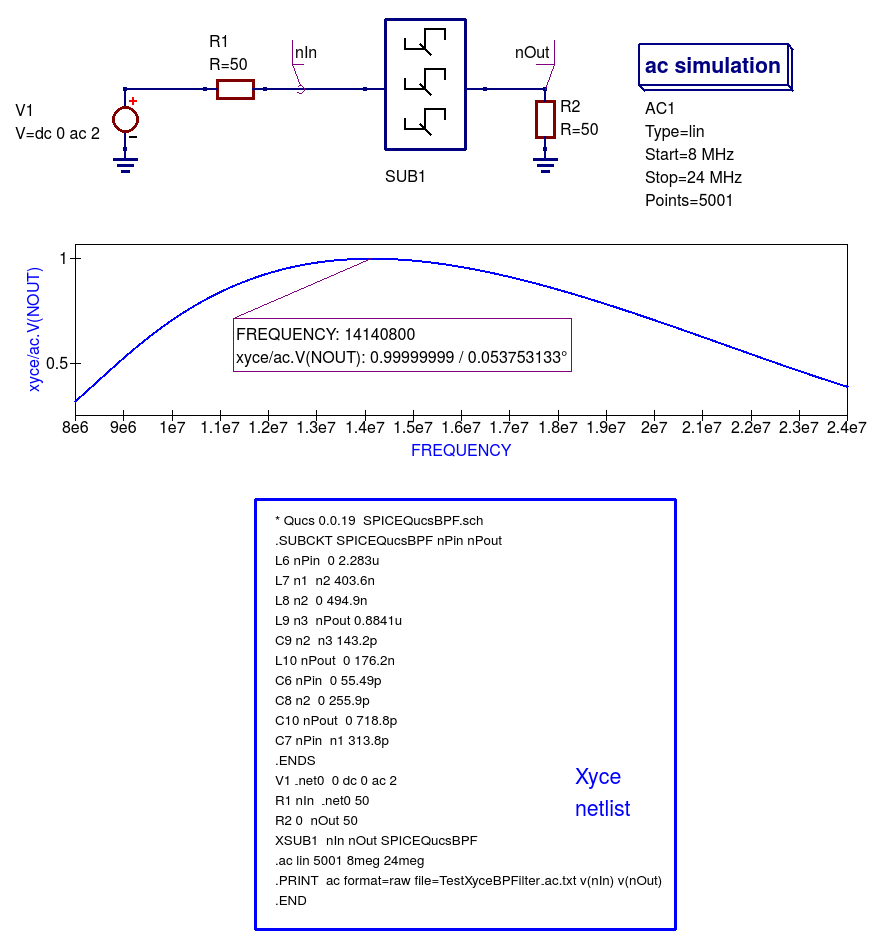
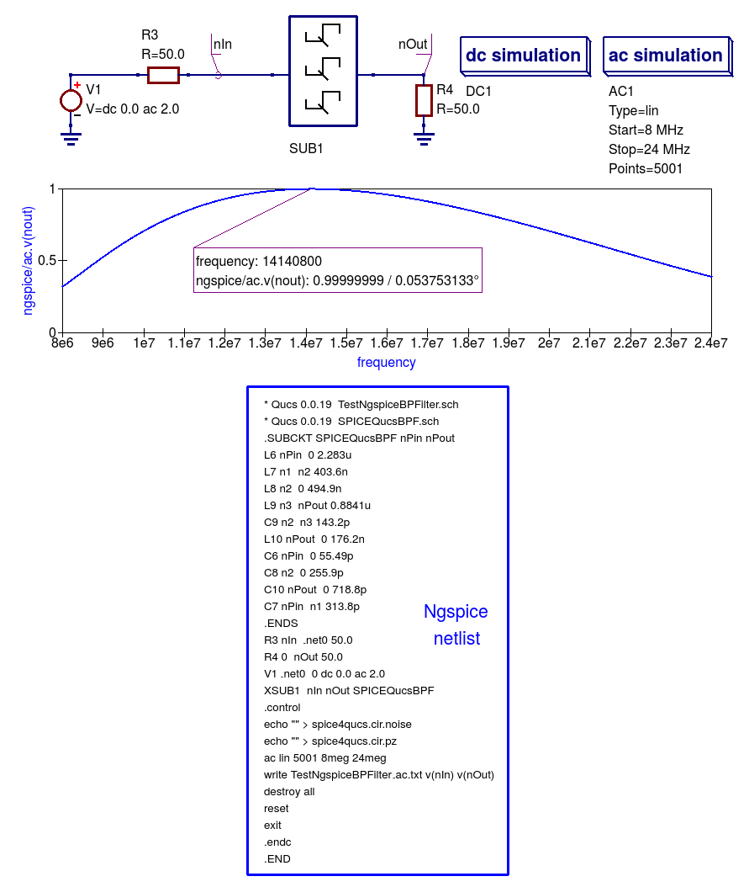
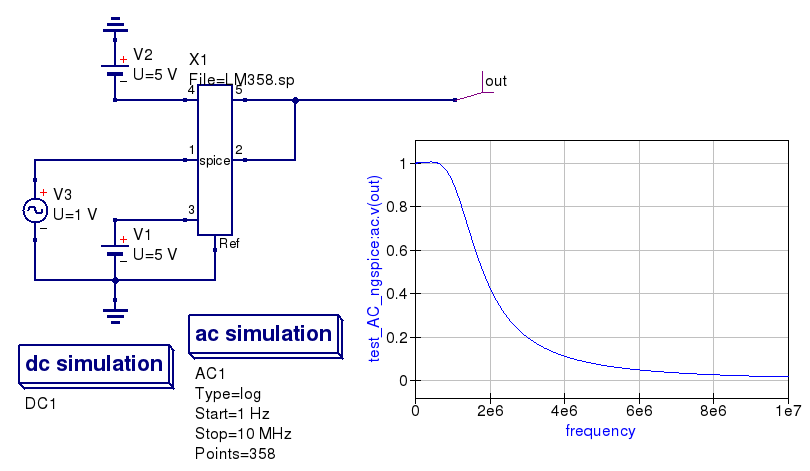

--------------------------------------------------------------------------
Chapter 3. ``Spice4qucs`` subcircuits, macromodels and device libraries
--------------------------------------------------------------------------

3.1 ``Spice4qucs`` Subcircuits: with and without parameters
~~~~~~~~~~~~~~~~~~~~~~~~~~~~~~~~~~~~~~~~~~~~~~~~~~~~~~~~~~~~~~~~
Subcircuits are a concept that has been part of established circuit simulation practice since the early days of computer aided circuit design. 
Today, all practical circuit simulators have subcircuits as part of their basic device compliment.  This is not surprising because they form 
a natural way of breaking an electonic system down into a number of smaller self contained functional blocks. 
``Spice4qucs`` supports all the features available with Qucs subcircuits. 
In a similar fashion to Qucs, the Ngspice, Xyce and SPICE OPUS circuit simulators allow subcircuits with or without parameters. 
However, an optional part of the Ngspice, Xyce and SPICE OPUS subcircuit netlist syntax that signifies that a parameter 
extension is present is not allowed (see section 3.1.2). 
As a starting point ``spice4qucs`` subcircuits without parameters are considered first. This introduction is
followed by a detailed description of the structure, and netlist syntax, of subcircuits with one or more parameters. 

3.1.1 ``Spice4qucs`` subcircuits without parameters
~~~~~~~~~~~~~~~~~~~~~~~~~~~~~~~~~~~~~~~~~~~~~~~~~~~~~~~~~

Figure 3.1 shows a Qucs subcircuit model for a 15MHz centre frequency band pass passive filter. Note that the three
distinct parts of a subcircuit model without parameters are: (1) a circuit representing the model body with one or more input (Pin) and output (Pout) pins plus
connected components selected from Qucs pre-defined components and user designed subcircuits ( there are no user defined subcircuits present in Figure 3.1),
(2) a subcircuit symbol, and (3) a Qucs netlist giving a list of the internal components, their connection nodes and  a wrapper which
defines the subcircuit.  The syntax of the subcircuit netlist listed in Figure 3.1 is only understood by Qucs and cannot be read without error by external SPICE simulators. 

|BPFCh3Fig1_EN|

Figure 3.1 Qucs 15MHz centre frequency band pass passive filter subcircuit without parameters

A test bench circuit for simulating the band pass filter circuit shown in Figure 3.1 is given in Figure 3.2.  This figure includes a plot of the small signal AC
output voltage for a filter with 50 Ohm input and output matching resistors.  Note the use of a node voltage probe and the signal name allocated by
Qucs. Also note that the individual
capacitor voltage and inductor current initial conditions are not set as they are not needed due to fact that the filter subcircuit is not DC biased. As a consequence 
the DC simulation icon shown in Figure 3.2 is not strictly necessary.  However, its a good idea to add it automatically to AC simulations because circuits with 
semiconductor devices or other non-linear components must have their small signal AC properties calculated, at their DC bias conditions, prior to small signal AC simulation. 

|BPFCh3Fig2_EN|

Figure 3.2 Qucs 15MHz centre frequency band pass passive filter test bench with 50 Ohm source and load matching

Figure 3.3 to Figure 3.5 present AC simulation results for the band pass filter generated with the Ngspice, Xyce and SPICEOPUS circuit simulators.

|BPFCh3Fig3_EN| 

Figure 3.3 Band pass filter Ngspice test results and SPICE netlist for test bench circuit.

|BPFCh3Fig4_EN|

Figure 3.4 Band pass filter Xyce test results and SPICE netlist for test bench circuit.

|BPFCh3Fig5_EN| 

Figure 3.5 Band pass filter SPICEOPUS test results and SPICE netlist for test bench circuit.

Most readers will probably have noticed that the SPICE netlists for the Ngspice and SPICEOPUS band pass filter test benches are identical except for file names.  
This is because Ngspice and SPICEOPUS both include implementations of the SPICE 3f5 **Nutmeg** post simulation data processing package that is distributed with their SPICE engines.  
These are not the same however, mainly because the SPICE OPUS development team have modified the original SPICE 3f5 Nutmeg package to firstly remove errors/bugs 
and secondly to improve its syntax.  The extent to how this will affect the operation of spice4qucs is at this time unclear.  If problems/bugs, due to implementation 
differences, surface in the future the spice4qucs  Development Team will attempt to correct them as quickly as possible.  
The Xyce circuit simulator does not include a version of Nutmeg in its distribution package.
This implies that Nutmeg style post simulation data processing is not possible with Xyce.  However, to minimise the effects of this omission an extended form of the SPICE .PRINT statement has been 
implemented in Xyce, allowing algebraic expressions for data processing to be embedded in .PRINT statements.  This topic and other aspects of Xyce post simulation data processing
are covered in later sections of this help manual.

3.1.2 ``Spice4qucs`` subcircuits with parameters
~~~~~~~~~~~~~~~~~~~~~~~~~~~~~~~~~~~~~~~~~~~~~~~~~~~~~~~~~

Subcircuits which have component or physical parameter values set by a list of names and values attached to a schematic symbol add a significant "value added" 
feature to the subcircuit concept. This form of subcircuit can, for example, be used to represent manufacturers product variations which have identical circuits but
require component values or device parameter values of differing value.  Unfortunately, SPICE 3f5 only implements subcircuits without parameters. 
Recent generations of open-source GPL circuit simulators, including Ngspice, Xyce and SPICE OPUS, have been extended by their Development Teams to allow subcircuits with parameters.  
One consequence of this is that over time divergence of the SPICE subcircuit statement syntax has occurred amongst different circuit simulators.  ``Spice4qucs`` 
implements a common subset of the published extended SPICE subcircuit syntax.  This works well, but does have one disadvantage however, in that some published subcircuit netlists may require a small amount of editing before they will simulate with ``Spice4qucs``. One code word often found in the SPICE extended subcircuit syntax is the term **PARAMS:**. This can occur in an **X** subcircuit call to 
signify a subcircuit with parameters.  As this is optional in Ngspice, and indeed in other SPICE derived circuit simulators, it is not implemented in ``Spice4qucs``. 

Qucsator, Ngspice, Xyce and SPICEOPUS all allow parameters to be attached to subcircuit symbols and to be used in design equation calculations.  
As an introductory example Figure 3.6 illustrates  a circuit schematic and user generated symbol for a simple Qucs harmonic generator composed of a fundamental AC signal and three sinusoidal harmonic components.  Parameters :math:`f1` to :math:`f4` set the frequencies of the harmonics. The Qucs Equation block, at the subcircuit internal circuit level, is used to calculate the individual harmonic frequencies. In a similar fashion :math:`ph1` to :math:`ph4` represent the phases of the signal harmonics. 

|QucsHgen_EN|

Figure 3.6 Qucs subcircuit sinusoidal harmonic signal generator: :MATH:`f1` is the fundamental frequency and :math:`f2` to :math:`f4` the higher order harmonics;
:math:`ph1` to :math:`ph4` the phases of the fundamental signal and its harmonics. For clarity long Qucs netlist lines have been spread over more than one line.

|NgspiceHgen_EN|

Figure 3.7 Ngspice subcircuit sinusoidal harmonic signal generator.

Figure 3.7 shows an Ngspice version of the Qucs sinusoidal harmonic generator illustrated in Figure 3.6.  A casual look at these two subcircuit diagrams shows that they are not dissimilar.  
However, there are a number of subtle changes apparent from the diagrams.  First it is important to realise that the Qucs and SPICE sinusoidal (sin) signal generator specifications are different;
Qucs requires the signal phase and SPICE the signal delay to be specified as parameters.  In Figure 3.7 extra equations to convert phase to time delay are added to Equation block Eqn1 inside subcircuit SPICEHarmonicGen. 
To ensure that Eqn1 variables, for example frequency :math:`f2`, are passed to the subcircuit component values as numerical values SPICE curly deliminator brackets, {...}, are placed round equation variable names.  Finally, it is important to realize that the order of the variables in Equation blocks are important.  Qucs allows them to be in any order because it arranges all entries into a sequence which ensures each variable can be allocated a numerical value before it is used in other equations.  However, SPICE does not do the same but assumes
that all variables included in the right hand side of an equation have been allocated a numerical value prior to being used in the calculation of the variable named on the left hand side of the same equation.
To check that the Ngspice generated waveform is correctly generated a Fourier analysis of signal :math:`V(ngensig)` is displayed on Figure 3.7.  At frequencies above :math:`f4` the phase values have no meaning.
The simulated signal waveform obtained with SPICE OPUS was found to be similar to that obtained with NGSPICE, see Figue 3.8.  Try simulating the sinusoidal harmonic generator waveform with SPICE OPUS to check this statement for your self.

|XyceHgen_EN|

Figure 3.8 Xyce subcircuit sinusoidal harmonic signal generator.
 
3.1.3 A second more complex example of ``Spice4qucs`` subcircuits with parameters
~~~~~~~~~~~~~~~~~~~~~~~~~~~~~~~~~~~~~~~~~~~~~~~~~~~~~~~~~~~~~~~~~~~~~~~~~~~~~~~~~~~~~~~

Variable assignment equations, defined in Qucs *Equation Eqn* 
blocks and embedded in a subcircuit, are converted by ``Spice4qucs`` 
into SPICE ``.PARAM`` statements. These are listed in the initial section of the SPICE-netlist of the circuit being simulated, or in the first section of a subcircuit netlist, allowing their values to be determined before the start of a simulation.
With Qucs *Equation Eqn* blocks it is important to remember that the variables defined cannot be functions of circuit voltage or current or any other voltage/current dependent properties. 
Restrictions placed by ``Spice4qucs`` on the use of Qucs *Equation Eqn* blocks are considered in detail in Chapter 4. However, one fundamental rule that must be followed at all 
times is that Qucs simulation icons must not  be placed inside a subcircuit.

The electrical equivalent circuit of a  HC-49/U 8.86 MHz Quartz crystal resonator is shown in Figure 3.9. 
In this model the crystal resonator is represented as the RCL parallel electric network illustrated in
the following two schematics:

* ``quarz.sch`` ---  Quartz crystal resonator subcircuit;  Figure 3.9. 
* ``quarz_test.sch`` --- ``Spice4qucs`` test circuit; Figure 3.10. 

These files can be found in the Qucs-S subdirectory ``examples\ngspice\``. 

Figure 3.9 shows the crystal resonator subcircuit. A brief introduction to the theory of crystal resonators can be found at https://en.wikipedia.org/wiki/Crystal_oscillator.

|Quarz_SUBCKT_EN|

Figure 3.9 Equivalent circuit of Quartz crystal resonator.

In the HC-49/U Quartz crystal resonator model the :math:`RCL` network has two resonant frequencies:

a series resonance frequency  :math:`f`, where

.. math::
    f=\frac{1}{2\pi\sqrt{L_{q}C_{q}}}

and a parallel resonance frequency :math:`f_{p}`, where

.. math::     
    f_p=\frac{1}{2\pi\sqrt{L_{q}C_{q}}}\sqrt{1+\frac{C_{q}}{C_s}}
    
Transposing equation :math:`f`  yields an expression for the series capacitance :math:`C_q`, where  
    
.. math::
    C_q=\frac{1}{4\pi^2f^2L_q^2}
    
This equation is placed in Qucs *Equation Eqn1* block inside the Quartz crystal resonator subcircuit.

Performing an *AC simulation* with Ngspice and Xyce, using the test circuit given in Figure 3.10, yields the amplitude response data plotted in Figure 3.11, 
Ngspice transfer coefficient ``K``  (``ac.k``) and Xyce voltage ``ac.V(OUT)``.  

|Quarz_EN|

Figure 3.10 Test circuit for Quartz crystal resonator.

Figure 3.11 indicates that the Ngspice and Xyce plotted results are identical. 
The only difference being that Xyce simulation result postprocessing is not implemented. 
Hence, only the Xyce output voltage can be plotted; this is done by choosing a logarithmic Y scale, then the Xyce plot 
effectively displays a scaled decibel output. The two resonant frequencies :math:`f` and :math:`f_p` are clearly visible on these plots.

|Quarz_Sim_EN|

Figure 3.11 Magnitude response of HC-49/U Quartz crystal.

Subcircuits are converted by ``Spice4qucs`` into  SPICE ``.SUBCKT`` routines. The SPICE netlist for the Quartz crystal resonator test 
circuit, Figure 3.10, shown below illustrates how the ``Spice4qucs``  handles SPICE ``.PARAM``, ``.SUBCIRCUIT`` and subcircuit ``X`` call statements, 
placing them in the correct position within the SPICE netlist of the circuit being simulated.

.. literalinclude:: _static/en/chapter3/quarz.cir
   :language: Bash
   :linenos:

..  |XyceHgen_EN| image::  _static/en/chapter3/XyceHGen.png

..  |NgspiceHgen_EN| image::  _static/en/chapter3/NgspiceHGen.png

..  |BPFCh3Fig5_EN| image::  _static/en/chapter3/SPICEOPUSBPF.png

..  |BPFCh3Fig2_EN| image::  _static/en/chapter3/QucsBPF.png

..  |BPFCh3Fig1_EN| image::  _static/en/chapter3/Ch3Fig1.png

..  |Quarz_EN| image::  _static/en/chapter3/quarz_test.png

..  |AD822_lib_EN| image::  _static/en/chapter3/ad822_lib.png

3.2 Component and circuit libraries
~~~~~~~~~~~~~~~~~~~~~~~~~~~~~~~~~~~~

Library components are supported in ``spice4qucs`` subsystem. You can use all 
library components. Some libraries have embedded original SPICE code of 
components. You should prefer to use these libraries to archive the best result 
with Spice simulation of Qucs schematics. The example of library component 
(IRFZ44 MOSFET from *MOSFETS* library) usage is 
``examples/ngspice/irfz44_switch.sch``

3.3 Using manufacturers component data libraries
~~~~~~~~~~~~~~~~~~~~~~~~~~~~~~~~~~~~~~~~~~~~~~~~~~

Electronic components manufacturers often provide spice models of components in 
datasheets. You can attach these datasheet spice models using *SPICE netlist* 
component. You need to perform the following steps to use Spice-model from 
component datasheet. Spice netlist builder substitutes SPICE-models directly to 
output netlist without any conversions. 

1. Extract Spice netlist text and save it as text file. You can use any 
extension for this file. Preferable are **.ckt** , **.cir**, **.sp**

2. Place on schematic component *SPICE netlist* and attach SPICE netlist nodes
to component port using standard *SPICE component properties* dialog. 

3. Simulate schematic with Ngspice/Xyce. 

It's need to note that SPICE-netlist of component **must not** be ended by 
``.END`` directive. In this case simulator exits after it reads 
``.SUBCKT`` routine and simulation cannot be executed.

The example of spice model usage (LM358 opamp) is shown in the Figure 3.12

|LM358_EN|

Figure 3.12 AC Simulation of LM358 opamp with Ngspice. 

Here is the netlist of LM358 spice-model. Model can be found in LM358 
datasheet. 

.. literalinclude:: _static/en/chapter3/LM358.sp
   :language: Bash
   :linenos:

3.4 Usage of unmodified SPICE Libraries
~~~~~~~~~~~~~~~~~~~~~~~~~~~~~~~~~~~~~~~

3.4.1 ``SpiceLibComp`` device
~~~~~~~~~~~~~~~~~~~~~~~~~~~~~

You can use an unmodified SPICE libraries with new ``SpiceLibComp`` device. This
component could be found at the *File components* group. This component have
three properties:

* ``File`` is full SPICE library file (usually ``*.lib``, ``*.cir``, or ``*.sp`` files) 
  path. You can use unmodified library here. 
* ``Device`` is SUBCKT entry name that represents desired device. Every
  component is defined as subcircuit and identified by ``.SUBCKT`` entry name.
  This property holds device name. You need to fill this property manually.  
* ``SymPattern`` is symbol pattern for device. You can select one of predefined
  symbol patterns or use automatic pattern. Automatic pattern is simple
  rectangular symbol with pins.  

Let's consider SPICE library structure. There exists a SPICE library file
``ad822.cir`` that contains AD822 model. Here is library source code:

.. literalinclude:: _static/en/chapter3/ad822.cir
   :language: Bash
   :linenos:

This library example contains only one model defined by one subcircuit entry,
but you can use any library containing any amount of device models.

Let's use AD822 opamp model. Create new schematic and place ``SpiceLibComp``
device on schematic (Figure 3.13). Select ``ad822.cir`` file in the first property. 
Then fill ``ad822`` (device name) in the second property. 

You can either create an automatic component symbol, either use one of the 
predefined patterns. At current state only ``opamp3t`` and ``opamp5t`` patterns 
are available. These patterns represents three- and five-terminal opamps
respectively. Symbol patterns are Qucs XML files. They are placed in the
``share/qucs/symbols`` subdirectory of the Qucs installation root. These files 
have ``*.sym`` extension. Symbol pattern format will be considered further. 

SPICE netlist builder performs automatic port assignment for subcircuit pins. 
If automatic symbol is used symbol pin names will be automatically filled from
the ``.SUBCKT`` entry definition. See Figure 3.13 for example of the automatic 
pin assignment.

If symbol pattern is used, the first ``.SUBCKT`` entry port will be
automatically mapped to the first symbol port, etc. Symbol port sequence is
defined in the symbol pattern file (``*.sym``) in Port description lines. 

|AD822_lib_EN|

Figure 3.13 LM358 opamp library model usage with ``SpiceLibComp`` device

3.4.2 Symbol pattern files format description
~~~~~~~~~~~~~~~~~~~~~~~~~~~~~~~~~~~~~~~~~~~~~

Let's consider symbol files format. Symbols have ``*.sym`` extension and are
placed in ``share/qucs/symbols`` subdirectory of the Qucs installation tree.
Qucs automatically scans content of this subdirectory and displays all found
valid symbols in drop-down list in the third property (``SymPattern``) of the
*SpiceLibComp* device. User can select any symbol for new SPICE library device.
It's need to create a new symbol file and place it into symbols directory to add
new symbols to the existing Qucs installation. 

Let's consider symbol file format. Symbols have Qucs XML schematic format
without header. An example of symbol file (five-terminal opamp) is shown in the 
listing below:

.. literalinclude:: _static/en/chapter3/opamp5t.sym
   :language: XML
   :linenos:

Automatic symbol files preparation is not yet implemented, but you can use Qucs
schematic editor to create new symbol files. You may use the following sequence
to create new symbol:

* Create Qucs subcircuit. Subcircuit may be empty. Place desired ports on it;
* Attach symbol to it using switching to symbol mode by ``F9`` keystroke. Wire
  subcircuit ports to symbol and paint symbol outline. 
* Save subcircuit, open it with any test editor and copy-paste symbol code form it
  into the symbol file.

Please pay attention to the proper port mapping. Let's consider port definition
line format:

.. code-block:: XML

 <.PortSym 10 -40 3 0>

This port definition consists of five space separated fields. The fourth field
(``3``) contains port number. This port number should match SPICE ``.SUBCKT``
port number (not port name!) to proper component wiring. You may need to edit
this field manually.

For example AD822 has the following definition in our library:

.. code-block:: Bash

 .SUBCKT AD822 1 2 99 50 25

Subcircuit node list follows after the subcircuit name ( ``AD822`` ). Subcircuit 
nodes will be mapped to component port in the following sequence:

* Node ``1`` --- to Port ``1``
* Node ``2`` --- to Port ``2``
* Node ``99`` --- to Port ``3``
* Node ``50`` --- to Port ``4``
* Node ``25`` --- to Port ``5``

3.5 Libraries blacklisting
~~~~~~~~~~~~~~~~~~~~~~~~~~

Every library may consist of simulator-incompatible components. For example
XSPICE devices will not work with Xyce backend. And Qucsatror microwave devices 
will not work with any of SPICE.

Library blacklisting serves to hide simulator incompatible libraries in Qucs-S 
library manager view. User will not see such libraries. This prevents simulator
compatibility issue.

There are three ``*.balcklist`` files in the system Qucs-S library directory
(for example ``$QUCSDIR/share/qucs-s/library/``). All files have plain text
format and contain a list of simulator-incompatible library files with extension
in the current directory. File entries are newline-separated. These libraries
will be blacklisted and will be not shown in the library manager if appropriate
simulator is selected as default.

Here is blacklist files list:

* ``ngspice.blacklist`` --- The list of Ngspice-incompatible libraries;
* ``xyce.blacklist`` --- The list of XYCE-incompatible libraries;
* ``qucs.blacklist`` --- The list of Qucsator-incompatible libraries;

For example, let's consider contents of the ``qucs.blacklist`` file: ::

  AnalogueCM.lib
  Cores.lib
  Transformers.lib
  Xanalogue.lib

All of these libraries contain SPICE-only components (XSPICE analogue blocks)
and will not work with Qucsator. 

`back to the top <#top>`__

