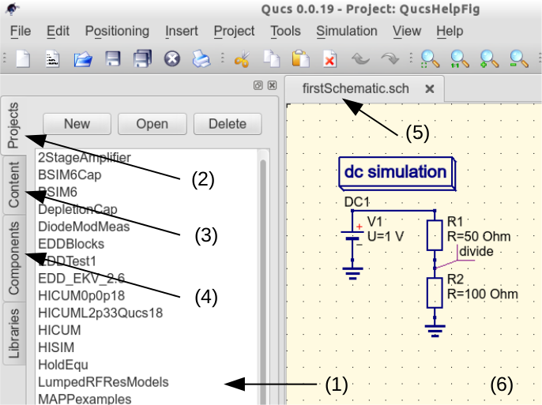

Getting Started with Qucs Analogue Simulation
=============================================

Qucs is s scientific/engineering software package that is capable of performing a range of different forms of circuit simulation, including for example, linear and non-linear DC analysis, small signal S parameter circuit analysis and time domain transient analysis. This section of the Qucs-Help document introduces readers to the basic steps involved in using Qucs for analogue circuit simulation. When Qucs is launched for the first time, it creates a directory called ".qucs" within the user's home directory. All files involved in a Qucs simulation are saved in the ".qucs" directory or in one of it's  sub-directories. After Qucs has been launched, the software displays a Graphical User Interface window (GUI) similar, or the same, to the one shown in Figure 1. At the centre of the GUI, a working area labelled (6) appears for displaying schematics, listing simulation and design data  and  displaying plotting signal waveforms or other numerical data as graphs. Using the tabular bar labelled (5), located above the main working area, allows users to quickly switch amongst the documents currently open. On the left side of the Qucs main window, there is third area labelled (1), whose content depends on the status of the tabular bars "Projects" (bar 2), "Content" (bar 3) and "Components" (bar 4) [Note there is also a bar called Libraries - this is introduced in a later Qucs-Help document]. After running Qucs, the "Projects" tab is activated. However, when Qucs is run for the first time, the "Projects" list is empty because a project is still to be specified and opened. To enter a new project left click on  the "New" button (using the mouse), located on the right above window area (1). This action causes a Qucs GUI dialogue to open. Next enter the name for your first Qucs project in the box provided, for example enter "QucsHelpFig" and click on the "OK" button. Qucs then creates a project directory in the ~/.qucs directory, In the example this is called "QucsHelpFig_prj". Every file belonging to this new project is saved within the "QucsHelpFig_prj directory. On creation a new project is immediately opened and it's name displayed on the Qucs window title bar. Next the tabular bar is switched to "Content", and the content of the currently opened project displayed. To save an open document click on the save button on the toolbar (or use the main menu: File->Save). This step initiates a sequence which saves the untitled document displayed in the working area (6). To complete the save sequence you will be ask for the name of your new document. Enter "firstSchematic", or some other suitable name, and click on the "OK" button to complete the save sequence. 

|image0_EN|

Figure 1 - Qucs main window

As a first example to help you get started with Qucs enter and run the simple DC circuit shown in Figure 1. The circuit illustrated is a simple two resistor voltage divider network connected to a fixed value DC voltage source. Start by clicking on the "Components" tab (4). Activating the "Components" tab results in a combo box being displayed from which a component group may a choose and the required components selected. Choose "lumped components" and click on the first symbol: "Resistor". Next move the mouse cursor into the working area (6). Pressing the right mouse button rotates the Resistor symbol. Similarly, pressing the left mouse button places the component onto the schematic at the place the mouse cursor is pointing at. Repeat this process for all components shown in Figure 1. The independent DC voltage source is located in the "sources" component class. The ground symbol can be found in the "lumped components" class or selected from the Qucs toolbar. The icon requesting DC simulation is listed in the"simulations" component class.  To edit the parameters of the second resistor, double-click on it. A dialog opens which allows the resistor value to changed; enter "100 Ohm" into the edit field on the right side and click enter.

To connect the circuit components shown in Figure 1, click on the wire toolbar button (or use the main menu: Insert->Wire). Move the cursor onto an open port (marked by a small red circle). Clicking on it starts the wire drawing sequence. Now move the drawing cursor to the end point of a wire (normally this is a second red circle attached to a placed component) and click again. Two components are now connected. Repeat the drawing sequence as many times as required to wire up a circuit. If you want to change the corner direction of a wire, click on the right mouse button before setting the end point. You can also end a wire without clicking on an open port or on a wire; Just double-click the left mouse button.

As a final step before DC simulation label the node or nodes whos DC voltage is required,  for example the wire connecting resistors R1 and R2. Click on the label toolbar button (or use the menu: Insert->Wire Label). Now click on the chosen wire. A dialog opens allowing a node name to be entered. Type "divide" and click the "OK" button. If you have drawn the test schematic correctly the entered circuit should look like, or be similar to, the one shown in Figure 1.

To start the DC simulation click on the simulate toolbar button (or use menu: Simulation->Simulate). A window opens and a sliding bar reports the simulation progress. After finishing the simulation successfully, the data display is opened. Normally, all this happens so fast that you only see a short flickering (this depends on the speed of your PC). Next place a diagram icon on the schematic drawing window (6). This allows the simulation results to be listed. On the left side the "diagrams" component class has already been chosen automatically by Qucs. Click on the "Tabular" item and move to the schematic working area and finally place it by clicking the left mouse button. A dialog opens allowing selection of the named signals you wish to displayed on the new diagram. In the left area of the dialog is displayed the node name: "divide". Double-click on it and it will be transferred to the right area of the dialog menu. Leave the dialog by clicking the "OK" button. The DC simulation voltage data should now be listed, with a value of  0.666667 volts at node "divide".

Further reading

1. Getting Started with Qucs.  Available from http://qucs.sourceforge.net/docs/tutorial/getstarted.pdf. 

.. only:: html

   `back to the top <#top>`__

.. |image0_DE| image:: _static/de/qucshaupt.png

.. |image0_CS| image:: _static/cs/qucsmain.png

.. |image0_ES| image:: _static/es/qucsmain.png

.. |image0_FR| image:: _static/fr/qucsmain.png

.. |image0_PT| image:: _static/pt/qucsmain.png

.. |image0_RU| image:: _static/ru/qucsmain.png

.. |image0_UK| image:: _static/uk/qucsmain.png
