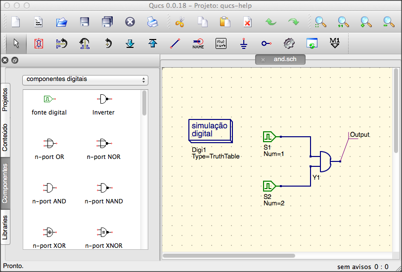

Getting Started with Digital Simulations
========================================

Qucs is also a graphical user interface for performing digital
simulations. This document should give you a short description on how to
use it.

For digital simulations Qucs uses the FreeHDL program
(`http://www.freehdl.seul.org <http://www.freehdl.seul.org>`__). So the
FreeHDL package as well as the GNU C++ compiler must be installed on the
computer.

There is no big difference in running an analog or a digital
simulation. So having read the `Getting Started for analog
simulations <start.html>`__, it is now easy to get a digital simulation
work. Let us compute the truth table of a simple logical AND cell.
Select the digital components in the combobox of the components tab on
the left-hand side and build the circuit shown in figure 1. The digital
simulation block can be found among the other simulation blocks.

The digital sources *S1* and *S2* are the inputs, the node labeled as
*Output* is the output. After performing the simulation, the data
display page opens. Place the diagram *truth table* on it and insert the
variable *Output*. Now the truth table of a two-port AND cell is shown.
Congratulation, the first digital simulation is done!

|image0_EN|

Figure 1 - Qucs main window

A truth table is not the only digital simulation that Qucs can
perform. It is also possible to apply an arbitrary signal to a circuit
and see the output signal in a timing diagram. To do so, the parameter
*Type* of the simulation block must be changed to *TimeList* and the
duration of the simulation must be entered in the next parameter. The
digital sources have now a different meaning: They can output an
arbitrary bit sequence by defining the first bit (low or high) and a
list that sets the times until the next change of state. Note that this
list repeats itself after its end. So, to create a 1GHz clock with pulse
ratio 1:1, the list writes: 0.5ns; 0.5ns

To display the result of this simulation type, there is the diagram
*timing diagram*. Here, the result of all output nodes can be shown row
by row in one diagram. So, let's have fun...

VHDL File Component
~~~~~~~~~~~~~~~~~~~

More complex and more universal simulations can be performed using the
component "VHDL file". This component can be picked up from the
component list view (section "digital components"). Nevertheless the
recommended usage is the following: The VHDL file should be a member of
the project. Then go to the content list view and click on the file
name. After entering the schematic area, the VHDL component can be
placed.

The last entity block in the VHDL file defines the interface, that
is, all input and output ports must be declared here. These ports are
also shown by the schematic symbol and can be connected to the rest of
the circuit. During simulation the source code of the VHDL file is
placed into the top-level VHDL file. This must be considered as it
causes some limitations. For example, the entity names within the VHDL
file must differ from names already given to subcircuits. (After a
simulation, the complete source code can be seen by pressing F6. Use it
to get a feeling for this procedure.)

.. only:: html

   `back to the top <#top>`__

.. |image0_EN| image:: _static/en/qucsdigi.png

.. |image0_ES| image:: _static/en/qucsdigi.png

.. |image0_DE| image:: _static/de/qucsdigi.png

.. |image0_CS| image:: _static/cs/qucsdigi.png

.. |image0_FR| image:: _static/en/qucsdigi.png

.. |image0_RU| image:: _static/ru/qucsdigi.png

.. |image0_UK| image:: _static/uk/qucsdigi.png
