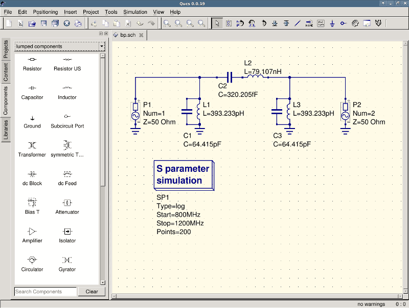
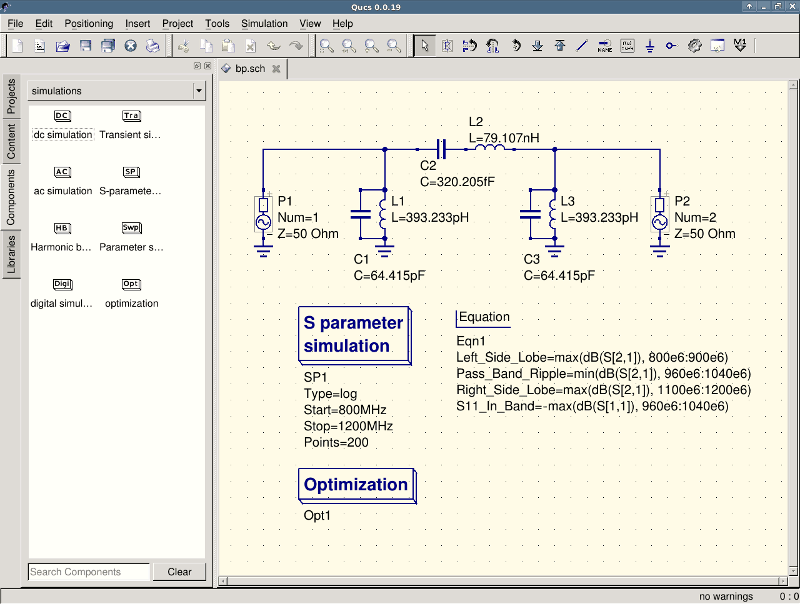
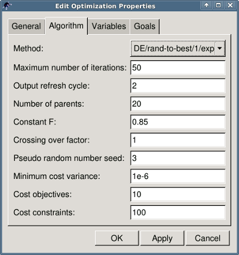
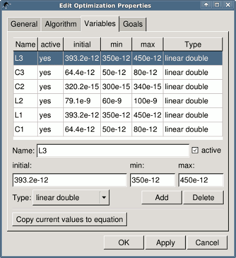
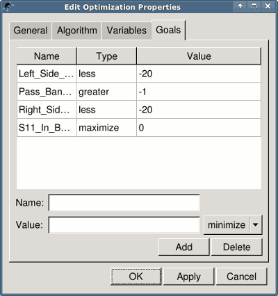
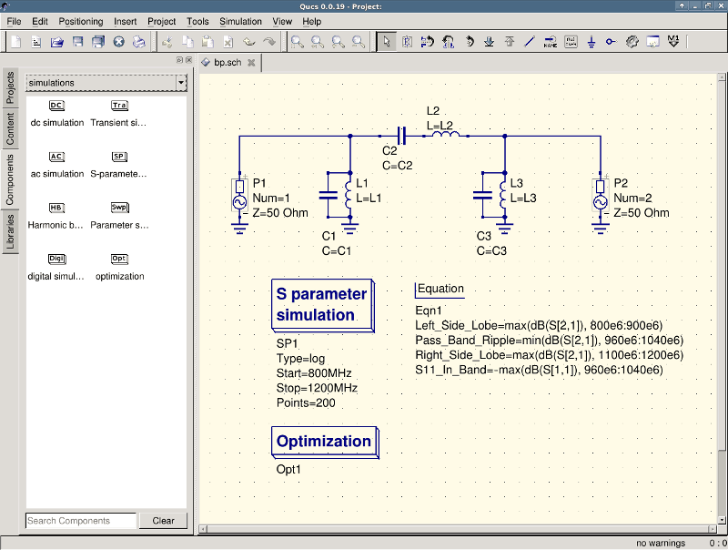
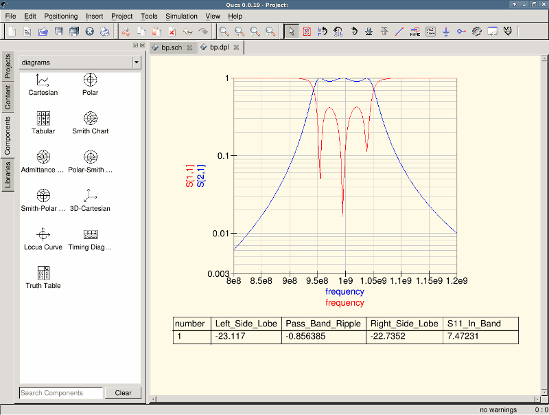
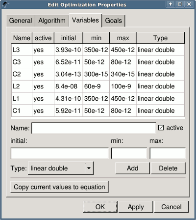

Getting Started with Optimization
=================================

For circuit optimization, Qucs uses the ASCO tool
(`http://asco.sourceforge.net/ <http://asco.sourceforge.net/>`__). A
brief description on how to prepare your schematic, execute and
interprete the results is given below. Before using this functionality,
ASCO must be installed on the computer.

Optimization of a circuit is nothing more than the minimization of a
cost function. It can either be the delay or the rise time of a digital
circuit, or the power or gain of an analog circuit. Another possibility
is defining the optimization problem as a composition of functions,
leading in this case to the definition of a figure-of-merit.

To setup a netlist for optimization two things must be added to the
already existing netlist: insert equation(s) and the optimization
component block. Take the schematic from Figure 1 and change it until
you have the resulting schematic given in Figure 2.

|image0_EN|

Figure 1 - Initial schematic.

|image1_EN|

Figure 2 - Prepared schematic.

Now, open the optimization component and select the optimization tab.
From the existing parameters, special attention should be paid to
'Maximum number of iterations', 'Constant F' and 'Crossing over factor'.
Over- or underestimation can lead to a premature convergence of the
optimizer to a local minimum or, a very long optimization time.

|image2_EN|

Figure 3 - Optimization dialog, algorithm options.

In the Variables tab, defining which circuit elements will be chosen
from the allowed range, as shown in Figure 4. The variable names
correspond to the identifiers placed into properties of components and
**not** the components' names.

|image3_EN|

Figure 4 - Optimization dialog, variables options.

Finally, go to Goals where the optimization objective (maximize,
minimize) and constraints (less, greater, equal) are defined. ASCO then
automatically combines them into a single cost function, that is then
minimized.

|image4_EN|

Figure 5 - Optimization dialog, goals options.

The next step is to change the schematic, and define which circuit
elements are to be optimized. The resulting schematic is show in Figure
6.

|image5_EN|

Figure 6 - New Qucs main window.

The last step is to run the optimization, i.e. the simulation by
pressing F2. Once finished, which takes a few seconds on a modern
computer, the best simulation results is shown in the graphical waveform
viewer.

|image6_EN|

Figure 7 - Qucs results window.

The best found circuit sizes can be found in the optimization dialog,
in the Variables tab. They are now the initial values for each one of
introduced variables (Figure 8).

|image7_EN|

Figure 8 - The best found circuit sizes.

.. only:: html

   `back to the top <#top>`__

.. |image0_DE| image:: _static/de/optimization1.png
.. |image1_DE| image:: _static/de/optimization2.png
.. |image2_DE| image:: _static/de/optimization3.png
.. |image3_DE| image:: _static/de/optimization4.png
.. |image4_DE| image:: _static/de/optimization5.png
.. |image5_DE| image:: _static/de/optimization6.png
.. |image6_DE| image:: _static/de/optimization7.png
.. |image7_DE| image:: _static/de/optimization8.png
